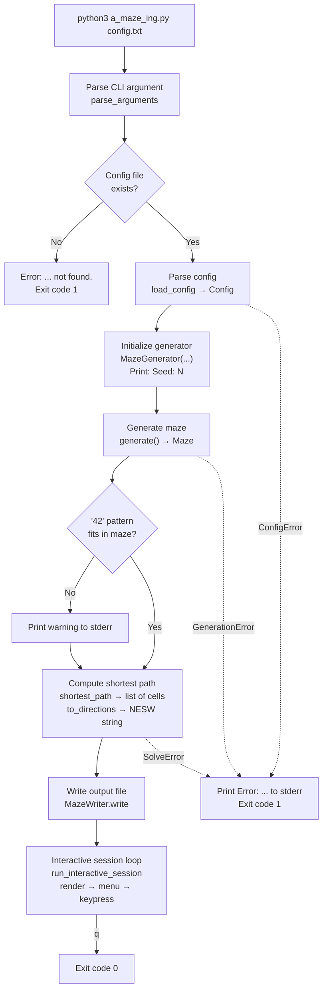
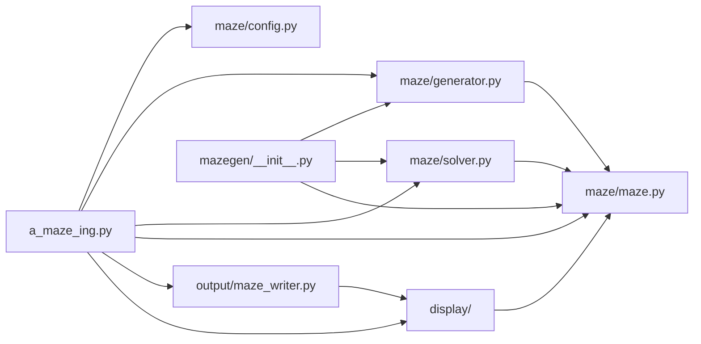

# 0. Overview

## What this chapter covers

- What this program accomplishes
- The exact execution order when running `python3 a_maze_ing.py config.txt`
- Map of files, modules, and author assignments
- Inter-module dependencies and data shapes flowing through the pipeline
- Overall exception hierarchy and error handling architecture
- Python prerequisites required to comfortably navigate the codebase

---

## 1. What this program does

The 42 project subject mandates four core responsibilities:

1. **Parse a configuration file** (§IV.3) — reads maze dimensions, entry/exit coordinates, output path, and mode in `KEY=VALUE` format.
2. **Generate a maze** (§IV.4) — supports two distinct generation modes:
   - `PERFECT=True`: **Perfect maze**. Exactly one unique path between any two cells, zero loops.
   - `PERFECT=False` (subject default): **Playable board**. Pac-Man-style layout featuring loops, interconnected corridors, and rare or zero dead ends.
   - In both modes, a stylized "**42**" logo carved out of fully closed wall cells must appear when dimensions allow.
3. **Serialize to an output file** (§IV.5) — writes 4-bit hexadecimal wall bitmasks for every cell, followed by entry, exit, and the shortest path.
4. **Render interactively in terminal** (§V) — displays the maze with options to toggle path visibility, cycle wall colors, regenerate a new maze, and quit cleanly.

Additionally, §VI requires packaging the core generator and solver into a **reusable standalone Python package** (`mazegen`).

---

## 2. Single Run Execution Flow



Console output (for default `config.txt`):

```text
Loading configuration from 'config.txt'...     ← stdout
Seed: 1134808802                               ← stdout (fresh random seed unless fixed in config)
+---+---+---+ ... (ASCII maze display)          ← stdout
========================================
         MAZE INTERACTIVE MENU                 ← interactive menu
...
Choose an option (t/c/r/q):                    ← awaiting input
```

Simultaneously, the specified `OUTPUT_FILE` (default `maze.txt`) is generated on disk.

---

## 3. Directory Map and Work Assignments

```text
.
├── a_maze_ing.py            Main entry point wiring all components         javi   → Chapter 7
├── config.txt               Default configuration file                     so     → Chapter 2
├── config_file_examples/    Sample configuration files (small/large/etc.)  javi   → Chapter 2
├── maze/                    Core maze engine (reusable package logic)
│   ├── __init__.py          Package export exposing Maze                   so
│   ├── maze.py              Maze data structure (cells, walls, bitmasks)   so     → Chapter 1
│   ├── config.py            Config parser and validation                   so     → Chapter 2
│   ├── generator.py         Maze generation engine (MazeGenerator)         so     → Chapter 3
│   └── solver.py            Shortest-path BFS solver                       so     → Chapter 4
├── output/
│   ├── __init__.py          Package export exposing MazeWriter             javi
│   └── maze_writer.py       Output serialization to hexadecimal format     javi   → Chapter 5
├── display/
│   ├── __init__.py          Package export exposing display components     javi
│   ├── colors.py            ANSI color palette definitions                 javi   → Chapter 6
│   ├── renderer.py          MazeLike (Protocol) and Renderer (ABC)         javi   → Chapter 6
│   ├── terminal_renderer.py ASCII terminal visualizer                      javi   → Chapter 6
│   ├── input_handler.py     Menu, keybindings, and interactive session loop javi  → Chapter 6
│   └── example_maze.py      Mock maze used during early visual testing     javi   → Chapter 6
├── mazegen/
│   └── __init__.py          §VI Reusable standalone package entry point    javi   → Chapter 8
├── tests/                   135+ unit and integration pytest test cases    both   → Chapter 9
├── pyproject.toml           Project and package build metadata (Poetry)    javi   → Chapter 8
├── Makefile                 Build/run automation (lint, test, build, run)  javi   → Chapter 8
├── mazegen-*.whl, .tar.gz   Compiled distribution package artifacts (§VI)  javi   → Chapter 8
├── maze_analyzer.py         Subject verification utility (provided by 42)
└── Docs/                    Design records, learning logs, and work logs
```

---

## 4. Module Dependencies

Arrows indicate `import` relationships.



Key architectural observations:

- **`maze/maze.py` sits at the center.** The generator, solver, and display all depend directly on it.
- **`maze/config.py` is completely decoupled.** It defines its own local `Coord` type and imports nothing from `maze.maze`. It focuses exclusively on text parsing and validation.
- **The generator and solver have zero awareness of terminal display or files.** This ensures true reusability under §VI. They emit no console output, allowing seamless headless embedding into other applications.
- `output/maze_writer.py` imports `display` solely to leverage the `MazeLike` protocol interface.

---

## 5. Data Shapes Flowing Through Pipeline

| Stage         | Producer                  | Data Object            | Type / Structure                                                                                 |
| ------------- | ------------------------- | ---------------------- | ------------------------------------------------------------------------------------------------ |
| Configuration | `load_config`             | `Config`               | Immutable frozen dataclass: `width`, `height`, `entry`, `exit`, `output_file`, `perfect`, `seed` |
| Generation    | `MazeGenerator.generate`  | `Maze`                 | 2D grid of 4-bit wall bitmasks (0–15) + frozenset of reserved "42" cells                         |
| Solving       | `shortest_path`           | Cell coordinate list   | `list[Coord]`, e.g. `[(0, 0), (0, 1), (1, 1), ...]`                                              |
| Encoding      | `to_directions`           | Direction string       | `str`, e.g. `"SEESE"`                                                                            |
| Serialization | `MazeWriter.encode`       | Formatted file content | Hex grid lines + blank line + entry + exit + direction string                                    |
| Rendering     | `TerminalRenderer.render` | Visual ASCII output    | 2 terminal lines per maze grid row + wall borders                                                |

`Coord` is an alias for `tuple[int, int]` and consistently adheres to `(x, y)` order throughout the codebase.

---

## 6. Exception Hierarchy

Errors are partitioned into two clean semantic families:

```text
Exception
├── ConfigError                 Configuration parsing issues (maze/config.py)
│   ├── ConfigFileError         File I/O or UTF-8 decoding failure
│   ├── ConfigSyntaxError       Missing '=' or malformed KEY=VALUE
│   ├── ConfigValueError        Invalid value, negative size, or duplicate keys
│   └── ConfigMissingKeyError   Required directive omitted
│
└── MazeError                   Maze structural errors (maze/maze.py)
    ├── OutOfBoundsError        Coordinates outside grid dimensions
    ├── NotAdjacentError        Non-adjacent cell connection attempted
    ├── GenerationError         Impossible maze dimensions requested (maze/generator.py)
    └── SolveError              Unreachable exit or entry/exit on "42" (maze/solver.py)
```

The top-level entry point `a_maze_ing.py` intercepts both families plus `OSError`:

```python
except (ConfigError, MazeError, OSError) as err:
    print(f"Error: {err}", file=sys.stderr)
    return 1
```

Because `ConfigError` is not a subclass of `MazeError`, intercepting both families prevents unhandled stack traces. Handling `OSError` ensures that failures writing the output file (such as non-existent directories or unwritable files) print clean diagnostic messages instead of crashing.

---

## 7. Python Prerequisites and Codebase Conventions

### 7.1 Classes, Instances, and `self`

A **class** is a blueprint; an **instance** is the concrete object constructed from it. Calling `Maze(20, 15)` instantiates a concrete maze object.

The first parameter of an instance method, `self`, references the active instance. Calling `m.walls_at((0, 0))` is desugared internally to `Maze.walls_at(m, (0, 0))`.

Leading underscores (e.g. `self._grid`) indicate internal encapsulation by convention. While Python does not enforce private scope, it signals implementation details that external callers should not mutate directly.

### 7.2 `@property`

Transforms a method into a read-only attribute accessed without parentheses:

```python
@property
def width(self) -> int:
    return self._width
```

Accessing `m.width` invokes the getter. It prevents external reassignment (e.g. `m.width = 5` raises `AttributeError`) while exposing clean public accessors. Used throughout: `Maze.width`, `height`, `reserved`, `MazeGenerator.seed`, `Direction.opposite`, and `delta`.

→ Detailed notes: [`learning_log/python-enum-and-property.md`](../learning_log/python-enum-and-property.md)

### 7.3 `Enum` and `IntEnum`

Provides typed enumerations for discrete state sets:

```python
class Direction(IntEnum):
    NORTH = 1
    EAST = 2
    SOUTH = 4
    WEST = 8
```

`IntEnum` subclasses `int`, allowing direct bitwise operations (e.g. `mask | Direction.NORTH`). Iterating with `for d in Direction:` preserves definition order (N, E, S, W), which is critical for deterministic traversal.

In `display/input_handler.py`, `UserAction` is a standard string-backed `Enum` with values `"t"`, `"c"`, `"r"`, and `"q"`.

### 7.4 `@dataclass(frozen=True)`

Generates concise, immutable data containers. `Config` in `maze/config.py` is defined as:

```python
@dataclass(frozen=True)
class Config:
    width: int
    height: int
    ...
    seed: int | None = None
```

- Automatically synthesizes `__init__`, `__repr__`, and `__eq__`.
- `frozen=True` enforces immutability. Any attempt to reassign `config.width = 10` raises `FrozenInstanceError`, preventing configuration values from drifting after validation.

### 7.5 Generators (`yield`)

Functions using `yield` instead of `return` produce lazy iterator generators:

- Execution pauses at each `yield` and resumes on demand.
- Single-pass consumption: once exhausted, a generator cannot be iterated a second time without re-invoking the generator function.
- Memory efficient: elements are computed on the fly without allocating intermediate lists.

Used in: `Maze.neighbours`, `Maze.open_neighbours`, and `Maze.rows`.

→ Detailed notes: [`learning_log/python-generators.md`](../learning_log/python-generators.md)

### 7.6 `Protocol` vs `ABC`

Both declare structural expectations, but with contrasting philosophies:

| Feature      | `Protocol` (`MazeLike`)                                       | `ABC` (`Renderer`)                                                   |
| ------------ | ------------------------------------------------------------- | -------------------------------------------------------------------- |
| Typing Model | **Structural subtyping** (duck typing)                        | **Nominal subtyping** (explicit inheritance)                         |
| Requirement  | Any object exposing `width`, `height`, and `walls_at` matches | Classes must explicitly inherit: `class TerminalRenderer(Renderer):` |
| Primary Goal | Decouples renderer/writer from concrete `Maze` implementation | Enforces implementation of abstract methods (like `render`)          |

Covered in detail in Chapter 6.

### 7.7 Type Hints and Aliases

Signatures like `def walls_at(self, pos: Coord) -> int:` supply static type annotations inspected by `mypy` (`make lint`).

- `Coord = tuple[int, int]` is a **type alias** improving readability.
- `int | None` expresses union types.
- `Iterator[...]`, `Collection[...]`, and `Callable[...]` denote standard abstract container/callable types.

→ Detailed notes: [`learning_log/python-type-syntax-vs-values.md`](../learning_log/python-type-syntax-vs-values.md)

### 7.8 Exception Handling (`raise`, `try`, `except`, `from`)

- `raise SomeError("...")` halts execution and propagates the error up the call stack.
- `try ... except SomeError as err:` catches matching exceptions (including subclasses).
- `raise NewError(...) from err` establishes exception chaining, preserving the root causal exception in tracebacks.

→ Detailed notes: [`learning_log/python-exceptions.md`](../learning_log/python-exceptions.md)

### 7.9 Modules, Packages, and `__all__`

- Each `.py` file is a **module**; a folder containing `__init__.py` is a **package**.
- `mazegen/__init__.py` re-exports public symbols (`MazeGenerator`, `shortest_path`, etc.) from `maze/` to satisfy §VI requirements.
- `__all__` declares the explicit public interface exported during `from package import *`.

### 7.10 Closures

Inner functions capturing references to variables in enclosing scopes. In `a_maze_ing.py`, `regenerate()` closes over `config`, enabling maze recreation on `'r'` keypress with the original user dimensions.

### 7.11 Collection Types Comparison

| Container           | Properties                                             | Usage in A-Maze-ing                                    |
| ------------------- | ------------------------------------------------------ | ------------------------------------------------------ |
| `list`              | Ordered, mutable, $O(1)$ amortized append/pop          | DFS carving stack, shortest-path cell sequence         |
| `tuple`             | Ordered, immutable                                     | Coordinate pairs `(x, y)`, grid row tuples             |
| `set`               | Unordered, unique elements, $O(1)$ average `in` lookup | Visited cells, shortest path lookup set in renderer    |
| `frozenset`         | Immutable `set`                                        | Reserved cells (`Maze.reserved`), "42" pattern offsets |
| `dict`              | Key-value mapping, fast key lookup                     | Direction mapping, BFS parent tracking                 |
| `collections.deque` | Fast $O(1)$ appends and pops on both ends              | BFS exploration queue in solver                        |

---

## Related Documentation

- [`implementation_plans/architecture-overview.md`](../implementation_plans/architecture-overview.md) — Pipeline overview and responsibilities
- Next chapter: [1. Maze Data Structure](01_maze_structure-en.md)
