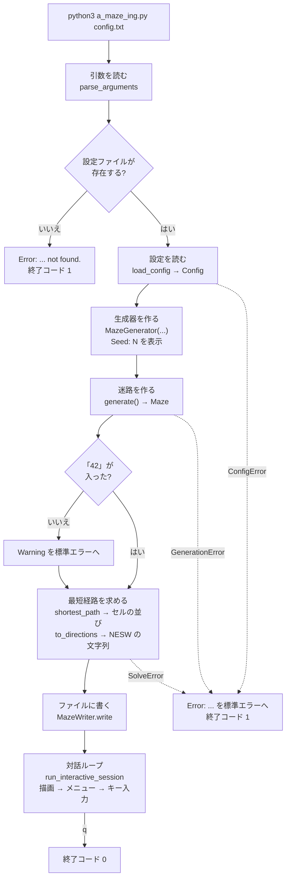
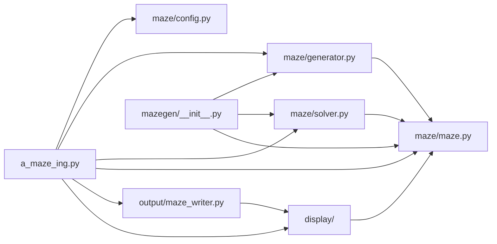

# 0. 全体像

## この章で分かること

- このプログラムが何をするのか
- `python3 a_maze_ing.py config.txt` を 1 回実行したときに、どの順番で何が起きるか
- ファイルとモジュールの地図、誰がどこを書いたか
- モジュールどうしの依存関係と、モジュールの間を流れるデータの形
- エラー(例外)の全体の仕組み
- コードを読むために必要な Python の前提知識

---

## 1. このプログラムは何をするか

subject(課題文)が求めているのは、次の 4 つです。

1. **設定ファイルを読む**(§IV.3) — 迷路の大きさ、入口、出口、出力先、モードを `KEY=VALUE` の形で書いたファイル
2. **迷路を作る**(§IV.4) — 2 つのモードがある
   - `PERFECT=True`:**完全迷路**。どの 2 つのセルの間にも道がちょうど 1 本だけ
   - `PERFECT=False`(subject の既定):**遊べる盤面**。パックマンのように、ループがあり、行き止まりがほとんどない
   - どちらのモードでも、閉じたセルで描いた「**42**」の文字が見えること
3. **ファイルに書き出す**(§IV.5) — 各セルの壁を 16 進数 1 桁で書き、最後に入口・出口・最短経路を書く
4. **画面に表示する**(§V) — 経路の表示/非表示、壁の色の変更、迷路の作り直しができる

さらに §VI は、迷路を作る部分を**他のプロジェクトから再利用できる形**(`mazegen` パッケージ)にすることを求めています。

---

## 2. 1 回の実行の流れ



画面に出るもの(既定の `config.txt` の場合):

```text
Loading configuration from 'config.txt'...     ← 標準出力
Seed: 1134808802                               ← 標準出力(SEED を書かないと毎回変わる)
+---+---+---+ ... (迷路の絵)                    ← 標準出力
========================================
         MAZE INTERACTIVE MENU                 ← メニュー
...
Choose an option (t/c/r/q):                    ← キー入力を待つ
```

そして `OUTPUT_FILE` に指定したファイル(既定は `maze.txt`)ができています。

---

## 3. ファイルの地図と担当

```text
.
├── a_maze_ing.py            エントリポイント(全部をつなぐ)                javi   → 7 章
├── config.txt               既定の設定ファイル                             so     → 2 章
├── config_file_examples/    見本の設定ファイル 3 つ                        javi   → 2 章
├── maze/                    迷路の中核(再利用される部分)
│   ├── __init__.py          Maze を公開するだけ                            so
│   ├── maze.py              迷路のデータ構造(セル・壁・ビット)            so     → 1 章
│   ├── config.py            設定ファイルの読み込みと検証                   so     → 2 章
│   ├── generator.py         迷路の生成(MazeGenerator)                     so     → 3 章
│   └── solver.py            最短経路(BFS)                                 so     → 4 章
├── output/
│   ├── __init__.py          MazeWriter を公開するだけ                      javi
│   └── maze_writer.py       出力ファイルの書き出し                         javi   → 5 章
├── display/
│   ├── __init__.py          表示部品をまとめて公開                         javi
│   ├── colors.py            色(ANSI エスケープ)の定数                     javi   → 6 章
│   ├── renderer.py          MazeLike(Protocol)と Renderer(ABC)          javi   → 6 章
│   ├── terminal_renderer.py 迷路を文字で描く                               javi   → 6 章
│   ├── input_handler.py     メニューとキー入力、対話ループ                 javi   → 6 章
│   └── example_maze.py      開発用のダミー迷路(本番では使わない)          javi   → 6 章
├── mazegen/
│   └── __init__.py          §VI の再利用パッケージ(maze/ を再公開)        javi   → 8 章
├── tests/                   pytest のテスト 133 本                         両方   → 9 章
├── pyproject.toml           パッケージの設定(名前・版・中身)              javi   → 8 章
├── Makefile                 make install / run / test / lint / build ...   javi   → 8 章
├── mazegen-0.1.0-py3-none-any.whl, mazegen-0.1.0.tar.gz   配布物(§VI)     javi   → 8 章
├── maze_analyzer.py         subject 付属の検証ツール(私たちは書いていない)
└── Docs/                    設計・学習・作業の記録
```

---

## 4. モジュールの依存関係

矢印は「import して使う」を表します。



読み取れること:

- **`maze/maze.py` が中心です。** 生成器・ソルバー・表示のすべてが使います。
- **`maze/config.py` は何にも依存しません。** 自分用の `Coord` 型を持ち、`maze.maze` も import しません。設定を読むことだけに集中しています。
- **生成器とソルバーは、画面やファイルのことを何も知りません。** これが §VI の「再利用できる」を支えています。何も表示しないので、他のプログラムに静かに組み込めます。
- `output/maze_writer.py` が `display` を import するのは、`MazeLike`(「迷路らしいもの」の型)を借りるためだけです。

---

## 5. モジュールの間を流れるデータ

| 段階 | 作る側 | データ | 形 |
| --- | --- | --- | --- |
| 設定 | `load_config` | `Config` | 変更できないデータクラス:`width`, `height`, `entry`, `exit`, `output_file`, `perfect`, `seed` |
| 生成 | `MazeGenerator.generate` | `Maze` | セルごとの壁のマスク(0〜15)の格子と、確保セルの集合 |
| 経路 | `shortest_path` | セルの並び | `list[Coord]` 例:`[(0, 0), (0, 1), (1, 1), ...]` |
| 経路 | `to_directions` | 向きの文字列 | `str` 例:`"SEESE"` |
| 出力 | `MazeWriter.encode` | ファイルの中身 | 16 進の行 + 空行 + 入口 + 出口 + 経路 |
| 表示 | `TerminalRenderer.render` | 画面の文字 | 1 行のセルにつき 2 行の文字 |

`Coord` は `tuple[int, int]` の別名で、常に `(x, y)` の順です。

---

## 6. エラー(例外)の全体像

このプログラムのエラーは、2 つの**系統**に分かれています。

```text
Exception
├── ConfigError                 設定ファイルの問題(maze/config.py)
│   ├── ConfigFileError         ファイルを読めない
│   ├── ConfigSyntaxError       KEY=VALUE の形になっていない行
│   ├── ConfigValueError        値が使えない(重複キーも)
│   └── ConfigMissingKeyError   必須のキーが無い
│
└── MazeError                   迷路の問題(maze/maze.py)
    ├── OutOfBoundsError        盤面の外の座標
    ├── NotAdjacentError        隣り合っていない 2 つのセル
    ├── GenerationError         作れない迷路を頼まれた(maze/generator.py)
    └── SolveError              入口から出口へ行けない(maze/solver.py)
```

エントリポイント `a_maze_ing.py` は、**この 2 つの系統をまとめて捕まえます。**

```python
except (ConfigError, MazeError) as err:
    print(f"Error: {err}", file=sys.stderr)
    return 1
```

`ConfigError` は `MazeError` の子ではないので、片方だけを捕まえると、もう片方のエラーでプログラムが落ちます。これが 2 つとも書いてある理由です。

**この 2 つの系統に入らないエラー**(正直に書いておきます):

| エラー | どこで起きるか | 捕まえられるか |
| --- | --- | --- |
| `ValueError` | `Maze(0, 5)` のように大きさが 1 未満。ただし生成器が先に `GenerationError` で止めるので、通常の実行では起きない | — |
| `KeyError` | `to_directions` に隣り合っていないセルを渡したとき。ソルバーの出力では起きない(起きたらバグ) | — |
| `OSError` | `OUTPUT_FILE` に書けないとき(存在しないフォルダなど) | **捕まえていない**(traceback になる) |
| `EOFError` / `KeyboardInterrupt` | メニューの入力中に Ctrl-D / Ctrl-C | **捕まえていない** |

---

## 7. コードを読むための Python の前提知識

このプロジェクトのコードに出てくる Python の仕組みを、使われている場所と一緒にまとめます。

### 7.1 クラス・インスタンス・`self`

**クラス**は「設計図」、**インスタンス**はそこから作った「実物」です。`Maze(20, 15)` と書くと、`Maze` という設計図から迷路の実物が 1 つ作られます。

メソッドの最初の引数 `self` は「今操作している実物」です。`m.walls_at((0, 0))` は、内部では `Maze.walls_at(m, (0, 0))` として呼ばれ、`self` に `m` が入ります。

名前の前の `_`(例:`self._grid`)は、「クラスの外から直接触らないでください」という**慣習**です。Python は禁止しませんが、読む人への約束になります。

### 7.2 `@property`

メソッドを、**括弧なしで読める属性のように見せる**仕組みです。

```python
@property
def width(self) -> int:
    return self._width
```

`m.width` と書くと、この関数が呼ばれて値が返ります。**代入のための仕組みではありません**(setter を別に書かない限り、`m.width = 5` はエラーになります)。「読み取り専用の出口」として使っています。使用例:`Maze.width`・`height`・`reserved`、`MazeGenerator.seed`、`Direction.opposite`・`delta`。

→ 詳しくは学習ノート [`python-enum-and-property.md`](../learning_log/python-enum-and-property.md)

### 7.3 `Enum` と `IntEnum`

決まった選択肢に名前を付ける仕組みです。

```python
class Direction(IntEnum):
    NORTH = 1
    EAST = 2
    SOUTH = 4
    WEST = 8
```

`IntEnum` は**整数としても使える** `Enum` です。`Direction.EAST` は名前を持ちつつ、整数の `2` としてビット演算に使えます。`for d in Direction:` と書くと、定義した順(N, E, S, W)に回ります。この順番は、迷路の生成や経路の選び方の順番を決めているので重要です。

`display/input_handler.py` の `UserAction` は普通の `Enum` で、値は文字(`"t"`, `"c"`, `"r"`, `"q"`)です。

### 7.4 `@dataclass(frozen=True)`

データを入れておくクラスを短く書く仕組みです。`maze/config.py` の `Config` がこれです。

```python
@dataclass(frozen=True)
class Config:
    width: int
    height: int
    ...
    seed: int | None = None
```

- `__init__` などを自動で作ってくれます。
- `frozen=True` は「作った後に変更できない」という意味です。`config.width = 5` はエラーになります。一度検証した設定を、後の段階が書き換えられないようにしています。

### 7.5 ジェネレータ(`yield`)

`return` の代わりに `yield` を使う関数は、**値を 1 つずつ渡す**ジェネレータになります。

- 呼んだ時点では本体は動かず、`for` などで値を求められたときに少しずつ動きます。
- **1 回しか回せません。** 2 回使うなら `list(...)` で受け取るか、もう一度呼びます。
- 長さ(`len`)がありません。

使用例:`Maze.neighbours`、`Maze.open_neighbours`、`Maze.rows`。

→ 学習ノート [`python-generators.md`](../learning_log/python-generators.md)

### 7.6 `Protocol` と `ABC`

どちらも「このメソッドを持っていること」を表しますが、考え方が違います。

| | `Protocol`(`MazeLike`) | `ABC`(`Renderer`) |
| --- | --- | --- |
| 考え方 | **形が合えばよい**(継承しなくてよい) | **継承しなければならない** |
| 例 | `width`・`height`・`walls_at` を持つものは何でも `MazeLike` | `TerminalRenderer(Renderer)` と書いて継承する |
| 目的 | 描画や書き出しが `Maze` 以外(テスト用の偽物など)も受け取れる | 描画クラスが必ず `render` を実装するように強制する |

6 章で詳しく説明します。

### 7.7 型ヒントと型の別名

`def walls_at(self, pos: Coord) -> int:` の `: Coord` や `-> int` は型ヒントです。実行時には何も確かめませんが、`mypy` がこれを読んで型の食い違いを見つけます(`make lint`)。

- `Coord = tuple[int, int]` は**型の別名**です。`tuple[int, int]` と毎回書く代わりに `Coord` と書けます。
- `int | None` は「`int` か `None`」です。
- `Iterator[...]`、`Collection[...]`、`Callable[...]` は「回せるもの」「集まり」「呼び出せるもの」を表す型です。

→ 学習ノート [`python-type-syntax-vs-values.md`](../learning_log/python-type-syntax-vs-values.md)

### 7.8 例外(`raise`・`try`・`except`・`from`)

- `raise SomeError("メッセージ")` でエラーを**投げる**と、その場で関数が止まり、呼び出し元へ伝わっていきます。
- `try:` の中で起きたエラーは、`except SomeError as err:` で**捕まえ**られます。子クラスのエラーも捕まえます(`except ConfigError` は `ConfigValueError` も捕まえる)。
- `raise NewError(...) from err` は、「元のエラー `err` が原因で、この新しいエラーを投げる」という記録を残します(`maze/config.py` で使用)。

→ 学習ノート [`python-exceptions.md`](../learning_log/python-exceptions.md)

### 7.9 モジュール・パッケージ・`__init__.py`・`__all__`

- `.py` ファイル 1 つが**モジュール**、`__init__.py` を持つフォルダが**パッケージ**です。
- `from maze.generator import MazeGenerator` は「`maze` パッケージの `generator` モジュールから `MazeGenerator` を取り出す」です。
- `__init__.py` に `from .maze import Maze` と書くと、`from maze import Maze` とも書けるようになります(再公開)。
- `__all__` は「`from パッケージ import *` で出すものの一覧」で、公開する名前の宣言として使っています。

### 7.10 クロージャ

関数の中で定義した関数が、外側の変数を覚えて使うことです。`a_maze_ing.py` の `regenerate()` は、外側の `config` を覚えていて、`r` を押されたときにその設定で迷路を作り直します(7 章)。

### 7.11 入れ物の使い分け

| 入れ物 | 特徴 | 使っている場所 |
| --- | --- | --- |
| `list` | 順番がある、変更できる、末尾の出し入れが速い | 掘る段階のスタック、経路 |
| `tuple` | 順番がある、変更できない | 座標 `(x, y)`、`rows()` の各行 |
| `set` | 順番なし、重複なし、`in` が速い | 訪問済みのセル |
| `frozenset` | 変更できない `set` | 確保セル(`Maze.reserved`)、「42」の形 |
| `dict` | キーから値を引く | 方向の対応表、BFS の親の記録 |
| `collections.deque` | 両端の出し入れが速い | BFS のキュー |

### 7.12 f 文字列

`f"got {width}x{height}"` のように、文字列の中の `{}` に値を埋め込みます。`f"{mask:x}"` は整数を小文字の 16 進数にします(`15` → `"f"`)。

---

## 関連文書

- [`implementation_plans/architecture-overview.md`](../implementation_plans/architecture-overview.md) — パイプラインと担当の一覧
- 次の章:[1. 迷路のデータ構造](01_maze_structure.md)
