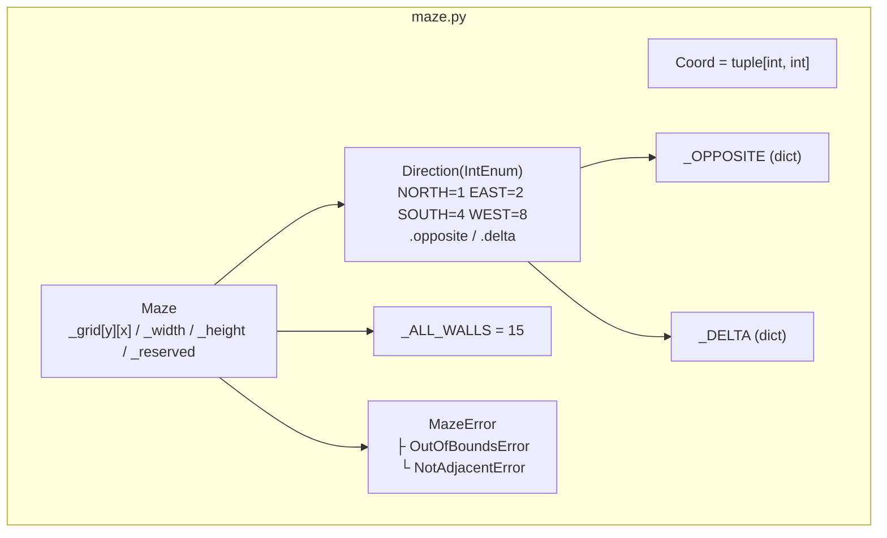
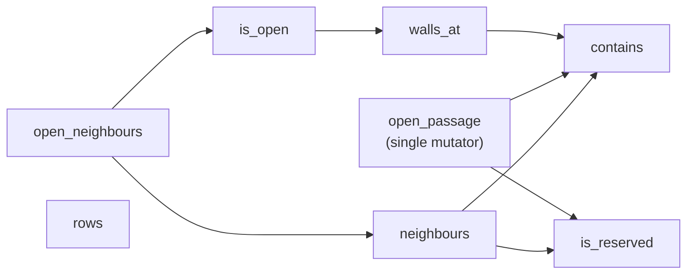

# 1. Maze Data Structure — `maze/maze.py`

|                    |                                                                                                                                                        |
| ------------------ | ------------------------------------------------------------------------------------------------------------------------------------------------------ |
| **Author**         | so                                                                                                                                                     |
| **Consumers**      | Generator (Chapter 3), Solver (Chapter 4), Writer (Chapter 5), Display (Chapter 6)                                                                     |
| **Design Records** | [`maze-data-structure.md`](../implementation_plans/maze-data-structure.md), Decisions 3.1–3.3 ([`01_kickoff.md`](../pair_communication/01_kickoff.md)) |

## What this chapter covers

- Internal maze representation in memory (cells, walls, bitmasks)
- Operation of all methods on `Direction` and `Maze`
- Structural coherence enforcement (ensuring shared walls never mismatch via `open_passage`)
- Distinction between "adjacent neighbours" (`neighbours`) and "walkable neighbours" (`open_neighbours`)

---

## 1. Foundational Concepts

### 1.1 Cells and Walls

A maze is arranged as a 2D grid of discrete **cells**. Each cell has four perimeter **walls** corresponding to the cardinal directions (North, East, South, West), and each wall is either closed or open.

```text
        North (N)
      +-------+
 West |  Cell | East
 (W)  +-------+  (E)
        South (S)
```

Two adjacent cells **share a single common wall**. For instance, the East wall of cell `(0, 0)` and the West wall of cell `(1, 0)` are the exact same physical barrier.

```text
   (0,0)   (1,0)
  +-----+-----+
  |     |     |     ← This vertical segment is (0,0)'s East wall AND (1,0)'s West wall
  +-----+-----+
```

### 1.2 Coordinate System

Coordinates follow `(x, y)` ordering. `x` is the column index (from left: 0, 1, 2, ...), and `y` is the row index (from top: 0, 1, 2, ...). **`y` increases downwards**, mirroring screen raster coordinates rather than Cartesian math plots.

```text
         x=0     x=1     x=2
y=0    (0,0)   (1,0)   (2,0)
y=1    (0,1)   (1,1)   (2,1)
```

The type alias `Coord = tuple[int, int]` consistently denotes this coordinate pair.

### 1.3 4-Bit Wall Bitmasks

Subject §IV.5 requires encoding each cell's four wall states into a **single hexadecimal character**. A single hex digit spans 0–15 (`0x0`–`0xf`), corresponding to exactly **4 bits** in binary. Each bit maps to one cardinal direction:

| Bit Index                 | Decimal Value | Direction |
| ------------------------- | ------------- | --------- |
| Bit 0 (Least Significant) | 1             | North (N) |
| Bit 1                     | 2             | East (E)  |
| Bit 2                     | 4             | South (S) |
| Bit 3 (Most Significant)  | 8             | West (W)  |

**Bit convention: 1 represents a closed wall; 0 represents an open passage.**

```text
Mask 13 = Binary 1101

   W   S   E   N        ← Powers of two: 8, 4, 2, 1
   1   1   0   1
 Close Close Open Close   → Only East is open
```

A freshly initialized cell has all four walls closed: `1111` = 15 = hexadecimal `f`.

→ Conceptual notes: [`learning_log/bitmask-wall-encoding.md`](../learning_log/bitmask-wall-encoding.md)

### 1.4 Bitwise Manipulation Primitives

| Operator      | Bitwise Operation         | Purpose in this Module                             |
| ------------- | ------------------------- | -------------------------------------------------- |
| `a & b` (AND) | 1 only if both bits are 1 | **Test** whether a specific wall bit is set        |
| `a \| b` (OR) | 1 if either bit is 1      | **Set** bits (e.g. constructing `_ALL_WALLS = 15`) |
| `~b` (NOT)    | Invert all bits (0 ↔ 1)   | `mask & ~d` **clears** a single bit (opens a wall) |

```text
Testing:  13 & 2  =  1101 & 0010  =  0000  = 0   → East bit is 0 → East is open
Clearing: 15 & ~2 =  1111 & 1101  =  1101  = 13  → Only the East bit is cleared
```

---

## 2. Architecture Overview



### Method Call Graph



`rows` iterates internal grid rows directly and invokes no subsidiary methods.

---

## 3. Module Constants

| Constant     | Value                                                          | Purpose                                                             |
| ------------ | -------------------------------------------------------------- | ------------------------------------------------------------------- |
| `Coord`      | `tuple[int, int]`                                              | Type alias for coordinates `(x, y)`                                 |
| `_OPPOSITE`  | `{NORTH: SOUTH, EAST: WEST, SOUTH: NORTH, WEST: EAST}`         | Maps reverse direction; backing table for `Direction.opposite`      |
| `_DELTA`     | `{NORTH: (0, -1), EAST: (1, 0), SOUTH: (0, 1), WEST: (-1, 0)}` | Positional offset for one step; backing table for `Direction.delta` |
| `_ALL_WALLS` | `NORTH \| EAST \| SOUTH \| WEST` = 15                          | Fully closed cell bitmask (`1111` binary = `0xf`)                   |

The dictionaries are defined immediately following the `Direction` enum declaration.

---

## 4. `Direction` — Cardinal Directions

```python
class Direction(IntEnum):
    NORTH = 1  # bit 0
    EAST = 2   # bit 1
    SOUTH = 4  # bit 2
    WEST = 8   # bit 3
```

**Member values correspond directly to their bit flags.** Writing `mask & Direction.EAST` directly inspects the East wall.

| Member  | Value | `delta` (Offset) | `opposite` |
| ------- | ----- | ---------------- | ---------- |
| `NORTH` | 1     | `(0, -1)`        | `SOUTH`    |
| `EAST`  | 2     | `(1, 0)`         | `WEST`     |
| `SOUTH` | 4     | `(0, 1)`         | `NORTH`    |
| `WEST`  | 8     | `(-1, 0)`        | `EAST`     |

### `opposite` (property)

- **Purpose:** Returns the reciprocal direction viewed from the neighbouring cell. Cell `(0, 0)`'s `EAST` wall is cell `(1, 0)`'s `WEST` wall.
- **Rationale:** Carving passages requires clearing bits on both adjacent cells simultaneously in `open_passage`.

### `delta` (property)

- **Purpose:** Returns the coordinate offset `(dx, dy)` when stepping one cell in this direction.
- **Usage:** Adding `(x + dx, y + dy)` yields the target cell position. Stepping North decreases `y`, yielding `(0, -1)`.

### Iteration Order

Iterating `for d in Direction:` proceeds deterministically through **N → E → S → W**. This sequence defines the neighbour discovery order in `neighbours`, influencing DFS carving paths and tie-breaking in BFS pathfinding.

---

## 5. Exception Classes

| Class              | Base Class  | Raised When                                                                                                      |
| ------------------ | ----------- | ---------------------------------------------------------------------------------------------------------------- |
| `MazeError`        | `Exception` | Base exception for maze domain errors. Raised directly if an attempt is made to open a wall into a reserved cell |
| `OutOfBoundsError` | `MazeError` | Coordinates lie outside `[0, width)` or `[0, height)`                                                            |
| `NotAdjacentError` | `MazeError` | Attempting to open a passage between non-adjacent cells or identical cells                                       |

---

## 6. `Maze` Class

### 6.1 State Attributes

| Attribute   | Type               | Description                                                             |
| ----------- | ------------------ | ----------------------------------------------------------------------- |
| `_grid`     | `list[list[int]]`  | 2D list of integer wall masks, indexed as **`_grid[y][x]`** (row first) |
| `_width`    | `int`              | Total columns in the maze grid                                          |
| `_height`   | `int`              | Total rows in the maze grid                                             |
| `_reserved` | `frozenset[Coord]` | Immutable set of reserved coordinates forming the "42" pattern          |

**Transposition from `(x, y)` to `_grid[y][x]` is strictly encapsulated within this class.** Callers interface exclusively with `(x, y)` coordinates.

### 6.2 Class Invariants

1. Every cell mask resides in the interval `[0, 15]`.
2. **Shared wall consistency is strictly maintained:** if cell `(x, y)` has its East wall open, cell `(x + 1, y)` always has its West wall open.
3. Reserved pattern cells maintain bitmask `15` (`0xf`) permanently.
4. Maze dimensions are immutable post-construction.

Invariants 2 and 3 are guaranteed because all mutations funnel exclusively through `open_passage`.

### 6.3 `__init__(self, width, height, reserved=frozenset())`

- **Purpose:** Constructs an uncarved maze where all cells start with mask `15`.
- **Steps:**
  1. If `width < 1` or `height < 1`, raise `ValueError` (caught upstream by generator).
  2. Instantiate grid via `[[_ALL_WALLS] * width for _ in range(height)]`.
  3. Store dimensions and freeze `reserved`.
- **Note on Grid Allocation:** Writing `[[15] * width] * height` would cause all rows to reference the identical list in memory, causing a mutation in one cell to reflect across every row. The list comprehension ensures each row is an independently allocated list.

### 6.4 Read-Only Properties

- `width`: returns `_width`
- `height`: returns `_height`
- `reserved`: returns `_reserved` (`frozenset[Coord]`)

### 6.5 `contains(self, pos: Coord) -> bool`

Returns `True` if `0 <= x < self.width and 0 <= y < self.height`.

Guards against Python negative list indexing (`lst[-1]`), which would otherwise silently access the opposite boundary of the grid.

### 6.6 `is_reserved(self, pos: Coord) -> bool`

Returns `pos in self.reserved`. Out-of-bounds positions safely evaluate to `False`.

### 6.7 `walls_at(self, pos: Coord) -> int`

Returns the integer mask (`0`–`15`) for the specified cell. Directly provides the hexadecimal character written to the output file. Raises `OutOfBoundsError` if `pos` fails `contains`.

### 6.8 `is_open(self, pos: Coord, direction: Direction) -> bool`

Returns `True` if the specified wall is open:

```python
mask = self.walls_at(pos)
return ((mask & direction) == 0)
```

### 6.9 `open_passage(self, a: Coord, b: Coord) -> None` — Single Mutator

Opens the shared wall between orthogonal neighbours `a` and `b`, clearing both reciprocal bit flags simultaneously.

**Validation Order:**

1. `a` inside grid → else `OutOfBoundsError`
2. `b` inside grid → else `OutOfBoundsError`
3. `a != b` → else `NotAdjacentError`
4. `a` not reserved → else `MazeError`
5. `b` not reserved → else `MazeError`
6. `a` and `b` orthogonally adjacent → else `NotAdjacentError`

**Core Implementation:**

```python
for d in Direction:
    if (bx - ax, by - ay) == d.delta:
        self._grid[ay][ax] = self._grid[ay][ax] & ~d
        oppo_d = d.opposite
        self._grid[by][bx] = self._grid[by][bx] & ~oppo_d
        return
raise NotAdjacentError(...)
```

**Concrete Execution Trace:** Carving between `(0, 0)` and `(1, 0)` on a $2 \times 2$ maze:

```text
delta = (1-0, 0-0) = (1, 0) == EAST.delta → d = EAST (2), d.opposite = WEST (8)

(0,0): 15 & ~2  = 1111 & 1101 = 1101 = 13 (East wall opened)
(1,0): 15 & ~8  = 1111 & 0111 = 0111 = 7  (West wall opened)

Verification:
  is_open((0,0), EAST)  → True
  is_open((1,0), WEST)  → True
  is_open((0,0), SOUTH) → False (untouched)
```

Opening an already open passage is an idempotent no-op without error.

### 6.10 `neighbours(self, pos: Coord)` — Spatial Neighbours

Generator yielding `(Direction, Coord)` for all non-reserved adjacent cells inside the grid:

```python
for d in Direction:
    dx, dy = d.delta
    npos = (x + dx, y + dy)
    if self.contains(npos) and not self.is_reserved(npos):
        yield (d, npos)
```

Ignores wall states; used primarily by the backtracker during **carving**.

### 6.11 `open_neighbours(self, pos: Coord)` — Walkable Neighbours

Generator yielding `Coord` exclusively for neighbouring cells where the connecting wall is **open**:

```python
for d, npos in self.neighbours(pos):
    if self.is_open(pos, d):
        yield npos
```

Used when traversing the maze (counting dead ends during braiding, BFS pathfinding).

| Feature           | `neighbours`                     | `open_neighbours`                                      |
| ----------------- | -------------------------------- | ------------------------------------------------------ |
| Question Answered | What cells border this location? | Where can I physically walk?                           |
| Wall Condition    | Ignored                          | Must be open                                           |
| Yields            | `tuple[Direction, Coord]`        | `Coord`                                                |
| Primary Usage     | DFS carving (Chapter 3)          | Dead-end braiding (Chapter 3), BFS solving (Chapter 4) |

### 6.12 `rows(self)` — Grid Read Accessor

Generator yielding each row of masks as an immutable `tuple[int, ...]`:

```python
for row in self._grid:
    yield tuple(row)
```

Yielding tuples prevents external code from mutating internal grid rows, preserving class invariants.

---

## 7. Caveats & Common Misconceptions

| Misconception                             | Reality                                                                             |
| ----------------------------------------- | ----------------------------------------------------------------------------------- |
| Bit 1 means open wall                     | **Inverse: 1 indicates closed wall; 0 indicates open passage.** Initial mask is 15. |
| Grid indexing is `_grid[x][y]`            | Internal grid is stored row-major as `_grid[y][x]`.                                 |
| `[[15] * w] * h` correctly allocates grid | Shares references across all rows; list comprehension must be used.                 |
| `neighbours` returns walkable cells       | `neighbours` ignores walls; `open_neighbours` tests for open passages.              |
| Generators can be re-iterated             | Exhausted after a single traversal. Cast to `list()` if reused.                     |
| Can modify `_grid` directly               | Bypassing `open_passage` risks desynchronizing shared wall states.                  |

---

## Related Documentation

- Design contract: [`implementation_plans/maze-data-structure.md`](../implementation_plans/maze-data-structure.md)
- Learning logs: [`bitmask-wall-encoding.md`](../learning_log/bitmask-wall-encoding.md), [`python-enum-and-property.md`](../learning_log/python-enum-and-property.md)
- Tests: `tests/test_maze.py` (Chapter 9)
- Next chapter: [2. Configuration Parsing](02_config-en.md)
