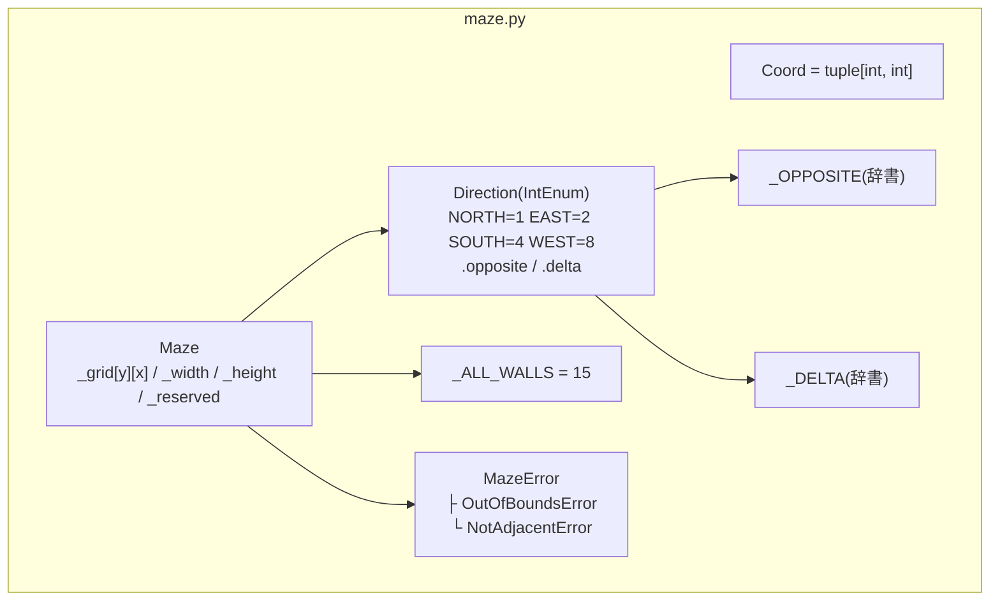
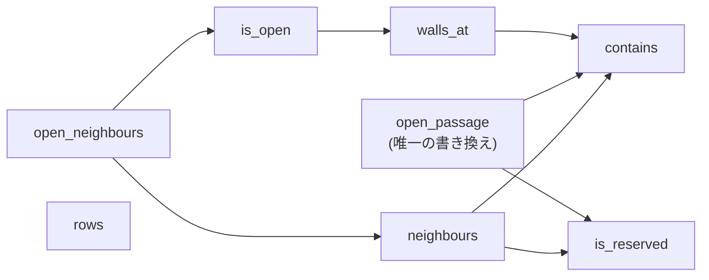

# 1. 迷路のデータ構造 — `maze/maze.py`

| | |
| --- | --- |
| **書いた人** | so |
| **使う側** | 生成器(3 章)、ソルバー(4 章)、出力(5 章)、表示(6 章) |
| **設計の記録** | [`maze-data-structure.md`](../implementation_plans/maze-data-structure.md)、決定 3.1〜3.3([`01_kickoff.md`](../pair_communication/01_kickoff.md)) |

## この章で分かること

- 迷路をコンピュータの中でどう表しているか(セル・壁・ビット)
- `Direction` と `Maze` のすべてのメソッドの働き
- 壁の情報が食い違わないようにする仕組み(`open_passage` だけが壁を開ける)
- 「隣のセル」と「通れる隣のセル」の違い

---

## 1. そもそもの概念

### 1.1 セルと壁

迷路は、マス目(**セル**)が縦横に並んだものです。各セルには北・東・南・西の 4 つの**壁**があり、それぞれ「閉じている」か「開いている」のどちらかです。

```text
        北 (N)
      +-------+
 西 (W) | セル  | 東 (E)
      +-------+
        南 (S)
```

隣り合う 2 つのセルは、1 枚の壁を**共有**しています。(0,0) の東の壁と、(1,0) の西の壁は、同じ 1 枚の壁です。

```text
   (0,0)   (1,0)
  +-----+-----+
  |     |     |     ← この縦線 1 本が、(0,0) の東の壁でもあり、(1,0) の西の壁でもある
  +-----+-----+
```

### 1.2 座標

座標は `(x, y)` です。`x` は列(左から 0, 1, 2, …)、`y` は行(上から 0, 1, 2, …)で、**`y` は下に向かって増えます。** 数学のグラフとは上下が逆なので注意してください。

```text
         x=0     x=1     x=2
y=0    (0,0)   (1,0)   (2,0)
y=1    (0,1)   (1,1)   (2,1)
```

型の別名 `Coord = tuple[int, int]` が、この `(x, y)` を表します。

### 1.3 4 つの壁を 1 つの整数で表す(ビットマスク)

subject §IV.5 は、1 つのセルの 4 つの壁を **16 進数 1 桁**で書くことを求めています。16 進数 1 桁は 0〜15 で、これは **4 ビット**(2 進数 4 桁)です。4 つのビットに、4 つの壁を 1 つずつ割り当てます。

| ビットの位置 | 値 | 壁 |
| --- | --- | --- |
| 0 番目(一番右) | 1 | 北 N |
| 1 番目 | 2 | 東 E |
| 2 番目 | 4 | 南 S |
| 3 番目(一番左) | 8 | 西 W |

**ビットが 1 なら壁は閉じている、0 なら開いている**、と決めています。

```text
マスク 13 = 2 進数 1101

   W   S   E   N        ← 左から 8, 4, 2, 1 の位
   1   1   0   1
   閉  閉  開  閉        → 東だけが開いている
```

新しいセルは全部の壁が閉じているので、`1111` = 15 = 16 進数の `f` です。

→ 学習ノート [`bitmask-wall-encoding.md`](../learning_log/bitmask-wall-encoding.md)

### 1.4 ビット演算の 3 つの道具

| 演算 | 意味 | この章での使い方 |
| --- | --- | --- |
| `a & b`(AND) | 両方 1 のところだけ 1 | 「その壁のビットが立っているか」を**調べる** |
| `a \| b`(OR) | どちらか 1 なら 1 | ビットを**立てる**(全部閉じた 15 を作る) |
| `~b`(NOT) | 0 と 1 を反転 | `mask & ~d` で、その 1 ビットだけを**消す**(壁を開ける) |

```text
調べる:  13 & 2  =  1101 & 0010  =  0000  = 0   → 東のビットは 0 → 東は開いている
消す:    15 & ~2 =  1111 & 1101  =  1101  = 13  → 東のビットだけ消えた
```

---

## 2. 全体図



### メソッドの呼び出し関係



`rows` は内部の格子を読むだけで、他のメソッドを呼びません。

---

## 3. モジュールの定数

| 名前 | 値 | 意味 |
| --- | --- | --- |
| `Coord` | `tuple[int, int]` | 座標 `(x, y)` の型の別名 |
| `_OPPOSITE` | `{NORTH: SOUTH, EAST: WEST, SOUTH: NORTH, WEST: EAST}` | 反対の向き。`Direction.opposite` が使う |
| `_DELTA` | `{NORTH: (0, -1), EAST: (1, 0), SOUTH: (0, 1), WEST: (-1, 0)}` | その向きに 1 歩進んだときの座標の変化。`Direction.delta` が使う |
| `_ALL_WALLS` | `NORTH \| EAST \| SOUTH \| WEST` = 15 | 全部の壁が閉じたマスク。新しいセルの値 |

2 つの辞書は `Direction` クラスの**後**に定義されています。プロパティが呼ばれるのは実行中なので、その時点では辞書ができていて問題ありません。

---

## 4. `Direction` — 4 つの向き

```python
class Direction(IntEnum):
    NORTH = 1  # bit 0
    EAST = 2   # bit 1
    SOUTH = 4  # bit 2
    WEST = 8   # bit 3
```

**値がそのままビットです。** `mask & Direction.EAST` と書けば東の壁を調べられます。

| メンバー | 値 | `delta`(1 歩の変化) | `opposite` |
| --- | --- | --- | --- |
| `NORTH` | 1 | `(0, -1)` | `SOUTH` |
| `EAST` | 2 | `(1, 0)` | `WEST` |
| `SOUTH` | 4 | `(0, 1)` | `NORTH` |
| `WEST` | 8 | `(-1, 0)` | `EAST` |

(実際にコードを動かして得た値です。)

### `opposite`(プロパティ)

**何をするか:** 同じ壁を、隣のセルから見たときの向きを返します。(0,0) の `EAST` の壁は、(1,0) から見ると `WEST` です。

**なぜ必要か:** 壁を開けるとき、両側のセルのビットを両方とも消す必要があるからです(`open_passage`)。

### `delta`(プロパティ)

**何をするか:** その向きに 1 歩進んだときの `(x の変化, y の変化)` を返します。**位置ではなく、差分**です。

**使い方:** `(x + dx, y + dy)` で隣のセルの座標が分かります。北は `y` が小さくなる方向なので `(0, -1)` です。

### 回る順番

`for d in Direction:` は **N → E → S → W** の順に回ります。この順番は、隣のセルを調べる順番(`neighbours`)を決め、その結果、迷路の掘り方や最短経路の選び方にまで影響します。**同じシードから同じ迷路ができる**のは、この順番が固定されているからでもあります。

---

## 5. 例外クラス

| クラス | 親 | いつ投げられるか |
| --- | --- | --- |
| `MazeError` | `Exception` | このモジュールのエラーの親。確保セルの壁を開けようとしたときは、この親クラスそのものが投げられる |
| `OutOfBoundsError` | `MazeError` | 盤面の外の座標を渡した |
| `NotAdjacentError` | `MazeError` | 隣り合っていない 2 つのセルの間の壁を開けようとした |

どのクラスも本体は docstring だけで、「名前でエラーの種類を区別する」ために存在します。

---

## 6. `Maze` — 迷路そのもの

### 6.1 持っているデータ

| 属性 | 型 | 意味 |
| --- | --- | --- |
| `_grid` | `list[list[int]]` | セルのマスクの格子。**`_grid[y][x]`** の順で並ぶ(行が先) |
| `_width` | `int` | 横のセル数 |
| `_height` | `int` | 縦のセル数 |
| `_reserved` | `frozenset[Coord]` | 確保セル(「42」)の集合 |

**`(x, y)` と `[y][x]` の入れ替えは、このクラスの中だけで起きます。** 外のコードはすべて `(x, y)` で話し、格子の並び順を知る必要がありません。

### 6.2 不変条件(いつも成り立っていること)

1. 各マスクは 0〜15。
2. **共有する壁の 2 つの記録は、必ず一致する。**((0,0) の東が開いていれば、(1,0) の西も開いている)
3. 確保セルのマスクは常に 15。
4. 大きさは作った後に変わらない。

2 と 3 を守っているのが、**壁を書き換える唯一の方法 `open_passage`** です。

### 6.3 `__init__(self, width, height, reserved=frozenset())`

**何をするか:** 全部の壁が閉じた迷路を作ります。

**処理の手順:**

1. `width < 1` または `height < 1` なら `ValueError` を投げる(`MazeError` ではない点に注意。通常は生成器が先に止める)。
2. `[[_ALL_WALLS] * width for _ in range(height)]` で格子を作る。
3. 大きさと確保セルを保存する。

**2 の書き方の理由:** `[[15] * width] * height` と書くと、**すべての行が同じリストを共有**してしまい、1 つのセルを変えると同じ列の全行が変わります。内包表記(`for _ in range(height)`)で、行ごとに別のリストを作っています。行の中の `* width` は、整数が変更できない値なので問題ありません。

**`reserved` は検証しません。** 盤面の外の座標が入っていても受け入れます(生成器は常に盤面の中の座標を渡します)。

### 6.4 読み取り専用のプロパティ

| プロパティ | 返すもの |
| --- | --- |
| `width` | `_width` |
| `height` | `_height` |
| `reserved` | `_reserved`(変更できない `frozenset`) |

### 6.5 `contains(self, pos) -> bool`

**何をするか:** 座標が盤面の中かどうかを返します。

```python
x, y = pos
return (0 <= x < self.width and 0 <= y < self.height)
```

**なぜ必要か:** Python のリストは、**負の添字を後ろからの位置として受け付けます**(`lst[-1]` は最後の要素)。確かめずに `_grid[y][x]` を読むと、`(-1, 0)` が黙って右端のセルを返してしまいます。すべての読み取りの前に、これで守っています。

### 6.6 `is_reserved(self, pos) -> bool`

**何をするか:** そのセルが確保セル(「42」)かどうかを返します。本体は `return pos in self.reserved` の 1 行です。

**盤面の外でもエラーにしません。** 集合に入っていないので `False` が返るだけです。

### 6.7 `walls_at(self, pos) -> int`

**何をするか:** そのセルのマスク(0〜15)を返します。**この値が、そのまま出力ファイルの 16 進数 1 桁になります。**

**処理:** `contains` で確かめ、外なら `OutOfBoundsError`。中なら `_grid[y][x]` を返します(ここで `(x, y)` が `[y][x]` に入れ替わる)。

### 6.8 `is_open(self, pos, direction) -> bool`

**何をするか:** そのセルの、その向きの壁が開いているかを返します。

```python
mask = self.walls_at(pos)
return ((mask & direction) == 0)
```

ビットが 0 なら開いている、という約束をそのまま書いています。盤面の外のチェックは `walls_at` に任せています。

### 6.9 `open_passage(self, a, b) -> None` — 唯一の書き換え

**何をするか:** 隣り合う 2 つのセル `a` と `b` の間の壁を開けます。**両側のセルのビットを同時に消す**ので、壁の記録が食い違うことはありません。

**確かめる順番:**

| 順 | 条件 | 投げる例外 |
| --- | --- | --- |
| 1 | `a` が盤面の外 | `OutOfBoundsError("a is outside the grid: ...")` |
| 2 | `b` が盤面の外 | `OutOfBoundsError("b is outside the grid: ...")` |
| 3 | `a == b` | `NotAdjacentError("a and b are the same cell: ...")` |
| 4 | `a` が確保セル | `MazeError('a is reserved for the "42" pattern: ...')` |
| 5 | `b` が確保セル | `MazeError('b is reserved for the "42" pattern: ...')` |
| 6 | 4 つの向きのどれとも隣り合っていない | `NotAdjacentError("... are not orthogonally adjacent")` |

**本体(6 番目):**

```python
for d in Direction:
    if (bx - ax, by - ay) == d.delta:
        self._grid[ay][ax] = self._grid[ay][ax] & ~d
        oppo_d = d.opposite
        self._grid[by][bx] = self._grid[by][bx] & ~oppo_d
        return
raise NotAdjacentError(...)
```

`b - a` の差が、どの向きの `delta` と一致するかで向き `d` を決めます。`a` からは `d` のビットを、`b` からは反対の向き `d.opposite` のビットを消します。斜めや離れたセルは、どの `delta` とも一致しないので、ループを抜けてエラーになります。

**トレース(実際に実行した値):** 2 × 2 の迷路で `(0,0)` と `(1,0)` の間を開ける

```text
差 = (1-0, 0-0) = (1, 0) = EAST.delta → d = EAST(2)、d.opposite = WEST(8)

(0,0):  15 & ~2  =  1111 & 1101  =  1101  = 13   東が開いた
(1,0):  15 & ~8  =  1111 & 0111  =  0111  =  7   西が開いた

確認:  is_open((0,0), EAST) → True
       is_open((1,0), WEST) → True
       is_open((0,0), SOUTH) → False(触っていない)
```

**もう開いている壁を開けても、何も変わらず、エラーにもなりません**(ビットを消す操作は 2 回やっても同じ)。これは便利ですが、生成器の 3 章で「同じ壁を 2 回選んでもループが増えない」落とし穴の原因になりました。

### 6.10 `neighbours(self, pos)` — 隣のセル(壁は無視)

**何をするか:** 盤面の中にあり、確保セルでない隣のセルを、`(向き, 座標)` の組で 1 つずつ渡します(ジェネレータ)。

```python
for d in Direction:                     # N, E, S, W の順
    dx, dy = d.delta
    npos = (x + dx, y + dy)
    if self.contains(npos) and not self.is_reserved(npos):
        yield (d, npos)
```

**壁が開いているかは見ません。** 「隣に何があるか」だけに答えます。迷路を**掘る**ときに使います。

**トレース:** 3 × 3 で (1,0) が確保セルのとき

```text
neighbours((0,0))  → [(SOUTH, (0, 1))]
                     北は盤面の外、東 (1,0) は確保セル、西は盤面の外 → 南だけ

neighbours((1,1))  → [(EAST, (2, 1)), (SOUTH, (1, 2)), (WEST, (0, 1))]
                     北 (1,0) は確保セルなので出てこない
```

**注意:** ジェネレータなので、盤面の外の `pos` を渡しても、**最初の値を求めた時点で**初めて `OutOfBoundsError` になります。

### 6.11 `open_neighbours(self, pos)` — 通れる隣のセル

**何をするか:** `neighbours` のうち、**共有する壁が開いている**セルだけを渡します(ジェネレータ)。

```python
for d, npos in self.neighbours(pos):
    if self.is_open(pos, d):
        yield npos
```

迷路を**歩く**(行き止まりを数える、最短経路を探す)ときに使います。

| | `neighbours` | `open_neighbours` |
| --- | --- | --- |
| 答える問い | 隣に何があるか | どこへ歩いて行けるか |
| 壁 | 見ない | 開いているものだけ |
| 渡すもの | `(向き, 座標)` | 座標だけ |
| 使う場面 | 掘る(3 章) | 歩く(3 章の行き止まり、4 章) |

**トレース:** 上の 2 × 2 で (0,0)–(1,0) を開けた後、`list(open_neighbours((0,0)))` → `[(1, 0)]`

### 6.12 `rows(self)` — 格子全体を見る唯一の方法

**何をするか:** 上の行から順に、1 行分のマスクを**タプル**で渡します(ジェネレータ)。

```python
for row in self._grid:
    yield tuple(row)
```

**なぜタプルか:** 内部のリストをそのまま渡すと、受け取った側が書き換えられてしまい、不変条件が壊れます。タプルは変更できないので安全です。

**トレース:** 新しい 2 × 2 → `[(15, 15), (15, 15)]`

---

## 7. 注意点・よくある誤解

| 誤解 | 実際 |
| --- | --- |
| ビットが 1 なら開いている | **逆。1 が閉じている。** 新しいセルは 15(全部閉) |
| `(x, y)` のまま `_grid[x][y]` で読める | 格子は `_grid[y][x]`。入れ替えは `Maze` の中だけで起きる |
| `[[15] * w] * h` で格子が作れる | 全行が同じリストを共有する。内包表記で作る |
| `neighbours` は通れる隣を返す | 壁を無視する。通れる隣は `open_neighbours` |
| ジェネレータは何度でも回せる | 1 回だけ。2 回使うなら `list(...)` |
| 壁を開けるのに `_grid` を直接書き換えてよい | `open_passage` 以外で書くと、両側の記録が食い違いうる |
| `Maze(0, 5)` は `MazeError` | `ValueError`(ただし通常は生成器が先に `GenerationError` で止める) |

---

## 関連文書

- [`maze-data-structure.md`](../implementation_plans/maze-data-structure.md) — このクラスの設計(契約)
- 学習ノート:[`bitmask-wall-encoding.md`](../learning_log/bitmask-wall-encoding.md)、[`python-enum-and-property.md`](../learning_log/python-enum-and-property.md)、[`python-generators.md`](../learning_log/python-generators.md)
- テスト:`tests/test_maze.py`(9 章)
- 次の章:[2. 設定ファイルの読み込み](02_config.md)
