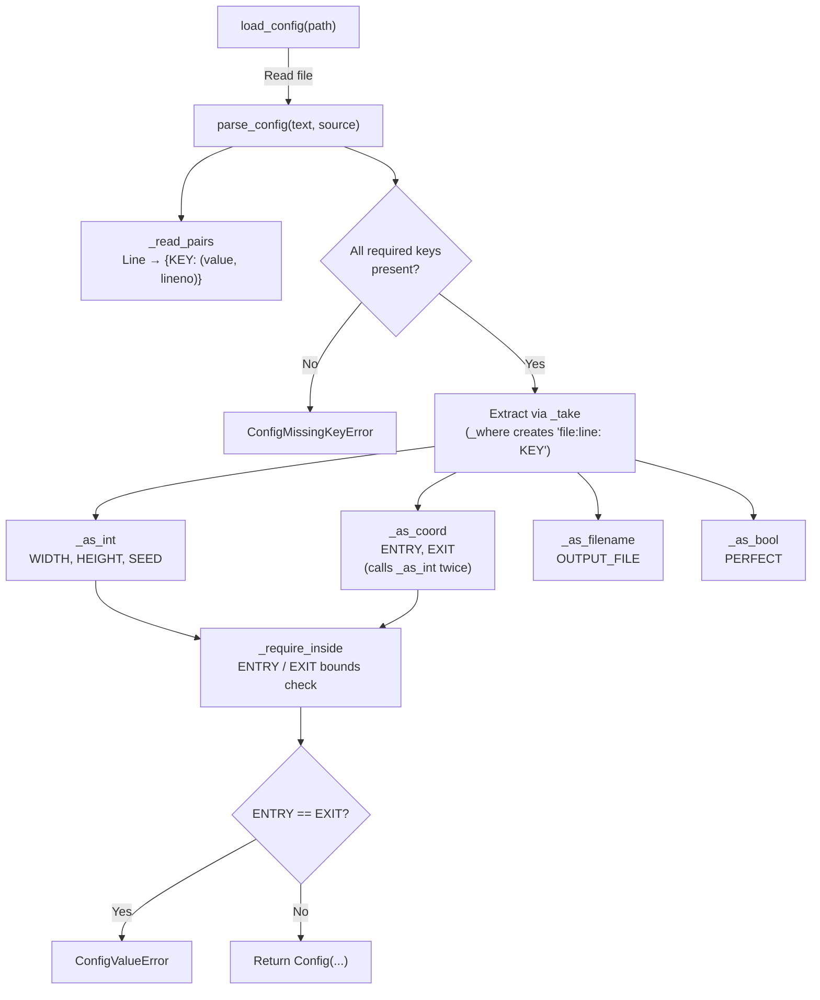

# 2. Configuration Parsing — `maze/config.py`

|                    |                                                                                              |
| ------------------ | -------------------------------------------------------------------------------------------- |
| **Author**         | so                                                                                           |
| **Consumer**       | `a_maze_ing.py` (Chapter 7)                                                                  |
| **Design Records** | [`config-parser.md`](../implementation_plans/config-parser.md) (31 edge cases), Decision 3.9 |

## What this chapter covers

- Configuration file syntax and directives
- Step-by-step pipeline transforming raw text into a validated `Config` object
- Inventory of all configuration error messages with real examples
- Architectural rationale behind type-specific converter functions

---

## 1. Foundational Concepts

### 1.1 The Configuration File is the Program's Sole Input

Subject §IV.2 fixes the invocation command to `python3 a_maze_ing.py config.txt`. **Every runtime parameter available to the user must be expressed as a line in this file.**

Because configuration files are authored manually in text editors, human syntax errors are inevitable. §IV.2 mandates that "the program must never crash unexpectedly." Consequently, this module is designed to catch any syntax or semantic mistake, reporting the exact file, line number, and cause.

Once validated by `parse_config`, **no downstream module verifies these parameters again**. The generator, solver, and display rely completely on the guarantees provided by `Config`.

### 1.2 Default `config.txt`

```text
# A-Maze-ing configuration. Used as: python3 a_maze_ing.py config.txt
# One KEY=VALUE per line. A line starting with '#' is ignored.

WIDTH=20
HEIGHT=15

# ENTRY and EXIT are x,y with the origin at the top-left corner,
# so the far corner of a 20x15 maze is 19,14 -- not 20,15.
ENTRY=0,0
EXIT=19,14

OUTPUT_FILE=maze.txt

# True gives exactly one route between entry and exit.
PERFECT=False

# Optional. The same seed always builds the same maze; left out here so
# that each run differs.
#SEED=42
```

Because `#SEED=42` is commented out, `seed` defaults to `None`, producing a non-deterministic seed for each run.

Three sample configurations are maintained under `config_file_examples/`:

| File                 | Dimensions | Exit    | Output Target      | Mode    | Seed  | Purpose                               |
| -------------------- | ---------- | ------- | ------------------ | ------- | ----- | ------------------------------------- |
| `config_large.txt`   | 40 × 25    | `39,24` | `maze_large.txt`   | `False` | 999   | Large board validation                |
| `config_perfect.txt` | 20 × 15    | `19,14` | `maze_perfect.txt` | `True`  | 12345 | Perfect maze mode                     |
| `config_small.txt`   | 8 × 6      | `7,5`   | `maze_small.txt`   | `False` | None  | Triggers omitted "42" pattern warning |

---

## 2. Syntax Specification

| Element         | Rule                                                                                                                                                                                        |
| --------------- | ------------------------------------------------------------------------------------------------------------------------------------------------------------------------------------------- |
| Line Delimiters | Accepts `\n`, `\r\n`, or `\r` (`str.splitlines()`)                                                                                                                                          |
| Whitespace      | Surrounding whitespace is stripped from lines, keys, and values (`  WIDTH = 20  ` → `WIDTH` and `20`)                                                                                       |
| Empty Lines     | Ignored                                                                                                                                                                                     |
| Comments        | Lines whose first non-whitespace character is `#` are ignored. **Inline comments are NOT supported** (`WIDTH=20 # comment` parses value as `"20 # comment"`, triggering a conversion error) |
| Format          | `KEY=VALUE`, partitioned on the **first `=`** (allowing values to contain `=` characters)                                                                                                   |
| Keys            | Non-empty. Normalized to uppercase per §IV.3 (`width=20` and `WIDTH=20` are both accepted)                                                                                                  |
| Duplicate Keys  | Defining the same key twice is rejected as an error, even if unknown                                                                                                                        |
| Unknown Keys    | Preserved and ignored per §IV.3 extensibility rules                                                                                                                                         |

### Supported Keys and Values

| Key           | Required? | Value Format | Validation Rules                                                    |
| ------------- | :-------: | ------------ | ------------------------------------------------------------------- |
| `WIDTH`       |  **Yes**  | Integer      | $\ge 1$                                                             |
| `HEIGHT`      |  **Yes**  | Integer      | $\ge 1$                                                             |
| `ENTRY`       |  **Yes**  | `x,y`        | Exactly one comma; non-negative integers; `x < WIDTH`, `y < HEIGHT` |
| `EXIT`        |  **Yes**  | `x,y`        | Same as `ENTRY`; must not equal `ENTRY`                             |
| `OUTPUT_FILE` |  **Yes**  | String       | Non-empty string (path writability verified at write time)          |
| `PERFECT`     |  **Yes**  | Boolean      | Exactly `"True"` or `"False"` (`"true"`, `"1"`, `"yes"` rejected)   |
| `SEED`        |    No     | Integer      | Signed integer (optional)                                           |

**What this module deliberately does NOT check:** Whether entry/exit sit on outer perimeter walls, whether corridors are reachable, or the minimum $3 \times 2$ constraint for `PERFECT=False` (which is checked downstream by the generator).

---

## 3. Architecture Overview



Processing is bifurcated into two distinct layers:

| Layer               | Functions                                  | Responsibility                                                            |
| ------------------- | ------------------------------------------ | ------------------------------------------------------------------------- |
| **Syntactic Layer** | `_read_pairs`                              | Splits text into raw `KEY` and `VALUE` strings; ignores semantics         |
| **Semantic Layer**  | `_as_*`, `_require_inside`, `parse_config` | Converts strings to typed values, checks bounds and relational invariants |

---

## 4. `Config` Dataclass

```python
@dataclass(frozen=True)
class Config:
    width: int
    height: int
    entry: Coord
    exit: Coord
    output_file: str
    perfect: bool
    seed: int | None = None
```

- **`frozen=True`:** Prevents mutation post-instantiation.
- **`seed: int | None = None`:** Distinguishes omitted seeds (`None`) from seed `0`, which is a valid deterministic integer seed.
- **Independence:** Defines a local `Coord = tuple[int, int]` alias without importing `maze.maze`, maintaining modular decoupling.

---

## 5. Exception Classes

```text
ConfigError                     Base exception for configuration parsing
├── ConfigFileError             I/O errors (missing file, directory, permissions, encoding)
├── ConfigSyntaxError           Malformed line lacking '=' or key
├── ConfigValueError            Invalid value format, range violation, or duplicate keys
└── ConfigMissingKeyError       Mandatory directive omitted
```

Duplicate keys trigger `ConfigValueError` rather than `ConfigSyntaxError` because the line syntax is valid while the semantic key presence is invalid.

---

## 6. Function Breakdown

### 6.1 `_read_pairs(text: str, source: str) -> dict[str, tuple[str, int]]`

Iterates text lines and returns `{KEY: (value_str, line_number)}`.

1. Strips leading and trailing whitespace.
2. Skips empty lines and `#` comments.
3. If `=` is absent, raises `ConfigSyntaxError("... expected KEY=VALUE")`.
4. Splits on first `=`: `key, value = line.split("=", 1)`.
5. If stripped key is empty, raises `ConfigSyntaxError("... missing key before '='")`.
6. Normalizes key: `norm_key = key.upper()`.
7. If `norm_key in pairs`, raises `ConfigValueError("... duplicate key '{key}'...")`.
8. Records `pairs[norm_key] = (value.strip(), lineno)`.

Preserving the line number allows downstream validation errors to report the exact offending source line.

### 6.2 `_where(source: str, key: str, lineno: int) -> str`

Generates standardized error prefixes: `"config.txt:4: WIDTH"`.

### 6.3 `_take(pairs: dict, key: str, source: str) -> tuple[str, str]`

Retrieves a value and its message prefix tuple: `(value, "source:line: KEY")`.

### 6.4 Type Conversion Functions

#### `_as_int(value: str, where: str, minimum: int | None) -> int`

1. Parses via `int(value)`. On failure, if `minimum == 1`, raises `ConfigValueError(f"{where} must be a positive integer, got '{value}'")`; otherwise `f"{where} must be a whole number, got '{value}'"`.
2. If `minimum is not None and number < minimum`, if `minimum == 1`, raises `ConfigValueError(f"{where} must be a positive integer, got '{value}'")`; otherwise `f"{where} must be at least {minimum}, got '{value}'"`.

Requires callers to specify `minimum` explicitly (`1` for dimensions, `0` for coordinates, `None` for seed) to prevent accidental omission of bounds checks. Testing `if minimum is not None` ensures that `minimum=0` is not mistakenly skipped due to falsiness.

#### `_as_coord(value: str, where: str) -> Coord`

1. Splits by comma: `value.split(",")`. If length is not 2, raises `ConfigValueError(f"{where} must be 'x,y', got '{value}'")`.
2. Converts components using `_as_int(x, f"{where} x", minimum=0)` and `_as_int(y, f"{where} y", minimum=0)`.
3. Returns `(x_int, y_int)`.

Checking length prior to unpacking avoids raw `ValueError` unpacking crashes.

#### `_as_bool(value: str, where: str) -> bool`

Validates against lookup table `_BOOL = {"True": True, "False": False}`. Bypasses `bool("False")`, which incorrectly evaluates to `True` in Python.

#### `_as_filename(filename: str, where: str) -> str`

Rejects empty strings with `ConfigValueError(f"{where} must not be empty")`.

### 6.5 `_require_inside(coord: Coord, where: str, width: int, height: int) -> None`

Enforces boundary containment:

- `x >= width` → `ConfigValueError(f"{where} x must be less than {width}, got {x}")`
- `y >= height` → `ConfigValueError(f"{where} y must be less than {height}, got {y}")`

### 6.6 `parse_config(text: str, source: str = "<config>") -> Config`

Executes sequential validation:

1. `_read_pairs(text, source)`
2. Collects all missing keys from `_REQUIRED`. If any are absent, reports all missing directives at once via `ConfigMissingKeyError`.
3. Converts each key in order.
4. Validates coordinate boundaries (`_require_inside`).
5. Enforces `entry != exit`.
6. Returns immutable `Config`.

### 6.7 `load_config(path: str | Path) -> Config`

Reads UTF-8 text from filesystem. Catches `(OSError, UnicodeDecodeError)` and wraps in `ConfigFileError(f"{path}: {err}")`.

---

## 7. Inventory of Configuration Error Messages

| Exception               | Template                                                            | Concrete Example                                                 |
| ----------------------- | ------------------------------------------------------------------- | ---------------------------------------------------------------- |
| `ConfigSyntaxError`     | `{source}:{line}: expected KEY=VALUE, got '{line}'`                 | `config.txt:4: expected KEY=VALUE, got 'WIDTH 20'`               |
| `ConfigSyntaxError`     | `{source}:{line}: missing key before '=', got '{line}'`             | `config.txt:4: missing key before '=', got '=20'`                |
| `ConfigValueError`      | `{source}:{line}: duplicate key '{key}', first defined on line {n}` | `config.txt:6: duplicate key 'WIDTH', first defined on line 4`   |
| `ConfigMissingKeyError` | `{source}: missing required keys: {keys}`                           | `config.txt: missing required keys: WIDTH, EXIT`                 |
| `ConfigValueError`      | `{where} must be a positive integer, got '{val}'` (min 1)           | `config.txt:4: WIDTH must be a positive integer, got '0'`        |
| `ConfigValueError`      | `{where} must be at least {min}, got '{val}'` (min 0)               | `config.txt:9: ENTRY x must be at least 0, got '-1'`             |
| `ConfigValueError`      | `{where} must be a whole number, got '{val}'` (seed)                | `config.txt:18: SEED must be a whole number, got 'abc'`          |
| `ConfigValueError`      | `{where} must be 'x,y', got '{val}'`                                | `config.txt:9: ENTRY must be 'x,y', got '0'`                     |
| `ConfigValueError`      | `{where} must not be empty`                                         | `config.txt:12: OUTPUT_FILE must not be empty`                   |
| `ConfigValueError`      | `{where} must be True or False, got '{val}'`                        | `config.txt:15: PERFECT must be True or False, got 'true'`       |
| `ConfigValueError`      | `{where} x must be less than {width}, got {x}`                      | `config.txt:10: EXIT x must be less than 20, got 20`             |
| `ConfigValueError`      | `{where} y must be less than {height}, got {y}`                     | `config.txt:10: EXIT y must be less than 15, got 15`             |
| `ConfigValueError`      | `{where} must not be the same value of entry {entry}`               | `config.txt:10: EXIT must not be the same value of entry (0, 0)` |
| `ConfigFileError`       | `{path}: {OS error}`                                                | `nope.txt: [Errno 2] No such file or directory: 'nope.txt'`      |

---

## 8. Concrete Execution Trace

Given default `config.txt`:

```text
1. _read_pairs results (comments and blank lines skipped):
   "WIDTH"       → ("20",       4)
   "HEIGHT"      → ("15",       5)
   "ENTRY"       → ("0,0",      9)
   "EXIT"        → ("19,14",   10)
   "OUTPUT_FILE" → ("maze.txt", 12)
   "PERFECT"     → ("False",   15)

2. Required keys verified: all present.

3. Type conversions:
   WIDTH       _as_int("20", "config.txt:4: WIDTH", 1)      → 20
   HEIGHT      _as_int("15", "config.txt:5: HEIGHT", 1)     → 15
   ENTRY       _as_coord("0,0", "config.txt:9: ENTRY")      → (0, 0)
   EXIT        _as_coord("19,14", "config.txt:10: EXIT")    → (19, 14)
   OUTPUT_FILE _as_filename("maze.txt", ...)                → "maze.txt"
   PERFECT     _as_bool("False", ...)                       → False
   SEED        Omitted                                      → None

4. Coordinate bounds verified: (0,0) and (19,14) inside 20x15. Entry != Exit.

5. Result: Config(width=20, height=15, entry=(0, 0), exit=(19, 14),
                  output_file='maze.txt', perfect=False, seed=None)
```

---

## 9. Caveats & Common Misconceptions

| Misconception                          | Reality                                                                                |
| -------------------------------------- | -------------------------------------------------------------------------------------- |
| Inline `#` works as a comment          | Only lines starting with `#` are comments; inline `#` is treated as part of the value. |
| `PERFECT=true` is valid                | Case-sensitive: only `True` and `False` are accepted.                                  |
| `bool("False")` evaluates to `False`   | Evaluates to `True` for any non-empty string in Python.                                |
| `if minimum:` reliably verifies bounds | Skips verification when `minimum=0` because 0 is falsy.                                |
| Duplicate keys raise syntax errors     | Raises `ConfigValueError` because syntax is valid but semantic uniqueness is violated. |

---

## Related Documentation

- Design contract: [`implementation_plans/config-parser.md`](../implementation_plans/config-parser.md)
- Learning logs: [`python-exceptions.md`](../learning_log/python-exceptions.md), [`python-truthiness-and-none.md`](../learning_log/python-truthiness-and-none.md)
- Tests: `tests/test_config.py` (Chapter 9)
- Next chapter: [3. Maze Generation](03_generator.md)
