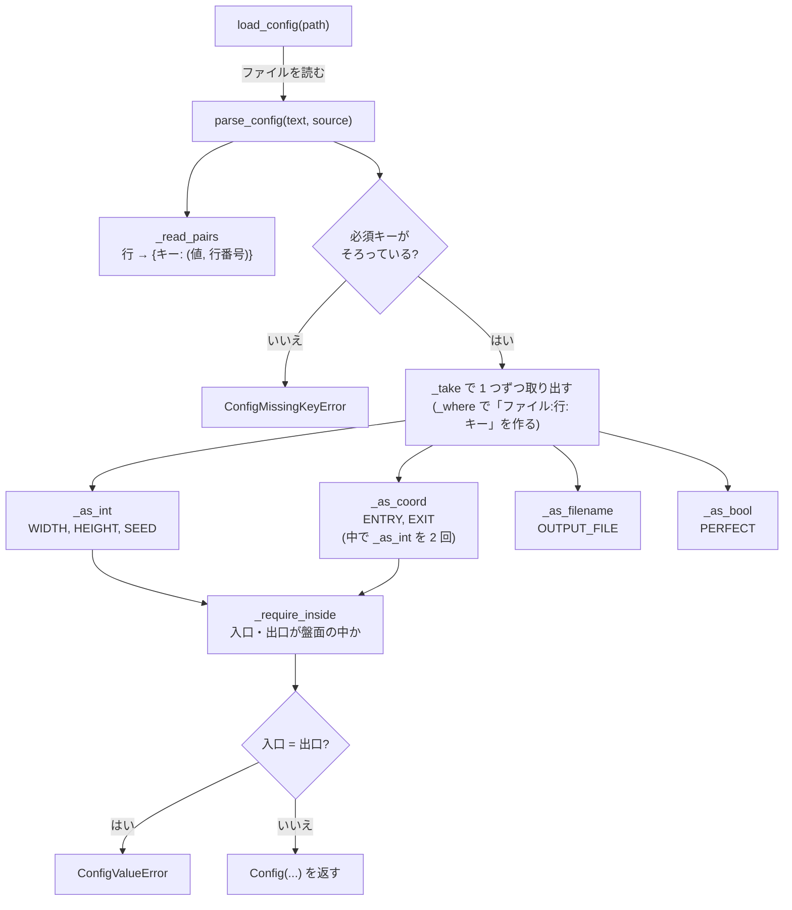

# 2. 設定ファイルの読み込み — `maze/config.py`

| | |
| --- | --- |
| **書いた人** | so |
| **使う側** | `a_maze_ing.py`(7 章) |
| **設計の記録** | [`config-parser.md`](../implementation_plans/config-parser.md)(31 のエッジケース)、決定 3.9 |

## この章で分かること

- 設定ファイルに何を書けるか(文法のすべて)
- 手書きの文字列を、検証済みの値(`Config`)に変える手順
- すべてのエラーメッセージと、その例
- なぜ「種類ごとの変換関数」に分けたのか

---

## 1. そもそもの概念

### 1.1 設定ファイルはプログラムの唯一の入力

subject §IV.2 は、プログラムを `python3 a_maze_ing.py config.txt` で動かすと決めています。**利用者が指定できるのは、このファイルの中身だけ**です。

人が手で書くファイルなので、書き間違いが必ず起きます。§IV.2 は「予期せぬクラッシュをしてはならない」とも求めているので、このモジュールは**どんな書き間違いにも、どの行の何が悪いかを伝えるエラー**で答えます。

そして、ここで一度検証した値は、**後の段階で二度と確かめません**。生成器もソルバーも、`Config` の値が正しいと信じて使います。

### 1.2 既定の `config.txt`

```text
# A-Maze-ing configuration. Used as: python3 a_maze_ing.py config.txt
# One KEY=VALUE per line. A line starting with '#' is ignored.

WIDTH=20
HEIGHT=15

# ENTRY and EXIT are x,y with the origin at the top-left corner,
# so the far corner of a 20x15 maze is 19,14 -- not 20,15.
ENTRY=0,0
EXIT=19,14

OUTPUT_FILE=maze.txt

# True gives exactly one route between entry and exit.
PERFECT=False

# Optional. The same seed always builds the same maze; left out here so
# that each run differs.
#SEED=42
```

`#SEED=42` はコメントなので、`SEED` は**書かれていない**扱いになり、実行するたびに違う迷路ができます。

見本の設定ファイルが `config_file_examples/` に 3 つあります(javi が用意):

| ファイル | 大きさ | 出口 | 出力先 | モード | シード | 目的 |
| --- | --- | --- | --- | --- | --- | --- |
| `config_large.txt` | 40 × 25 | `39,24` | `maze_large.txt` | `False` | 999 | 大きな迷路 |
| `config_perfect.txt` | 20 × 15 | `19,14` | `maze_perfect.txt` | `True` | 12345 | 完全迷路 |
| `config_small.txt` | 8 × 6 | `7,5` | `maze_small.txt` | `False` | なし | 「42」が省かれる場合 |

---

## 2. 文法のすべて

| 項目 | 規則 |
| --- | --- |
| 行の区切り | `\n`、`\r\n`、`\r` のどれでもよい(`str.splitlines()`) |
| 空白 | 各行の前後の空白は取り除く。キーと値も、それぞれ前後の空白を取り除く(`  WIDTH = 20  ` → `WIDTH` と `20`) |
| 空行 | 無視 |
| コメント | 空白を除いた最初の文字が `#` の行は無視。**行の途中の `#` はコメントにならない**(`WIDTH=20 # x` の値は `20 # x` になり、数値の変換で弾かれる) |
| 形 | `KEY=VALUE`。**最初の `=`** で分ける(値に `=` が入ってもよい) |
| キー | 空ではいけない。**大文字小文字を区別する**(`width` は `WIDTH` ではない) |
| 重複 | 同じキーが 2 回出たらエラー(知らないキーでも) |
| 知らないキー | 受け入れて無視する |

### キーと値

| キー | 必須 | 値の形 | 規則 |
| --- | --- | --- | --- |
| `WIDTH` | 必須 | 整数 | 1 以上 |
| `HEIGHT` | 必須 | 整数 | 1 以上 |
| `ENTRY` | 必須 | `x,y` | カンマがちょうど 1 つ。各部分は 0 以上の整数。`x < WIDTH`、`y < HEIGHT` |
| `EXIT` | 必須 | `x,y` | `ENTRY` と同じ規則。さらに `ENTRY` と違うこと |
| `OUTPUT_FILE` | 必須 | 文字列 | 空でないこと(パスが書けるかは確かめない) |
| `PERFECT` | 必須 | `True` か `False` | **この綴りだけ**(`true`、`1`、`yes` は不可) |
| `SEED` | 任意 | 整数 | 負の数も可 |

**このモジュールが確かめないこと:** 入口や出口が迷路の端にあるか、たどり着けるか、`PERFECT=False` のときの最小サイズ(3 × 2)。最小サイズは「ループの規則」なので、生成器(3 章)だけが確かめます。

---

## 3. 全体図



処理は 2 つの層に分かれています。

| 層 | 関数 | 仕事 |
| --- | --- | --- |
| **文法の層** | `_read_pairs` | 行を `KEY` と `VALUE` の文字列に分けるだけ。値の意味は解釈しない |
| **意味の層** | `_as_*`、`_require_inside`、`parse_config` | 文字列を整数・座標・真偽値に変え、範囲を確かめる |

---

## 4. `Config` — 検証済みの設定

```python
@dataclass(frozen=True)
class Config:
    width: int
    height: int
    entry: Coord
    exit: Coord
    output_file: str
    perfect: bool
    seed: int | None = None
```

- **`frozen=True`:** 作った後に変更できません。後の段階が設定を書き換えることを防ぎます。
- **`seed` だけ既定値 `None`:** 書かれていない場合を `None` で表します。`0` は正当なシードなので、「書かれていない」を `0` で表すことはできません。
- **検証は `Config` ではなく `parse_config` が行います。** `Config(...)` を直接作ると、検証を素通りします。

`Coord` はこのモジュールで独自に定義しています(`maze.maze` を import しない)。このモジュールを迷路のコードから独立させるためです。

---

## 5. 例外クラス

```text
ConfigError                     このモジュールのエラーの親
├── ConfigFileError             ファイルを読めない(存在しない、フォルダ、権限、文字コード)
├── ConfigSyntaxError           KEY=VALUE の形になっていない行
├── ConfigValueError            キーはあるが値が使えない(重複キーもこれ)
└── ConfigMissingKeyError       必須キーが無い
```

**重複キーは `ConfigSyntaxError` ではなく `ConfigValueError` です**(形は正しいが、内容が使えない)。

---

## 6. 各関数

### 6.1 `_read_pairs(text, source) -> dict[str, tuple[str, int]]` — 文法の層

**何をするか:** テキストを 1 行ずつ読み、`{キー: (値の文字列, 行番号)}` の辞書を作ります。

**処理の手順(1 行ごと):**

1. 行の前後の空白を取る。
2. 空行なら飛ばす。
3. `#` で始まれば飛ばす。
4. `=` が無ければ `ConfigSyntaxError`(`expected KEY=VALUE`)。
5. 最初の `=` で分ける:`key, value = line.split("=", 1)`。
6. キーの空白を取り、空なら `ConfigSyntaxError`(`missing key before '='`)。
7. すでに同じキーがあれば `ConfigValueError`(`duplicate key`、最初の行番号も示す)。
8. 値の空白を取り、`(値, 行番号)` を保存する。

**なぜ行番号を一緒に保存するか:** 値を解釈するのは後の段階です。そのときにはもう元の行は手元にありません。しかし §IV.2 の精神では、利用者に「どの行を直せばよいか」を伝えたい。そこで、値に行番号を付けて運びます。

### 6.2 `_where(source, key, lineno) -> str`

**何をするか:** `"config.txt:4: WIDTH"` のような、エラーメッセージの**先頭部分**を作ります。

**なぜ関数にしたか:** メッセージの形を 1 か所で決めるためです。すべての値のエラーが同じ形になります。

### 6.3 `_take(pairs, key, source) -> tuple[str, str]`

**何をするか:** 辞書からキーの値を取り出し、`(値, "ファイル:行: キー")` の組で返します。

**なぜ関数にしたか:** キーの名前を 1 回だけ書けば済むようにするためです。以前、キーを 2 回書く形だったとき、隣のキーの名前でメッセージを出す間違いが起き、lint もテストも通ってしまったことがあります(作業ログ 9/13)。

### 6.4 種類ごとの変換関数

キーごとではなく、**値の種類ごと**に関数を分けています。`WIDTH` と `HEIGHT` は同じ整数の変換を、`ENTRY` と `EXIT` は同じ座標の変換を使うので、6 つのキーに対して 4 つの関数で済み、各規則を 1 回ずつ書くだけで済みます。

#### `_as_int(value, where, minimum) -> int`

1. `int(value)` で変換。失敗したら `ConfigValueError("... must be a whole number, got '...'")`。元のエラーは `from err` で記録する。
2. `minimum` が `None` でなく、値がそれより小さければ `ConfigValueError`。メッセージは、最小値が 1(WIDTH と HEIGHT)なら `"... must be a positive integer, got '...'"`、それ以外(座標の 0)なら `"... must be at least N, got '...'"`。「1 以上の整数」は「正の整数」そのものなので、最小値 1 のときは利用者に分かりやすい言葉で伝える。

**`minimum` に既定値が無い理由:** 呼び出し側が毎回、範囲を明示しなければなりません(大きさは 1、座標は 0、シードは `None`)。既定値があると、範囲の指定を**忘れる**ことができてしまい、忘れると `WIDTH=0` が黙って通ります。

**`if minimum is not None` と書く理由:** `if minimum:` と書くと、`minimum=0` が「偽」と判定されて範囲の確認が飛ばされます。`0` と `None` を区別するために `is not None` を使います。

→ 学習ノート [`python-truthiness-and-none.md`](../learning_log/python-truthiness-and-none.md)

**`int()` が受け付けるもの:** `+5`、`-3`、前後の空白、`1_000`。受け付けないもの:`3.5`、`1e3`、`20abc`、空文字列。

#### `_as_coord(value, where) -> Coord`

1. `value.split(",")` で分け、**ちょうど 2 つ**でなければ `ConfigValueError("... must be 'x,y', got '...'")`。
2. 各部分を `_as_int(..., minimum=0)` で変換する。メッセージの場所は `"... ENTRY x"`、`"... ENTRY y"` になる。
3. `(x, y)` を返す。

**数を先に確かめる理由:** `x, y = parts` と先に分けると、`ENTRY=0` のときに Python の分解のエラー(`ValueError`)になり、利用者に分かりにくいメッセージが出ます。

`int()` が空白を許すので、`0, 0` も受け付けます。

#### `_as_bool(value, where) -> bool`

`{"True": True, "False": False}` の辞書 `_BOOL` にあれば値を返し、無ければ `ConfigValueError("... must be True or False, got '...'")`。

**`bool(value)` を使わない理由:** `bool("False")` は `True` です(空でない文字列はすべて真)。

#### `_as_filename(filename, where) -> str`

空なら `ConfigValueError("... must not be empty")`。それ以外はそのまま返します。パスが書けるかどうかは確かめません。

### 6.5 `_require_inside(coord, where, width, height) -> None`

`x >= width` なら `"... x must be less than W, got X"`、`y >= height` なら `"... y must be less than H, got Y"` の `ConfigValueError`。負の数は `_as_coord` がすでに弾いているので、上限だけを確かめます。

### 6.6 `parse_config(text, source="<config>") -> Config` — 組み立て

**処理の手順:**

1. `_read_pairs` で辞書にする。
2. 必須キー `("WIDTH", "HEIGHT", "ENTRY", "EXIT", "OUTPUT_FILE", "PERFECT")` のうち無いものを**全部**集め、1 つでもあれば `ConfigMissingKeyError("config.txt: missing required keys: ...")`。**全部まとめて**報告するので、利用者は 1 回で直せます。行番号はありません(存在しない行だから)。
3. 値を順に変換する:WIDTH → HEIGHT → ENTRY → EXIT → OUTPUT_FILE → PERFECT →(あれば)SEED。
4. 入口と出口が盤面の中かを確かめる。
5. 入口と出口が同じなら `ConfigValueError("... EXIT must not be the same value of entry (0, 0)")`。
6. `Config(...)` を返す。

**2 を先にやる理由:** 必須キーがそろっていると分かった後なら、`_take` で辞書を引いても `KeyError` になりません。

### 6.7 `load_config(path) -> Config` — ファイルに触る唯一の関数

```python
try:
    text = Path(path).read_text(encoding="utf-8")
except (OSError, UnicodeDecodeError) as err:
    raise ConfigFileError(f"{path}: {err}") from err
return parse_config(text, str(path))
```

- **先に `exists()` で確かめない理由:** 存在していても、フォルダだったり読む権限が無かったりします。`OSError` をまとめて捕まえれば、どの理由でも同じように扱えます。フォルダを開くと、Linux では `IsADirectoryError`、Windows では `PermissionError` になりますが、どちらも `OSError` の子です。
- **ファイルシステムに触るのはこの関数だけ**なので、`parse_config` は文字列だけでテストできます。

---

## 7. すべてのエラーメッセージ

(`source` が `config.txt` の場合。エントリポイントはこれに `Error: ` を付けて標準エラーに出す)

| 例外 | 形 | 例 |
| --- | --- | --- |
| `ConfigSyntaxError` | `{source}:{行}: expected KEY=VALUE, got '{行}'` | `config.txt:4: expected KEY=VALUE, got 'WIDTH 20'` |
| `ConfigSyntaxError` | `{source}:{行}: missing key before '=', got '{行}'` | `config.txt:4: missing key before '=', got '=20'` |
| `ConfigValueError` | `{source}:{行}: duplicate key '{キー}', first defined on line {n}` | `config.txt:6: duplicate key 'WIDTH', first defined on line 4` |
| `ConfigMissingKeyError` | `{source}: missing required keys: {キー, ...}` | `config.txt: missing required keys: WIDTH, EXIT` |
| `ConfigValueError` | `{場所} must be a whole number, got '{値}'` | `config.txt:4: WIDTH must be a whole number, got 'abc'` |
| `ConfigValueError` | `{場所} must be a positive integer, got '{値}'`(最小値 1:WIDTH・HEIGHT) | `config.txt:4: WIDTH must be a positive integer, got '0'` |
| `ConfigValueError` | `{場所} must be at least {最小}, got '{値}'`(それ以外の最小値) | `config.txt:9: ENTRY x must be at least 0, got '-1'` |
| `ConfigValueError` | 座標の部分が数でないとき | `config.txt:9: ENTRY y must be a whole number, got 'a'` |
| `ConfigValueError` | `{場所} must be 'x,y', got '{値}'` | `config.txt:9: ENTRY must be 'x,y', got '0'` |
| `ConfigValueError` | `{場所} must not be empty` | `config.txt:12: OUTPUT_FILE must not be empty` |
| `ConfigValueError` | `{場所} must be True or False, got '{値}'` | `config.txt:15: PERFECT must be True or False, got 'true'` |
| `ConfigValueError` | `{場所} x must be less than {幅}, got {x}` | `config.txt:10: EXIT x must be less than 20, got 20` |
| `ConfigValueError` | `{場所} y must be less than {高さ}, got {y}` | `config.txt:10: EXIT y must be less than 15, got 15` |
| `ConfigValueError` | `{EXIT の場所} must not be the same value of entry {入口}` | `config.txt:10: EXIT must not be the same value of entry (0, 0)` |
| `ConfigFileError` | `{パス}: {OS のエラー}` | `nope.txt: [Errno 2] No such file or directory: 'nope.txt'` |

**実際に `a_maze_ing.py` で出したもの**(README の確認で実行):

```text
Error: config.txt:4: WIDTH must be a positive integer, got '0'
Error: missing.txt: missing required keys: ENTRY, EXIT, OUTPUT_FILE, PERFECT
Error: dup.txt:2: duplicate key 'WIDTH', first defined on line 1
```

---

## 8. トレース — 既定の `config.txt`

```text
_read_pairs の結果(空行とコメントは飛ばされる):
  "WIDTH"       → ("20",       4)
  "HEIGHT"      → ("15",       5)
  "ENTRY"       → ("0,0",      9)
  "EXIT"        → ("19,14",   10)
  "OUTPUT_FILE" → ("maze.txt", 12)
  "PERFECT"     → ("False",   15)
  (19 行目の #SEED=42 はコメントなので入らない)

必須キー:すべてある

変換:
  WIDTH       _as_int("20", "config.txt:4: WIDTH", 1)      → 20
  HEIGHT      _as_int("15", "config.txt:5: HEIGHT", 1)     → 15
  ENTRY       _as_coord("0,0", "config.txt:9: ENTRY")      → (0, 0)
  EXIT        _as_coord("19,14", "config.txt:10: EXIT")    → (19, 14)
  OUTPUT_FILE _as_filename("maze.txt", ...)                → "maze.txt"
  PERFECT     _as_bool("False", ...)                       → False
  SEED        "SEED" が無い                                 → None

範囲:(0,0) も (19,14) も 20 × 15 の中。入口 ≠ 出口

結果:Config(width=20, height=15, entry=(0, 0), exit=(19, 14),
            output_file='maze.txt', perfect=False, seed=None)
```

---

## 9. 注意点・よくある誤解

| 誤解 | 実際 |
| --- | --- |
| 行の途中の `#` からはコメント | コメントになるのは行頭の `#` だけ |
| `PERFECT=true` でも通る | 大文字小文字を区別する。`True` か `False` だけ |
| `bool("False")` は `False` | `True`(空でない文字列) |
| `if minimum:` で範囲を確かめられる | `0` が偽なので、最小値 0 の確認が飛ぶ |
| 重複キーは構文エラー | `ConfigValueError` |
| `OUTPUT_FILE` のパスも確かめている | 空でないことだけ。書けないパスは、出力の時点で `OSError` になる(エントリポイントは捕まえていない) |
| 設定が通れば必ず迷路ができる | `PERFECT=False` で 2 × 2 のように小さいと、生成器が `GenerationError` で拒否する |

---

## 関連文書

- [`config-parser.md`](../implementation_plans/config-parser.md) — 設計と 31 のエッジケース
- 学習ノート:[`python-exceptions.md`](../learning_log/python-exceptions.md)、[`python-truthiness-and-none.md`](../learning_log/python-truthiness-and-none.md)
- テスト:`tests/test_config.py`(9 章)
- 次の章:[3. 迷路の生成](03_generator.md)
