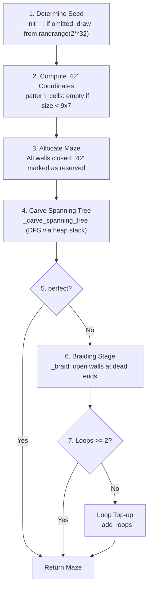
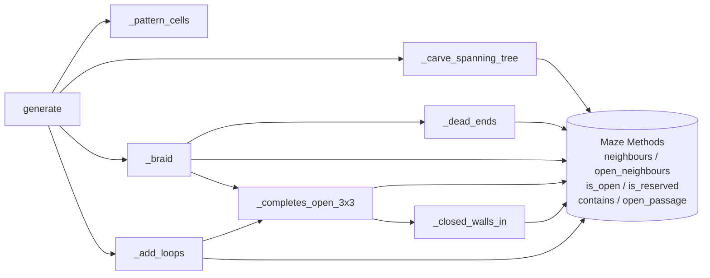

# 3. Maze Generation — `maze/generator.py`

|                    |                                                                                                                          |
| ------------------ | ------------------------------------------------------------------------------------------------------------------------ |
| **Author**         | so                                                                                                                       |
| **Consumers**      | `a_maze_ing.py` (Chapter 7), `mazegen` package (Chapter 8)                                                               |
| **Design Records** | [`generation-algorithm.md`](../implementation_plans/generation-algorithm.md) (Decisions Q1–Q11), Decisions 3.4–3.7, 3.10 |

## What this chapter covers

- Conceptualizing a maze as a graph (spanning trees, cycles/loops, dead ends)
- The 7-stage execution pipeline within `MazeGenerator`
- Detailed breakdown of all methods accompanied by concrete traces
- Placement of the "42" pattern logo and prevention of 3x3 open zones
- Deterministic reproducibility mechanism via seeds

---

## 1. Foundational Concepts

### 1.1 Mazes as Graphs

A maze can be modeled mathematically as an undirected **graph** consisting of **vertices** (cells) connected by **edges** (open passages through shared walls).

```text
Maze                     Graph Representation
+---+---+---+
|       |   |            (0,0)─(1,0)   (2,0)
+   +---+   +              │             │
|           |            (0,1)─(1,1)─(2,1)
+---+---+---+
```

An edge represents an open passage between orthogonal cells. Closed walls correspond to absent edges.

### 1.2 Spanning Trees = Perfect Mazes

A **spanning tree** is a connected, acyclic subgraph spanning all vertices:

- Every cell is reachable from any other cell (**spanning**).
- Exactly one unique path exists between any two cells (**tree**, no cycles).

This precisely matches the `PERFECT=True` requirement for a **perfect maze**.

In any spanning tree, the number of passages $E$ is always:
$$E = V - 1$$
Starting with a single root cell, attaching each subsequent reachable vertex requires opening exactly one connecting passage.

### 1.3 Cycles and the Loop Formula ($E - V + 1$)

A **loop (cycle)** is a closed path returning to the origin without traversing any edge twice. Cycles create alternative routes, enabling Pac-Man-style gameplay.

The number of **independent cycles** in a connected graph is given by the circuit rank:
$$\text{Cycles} = E - V + 1$$

In a spanning tree, $E = V - 1$, yielding $0$ cycles. **Adding any single edge to a spanning tree introduces exactly one new cycle**, because the two endpoints were already connected by a unique tree path.

```text
Spanning Tree (E=5, V=6)     Adding 1 Edge (E=6, V=6)
+---+---+---+                +---+---+---+
| A         |                |           |
+---+---+   +       →        +   +---+   +       Loops = 6 - 6 + 1 = 1
| B         |                |           |
+---+---+---+                +---+---+---+
```

On a $20 \times 15$ grid with seed 42, walkable cells $V = 282$ and passages $E = 316$, yielding $316 - 282 + 1 = 35$ independent loops.

The theoretical maximum number of loops on a $W \times H$ board is $(W - 1) \times (H - 1)$ (one per $2 \times 2$ block).

### 1.4 Dead Ends — Real vs Enclosed

A **dead end** is a cell with only 1 open passage. Subject analyzer `maze_analyzer.py` classifies dead ends into two categories:

| Category              | Criterion                                                                           | Eliminable?                                |
| --------------------- | ----------------------------------------------------------------------------------- | ------------------------------------------ |
| **Real Dead End**     | Has 1 open passage and **at least one closed wall facing a walkable interior cell** | **Yes** (opening that wall creates a loop) |
| **Enclosed Dead End** | Has 1 open passage; all other sides face perimeter borders or "42" pattern cells    | **No** (no eligible wall can be opened)    |

```text
Real Dead End                   Enclosed Dead End ("42" alcove)
+---+---+                       ###########
| D     |                       #   | D |##      North, East, South of D face "42";
+---+   +   South faces a       ####+   +##      West is the sole open passage.
|       |   walkable cell                        → No wall can be opened.
```

### 1.5 Braiding

**Braiding** is the selective removal of dead-end walls to introduce loops. Subject mode `PERFECT=False` requires multiple routes and minimal dead ends, which is achieved by braiding the spanning tree.

### 1.6 Prohibition of 3x3 Open Zones

Subject §IV.4 mandates that passages cannot exceed 2 cells in width and strictly forbids $3 \times 3$ open zones. In our architecture, a $3 \times 3$ open zone is defined as **a 9-cell window with all 12 internal walls opened** (Decision 3.7 = A).

```text
The 12 internal walls of a 3x3 window:

+---+---+---+
|   ①   ②   |      Horizontal internal walls (East walls): ① through ⑥
+-⑦-+-⑧-+-⑨-+      Vertical internal walls (South walls): ⑦ through ⑫
|   ③   ④   |
+-⑩-+-⑪-+-⑫-+      Perimeter bounding walls are not internal
|   ⑤   ⑥   |
+---+---+---+
```

A spanning tree never contains even a $2 \times 2$ open area (which would form a cycle). Therefore, **3x3 areas can only ever be introduced during braiding**. To prevent this, `_completes_open_3x3` inspects affected windows before removing any wall.

---

## 2. Architecture Overview — 7 Generation Stages



A **single unified generator pipeline** is used. `PERFECT=True` simply terminates after Stage 4 (Decision 3.4 = A), eliminating redundant logic.

### Method Call Graph



---

## 3. Module Constants and Exceptions

### `GenerationError(MazeError)`

Raised when impossible maze dimensions are requested. Inherits from `MazeError` so `a_maze_ing.py` intercepts it cleanly.

### `_PATTERN_OFFSETS` — The "42" Logo Geometry

A `frozenset` containing 18 coordinate offsets `(dx, dy)` within a $7 \times 5$ bounding box:

```text
    x: 0 1 2 3 4 5 6
 y 0   # . . . # # #       "4": (0,0) (0,1) (0,2) (1,2) (2,2) (2,3) (2,4)
   1   # . . . . . #       "2": (4,0) (5,0) (6,0) (6,1) (6,2) (5,2) (4,2)
   2   # # # . # # #            (4,3) (4,4) (5,4) (6,4)
   3   . . # . # . .
   4   . . # . # # #       # = Reserved cells (18 in total)
```

- Column $x=3$ is completely open from top to bottom, ensuring the center cell of the maze remains walkable (see 4.4).
- Stored as a module constant; only the top-left offset is computed dynamically per maze.

---

## 4. `MazeGenerator` Class Methods

### 4.1 `__init__(self, width: int, height: int, *, perfect: bool = False, seed: int | None = None)`

Keyword-only parameters `*` prevent swapped arguments.

**Validation Sequence:**

1. If `width < 1 or height < 1`:
   Raises `GenerationError("width and height must both be positive integers, got WxH")`.
2. If `perfect is False` and `(width - 1) * (height - 1) < 2`:
   Raises `GenerationError("a maze that is not perfect needs room for two loops: at least 3x2 or 2x3, got WxH")`.

**Seed Initialization:**
If `seed is None`, draws `random.randrange(2**32)` once and stores it. Storing the integer rather than the `random.Random` instance ensures that re-calling `generate()` on the same generator instance yields the exact same maze.

### 4.2 `seed` (property)

Returns the active seed integer. Emits no console prints directly, respecting headless library design.

### 4.3 `generate(self) -> Maze` — Pipeline Orchestrator

```python
maze = Maze(self._width, self._height, self._pattern_cells())
rng = Random(self.seed)
self._carve_spanning_tree(maze, rng)
if self._perfect:
    return maze
loops = self._braid(maze, rng)
if loops < 2:
    self._add_loops(maze, rng, 2 - loops)
return maze
```

- Creates a fresh `Random(self.seed)` each call, ensuring idempotence.
- Passes the same `rng` instance across all stages sequentially so subsequent random choices do not repeat previous RNG subsequences.

### 4.4 `_pattern_cells(self) -> frozenset[Coord]`

1. If `width < 9 or height < 7`, returns empty `frozenset()`.
2. Offsets top-left to `left = width // 2 - 3`, `top = height // 2 - 2`.
3. Maps all 18 offsets into absolute maze coordinates.

**Guarantees:**

- Column 3 of the pattern aligns with `width // 2`, and row 2 aligns with `height // 2`. Because column 3 is completely open, the central cell `(width // 2, height // 2)` is **always free**.
- For sizes $\ge 9 \times 7$, at least 1 cell of padding surrounds the pattern, ensuring all four corners remain free and walkable corridors stay connected.

### 4.5 `_carve_spanning_tree(self, maze: Maze, rng: Random)`

Implements an **iterative Recursive Backtracker** using an explicit heap-allocated `list` as a stack, avoiding Python's call-stack recursion depth limit (`sys.getrecursionlimit() \approx 1000`):

```python
start = (0, 0)
stack = [start]; visited = {start}
while len(stack) > 0:
    current = stack[-1]
    candidates = [n for _, n in maze.neighbours(current) if n not in visited]
    if len(candidates) == 0:
        stack.pop()
        continue
    chosen = rng.choice(candidates)
    maze.open_passage(current, chosen)
    stack.append(chosen)
    visited.add(chosen)
```

If visited cell count does not equal total walkable cells, raises `GenerationError`. Starts at `(0, 0)`, which is guaranteed to exist outside the "42" pattern.

### 4.6 `_dead_ends(self, maze: Maze) -> list[Coord]`

Finds real dead ends by scanning all cells where `len(list(maze.open_neighbours(pos))) == 1` and `len(list(maze.neighbours(pos))) >= 2`.

### 4.7 `_closed_walls_in(self, maze: Maze, wx: int, wy: int) -> int`

Counts how many of the 12 internal walls are closed within the $3 \times 3$ window anchored at top-left `(wx, wy)`.

### 4.8 `_completes_open_3x3(self, maze: Maze, a: Coord, b: Coord) -> bool`

Checks whether opening the wall between `a` and `b` would complete any $3 \times 3$ open zone:

- Inspects only the $\le 6$ overlapping $3 \times 3$ windows containing both cells.
- In each window, the candidate wall is internal and closed. If `_closed_walls_in` equals 1, opening this wall would leave 0 closed walls, completing a $3 \times 3$ open zone.
- Runs in $O(1)$ constant time (6 windows $\times$ 12 walls).

### 4.9 `_braid(self, maze: Maze, rng: Random) -> int`

Walks the dead ends collected in an initial pass:

- Re-checks open passages: if a dead end was already resolved by an adjacent wall removal, it is skipped.
- Filters candidate walls through `_completes_open_3x3`.
- Returns the count of opened walls, which directly equals the number of added independent loops.

### 4.10 `_add_loops(self, maze: Maze, rng: Random, count: int)`

On minimal boards (e.g. $3 \times 2$), braiding may resolve both dead ends with a single wall, creating only 1 loop. This function opens additional closed walls between walkable cells (checking `_completes_open_3x3`) until at least 2 loops exist.

---

## 5. Seed Reproducibility


Passing an identical seed to `SEED` in the configuration file deterministically reproduces the exact same maze layout.

---

## 6. Caveats & Common Misconceptions

| Misconception                                       | Reality                                                                                   |
| --------------------------------------------------- | ----------------------------------------------------------------------------------------- |
| Separate generator classes for Perfect vs Imperfect | Unified pipeline; `PERFECT=True` simply stops after Stage 4.                              |
| Recursive DFS is cleaner                            | Exceeds Python's recursion limit on $\ge 40 \times 40$ mazes; explicit stack is required. |
| Braiding repeats in a while-loop                    | Iterates dead ends once; re-counts open passages to handle mutual fixes.                  |
| 3x3 check scans whole maze                          | Only inspects the 6 overlapping windows covering the mutated wall ($O(1)$ time).          |

---

## Related Documentation

- Design contract: [`implementation_plans/generation-algorithm.md`](../implementation_plans/generation-algorithm.md)
- Learning log: [`maze-generation-algorithms.md`](../learning_log/maze-generation-algorithms.md)
- Tests: `tests/test_generator.py` (Chapter 9)
- Next chapter: [4. Shortest Path](04_solver.md)
