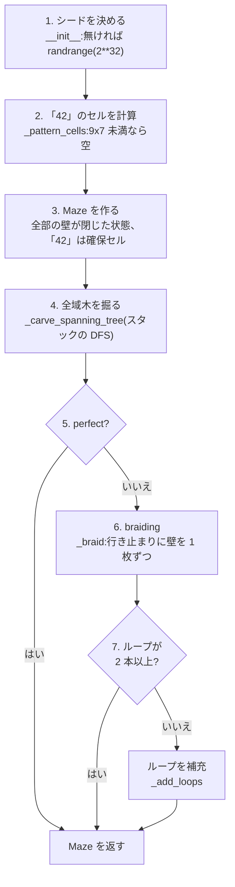
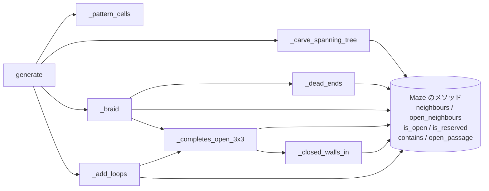

# 3. 迷路の生成 — `maze/generator.py`

| | |
| --- | --- |
| **書いた人** | so |
| **使う側** | `a_maze_ing.py`(7 章)、`mazegen` パッケージ(8 章) |
| **設計の記録** | [`generation-algorithm.md`](../implementation_plans/generation-algorithm.md)(決定 Q1〜Q11)、決定 3.4〜3.7、3.10 |

## この章で分かること

- 迷路を「グラフ」として見る考え方と、全域木・ループ・行き止まりの意味
- `MazeGenerator` が迷路を作る 7 つの段階
- 各メソッドの働きと、実際の値で追ったトレース
- 「42」の形と置き場所、3x3 の開けた場所を作らない仕組み
- シードで同じ迷路を作り直せる仕組み

---

## 1. そもそもの概念

### 1.1 迷路はグラフ

迷路を、**点(セル)**と**線(開いた壁 = 通路)**でできた**グラフ**として見ます。

```text
迷路                     グラフとして見ると
+---+---+---+
|       |   |            (0,0)─(1,0)   (2,0)
+   +---+   +              │             │
|           |            (0,1)─(1,1)─(2,1)
+---+---+---+
```

通路は、つながった 2 つのセルを結ぶ線です。壁が閉じているところには線がありません。

### 1.2 全域木 = 完全迷路

**全域木**とは、すべての点を**輪を作らずに**つないだグラフです。迷路で言えば:

- すべてのセルにたどり着ける(**全域**)
- どの 2 つのセルの間にも、道が**ちょうど 1 本**しかない(**木** = 輪が無い)

これがまさに `PERFECT=True` の**完全迷路**です。

全域木では、通路の数が**セルの数 − 1** になります。セルが 1 つだけの状態から始めて、新しいセルを 1 つつなぐたびに通路が 1 本増えるからです。

### 1.3 ループ(閉路)と `E − V + 1`

**ループ**とは、同じ通路を 2 回通らずに、出発したセルに戻れる道です。ループがあると、2 つのセルの間に**道が 2 本以上**できます。パックマンがお化けに追われても、反対側から逃げられるのはこのためです。

**独立なループの数**は、通路の数 `E` と歩けるセルの数 `V` から計算できます。

```text
独立なループの数 = E − V + 1
```

全域木は `E = V − 1` なので、ループは `0` です。**木に通路を 1 本足すたびに、ループが 1 本増えます。** 足した通路の両端は、木の中ですでに 1 本の道でつながっているので、新しい通路と合わせて輪ができるからです。

```text
木(E=5, V=6)              1 本足す(E=6, V=6)
+---+---+---+              +---+---+---+
| A         |              |           |
+---+---+   +     →        +   +---+   +     ループ = 6 − 6 + 1 = 1
| B         |              |           |
+---+---+---+              +---+---+---+
```

(実際の値:既定の設定、シード 42 の 20 × 15 では、歩けるセル `V = 282`、通路 `E = 316`、ループ `316 − 282 + 1 = 35` 本でした。)

`width × height` の盤面が持てるループは、最大で `(width − 1) × (height − 1)` 本です(2 × 2 のブロック 1 つにつき 1 本)。

### 1.4 行き止まり — 本物と、囲まれたもの

**行き止まり**は、通路が 1 本しかないセルです。`maze_analyzer.py` は行き止まりを 2 種類に分け、**本物の行き止まり**だけを数えます。

| 種類 | 条件 | 直せるか |
| --- | --- | --- |
| **本物の行き止まり** | 通路が 1 本で、普通のセルに面した**閉じた壁が少なくとも 1 枚ある** | 直せる(その壁を開ければよい) |
| **囲まれた行き止まり** | 通路が 1 本で、残りの壁が全部、外周か「42」に面している | 直せない |

```text
本物の行き止まり               囲まれた行き止まり(「42」のくぼみ)
+---+---+                      ###########
| D     |                      #   | D |##      D の北・東・南は「42」、
+---+   +   D の南は普通の      ####+   +##      西だけが通路
|       |   セルに面している                     → 開けられる壁が無い
```

### 1.5 braiding(編み込み)

**braiding** は、行き止まりの閉じた壁を開けて、行き止まりを無くしつつループを作る処理です。subject の既定モード(`PERFECT=False`)は、「ループが 2 本以上あり、行き止まりがまれな」盤面を求めているので、木を作った後に braiding をかけます。

### 1.6 3x3 の開けた場所を作ってはいけない

§IV.4 は「通路の幅は 2 セルまで。3x3 の開けた場所はだめ」と求めています。このプロジェクトでは **3 × 3 の 9 セルの内側の壁 12 枚がすべて開いている状態**を「3x3 の開けた場所」と定義しました(決定 3.7 = A)。

```text
3x3 のブロックの内側の壁 12 枚:

+---+---+---+
|   ①   ②   |      横に並ぶセルの間の壁(東の壁):① 〜 ⑥ の 6 枚
+-⑦-+-⑧-+-⑨-+      縦に並ぶセルの間の壁(南の壁):⑦ 〜 ⑫ の 6 枚
|   ③   ④   |
+-⑩-+-⑪-+-⑫-+      外周の壁(ブロックの縁)は数えない
|   ⑤   ⑥   |
+---+---+---+
```

完全迷路(木)には 2 × 2 の開けた場所すらありません(4 セルで輪ができてしまうから)。なので **3x3 を作りうるのは braiding の段階だけ**です。そこで、braiding が壁を開ける**前に**、その壁で 3x3 が完成しないかを毎回確かめます。

---

## 2. 全体図 — 生成の 7 つの段階



**生成器は 1 つです。** `PERFECT=True` は、この流れを 5 で止めるだけです(決定 3.4 = A)。2 つの生成器を別々に作ると、両方を同じように保ち続ける手間がかかります。

### メソッドの呼び出し関係



---

## 3. モジュールの定数と例外

### `GenerationError(MazeError)`

作れない迷路を頼まれたときのエラーです。メッセージは、拒否した大きさと、何なら受け付けるかを示します。`MazeError` の子なので、エントリポイントの `except (ConfigError, MazeError)` で捕まります。

### `_PATTERN_OFFSETS` — 「42」の形

7 × 5 のブロックの左上から見た、18 個のずれ `(dx, dy)` の集合(`frozenset`)です。

```text
    x: 0 1 2 3 4 5 6
 y 0   # . . . # # #       "4":(0,0) (0,1) (0,2) (1,2) (2,2) (2,3) (2,4)
   1   # . . . . . #       "2":(4,0) (5,0) (6,0) (6,1) (6,2) (5,2) (4,2)
   2   # # # . # # #           (4,3) (4,4) (5,4) (6,4)
   3   . . # . # . .
   4   . . # . # # #       # = 確保セル(18 個)
```

- 形は so が subject の画像から読み取ったもの(決定 Q10)。「4」は一筆書きの ↓↓→→↓↓、「2」は →→↓↓←←↓↓→→ です。
- **列 3 は上から下まで空いています。** これが中央のセルを空けておく仕掛けです(6.2)。
- 形は盤面の大きさで変わらないので、クラスの外に一度だけ書いてあります。位置だけを盤面ごとに計算します。

---

## 4. `MazeGenerator` の各メソッド

### 4.1 `__init__(self, width, height, *, perfect=False, seed=None)`

**何をするか:** 大きさ・モード・シードを保存します。迷路はまだ作りません。

`*` の後ろの `perfect` と `seed` は**キーワード専用**です。`MazeGenerator(20, 15, True)` のように名前なしでは渡せず、`perfect=True` と書く必要があります。引数の取り違えを防ぐためです。

**確かめる順番:**

| 順 | 条件 | エラーメッセージ |
| --- | --- | --- |
| 1 | `width < 1` または `height < 1` | `width and height must both be at least 1, got WxH` |
| 2 | `perfect is False` で、`(width - 1) * (height - 1) < 2` | `a maze that is not perfect needs room for two loops: at least 3x2 or 2x3, got WxH` |

**1 を先に確かめる理由:** 幅と高さがどちらも負だと、`(w − 1) × (h − 1)` は正になり、2 の確認をすり抜けてしまいます。

**2 の式の意味:** 1.3 のとおり、`(w − 1) × (h − 1)` は盤面が持てるループの最大数です。既定モードはループを 2 本必要とするので、これが 2 未満なら作れません。最小の盤面は 3 × 2 と 2 × 3 です。

**この規則は生成器だけが確かめます**(設定パーサは確かめない)。ループの規則は生成器の知識なので、2 か所に書くと食い違う恐れがあるからです(決定 Q6)。

**シード:** `seed` が `None` なら `random.randrange(2**32)`(0 以上 2³² 未満)で 1 回だけ引いて保存します。そうでなければ渡された値を保存します。

- `random` モジュール(プログラム全体で共有の乱数)を使うのは、**この 1 回だけ**です。
- 保存するのは**シードの数だけ**で、乱数の道具(`Random`)は保存しません。こうすると、`generate()` を何回呼んでも同じ迷路になります(4.3)。
- 2³² は、設定ファイルに書き写せる長さに収めるための範囲です。

### 4.2 `seed`(プロパティ)

使っているシードを返します。渡されたものでも、自分で引いたものでも同じです。**このクラスは表示しません。** 表示するのはエントリポイントの仕事です(決定 3.10 = A)。再利用される部品が勝手に画面に書くと、他のプログラムに静かに組み込めないからです。

### 4.3 `generate(self) -> Maze` — 7 つの段階をつなぐ

```python
maze = Maze(self._width, self._height, self._pattern_cells())
rng = Random(self.seed)
self._carve_spanning_tree(maze, rng)
if self._perfect:
    return maze
loops = self._braid(maze, rng)
if loops < 2:
    self._add_loops(maze, rng, 2 - loops)
return maze
```

- **`Random(self.seed)` を呼ぶたびに新しく作る:** 2 回呼んでも同じ迷路になります(同じシードの `Random` は同じ乱数の列を出すから)。
- **1 つの `rng` を全段階で共有する:** 掘る段階が使い終わった続きの乱数を braiding が使います。段階ごとに `Random(self.seed)` を作り直すと、同じ乱数の列を各段階で繰り返し使うことになり、段階どうしの選び方が結びついてしまいます。
- **`_braid` が返す数を使う:** 木から始めた braiding で開けた壁の枚数は、そのままループの数です(1.3)。数え直す必要がありません。

### 4.4 `_pattern_cells(self) -> frozenset[Coord]` — 「42」の置き場所

**処理:**

1. 幅 9 未満か高さ 7 未満なら、空の `frozenset()` を返す(「42」を省く)。
2. `left = width // 2 - 3`、`top = height // 2 - 2` を左上とする。
3. 18 個のずれそれぞれに `(left + dx, top + dy)` を作り、`frozenset` で返す。

**置き場所の意味:**

```text
20 × 15 の盤面(左上 = (7, 5)):

   x: 0 1 2 3 4 5 6 7 8 9 0 1 2 3 4 5 6 7 8 9
y  0  . . . . . . . . . . . . . . . . . . . .
   ...
   5  . . . . . . . # . . . # # # . . . . . .
   6  . . . . . . . # . . . . . # . . . . . .
   7  . . . . . . . # # # C # # # . . . . . .     C = 中央のセル (10, 7)
   8  . . . . . . . . . # . # . . . . . . . .
   9  . . . . . . . . . # . # # # . . . . . .
   ...
```

- ブロックの空き列(ずれ x = 3)が、列 `width // 2` に重なります。ずれ y = 2 の行が、行 `height // 2` に重なります。その交点は `maze_analyzer.py` の定義する「中央」のセルで、空き列は上から下まで空いているので、**中央のセルは必ず空きます。**
- 9 × 7 以上なら、ブロックの四方に 1 セル以上の余白が残るので、**四隅は必ず空き**、ブロックの中の空きセルはすべて余白につながるので、**歩けるセルは分断されません。**(9 × 7 から 60 × 60 まで、すべての大きさでスクリプトにより確認済み。決定 Q11)
- 呼び出し側は、`maze.reserved` が空かどうかで「42」が省かれたことを知り、警告を出します(7 章)。

### 4.5 `_carve_spanning_tree(self, maze, rng)` — 全域木を掘る

**何をするか:** **再帰的バックトラッカー**(深さ優先探索)で、全部の歩けるセルを輪を作らずにつなぎます。再帰を使わず、**明示的なスタック**(`list`)で書いています。

```python
start = (0, 0)
stack = [start];  visited = {start}
while len(stack) > 0:
    current = stack[-1]                                   # 一番上を見る
    candidates = [n for _, n in maze.neighbours(current)  # まだ訪れていない隣
                  if n not in visited]
    if len(candidates) == 0:
        stack.pop()                                       # 行き詰まったら戻る
        continue
    chosen = rng.choice(candidates)                       # ランダムに 1 つ選ぶ
    maze.open_passage(current, chosen)                    # 壁を開ける
    stack.append(chosen)                                  # 進む
    visited.add(chosen)                                   # 積んだ瞬間に訪問済み
```

(読みやすさのため、実際のコードの `for` と `append` を内包表記にまとめて示しています。)

最後に、訪れたセルの数が歩けるセルの数(`width × height − 確保セル数`)と違えば、`GenerationError('the reserved cells split the maze: only N of M walkable cells can be reached from (0, 0)')` を投げます。確保セルが盤面を分断したときだけ起きます(Q11 の配置では起きない)。

**なぜ輪ができないか:** 壁を開けるのは、**まだ訪れていないセル**に向かうときだけです。まだどこにもつながっていないセルとつなぐので、輪は生まれません。

**なぜ必ず終わるか:** セルは訪問済みの集合に入った瞬間に積まれ、集合から出ることはありません。なので各セルは最大 1 回積まれ、最大 1 回取り出されます。ループの 1 周ごとに、積むか取り出すかのどちらかが起きるので、セル数に比例した回数で終わります。

**なぜスタックか:** 再帰で書くと、セル 1 つにつき 1 段ずつ関数呼び出しが深くなり、Python の上限(約 1000)で止まります。40 × 40 でもセルは 1600 あります。スタックを普通のリストで持てば、この上限はありません。

**`(0, 0)` から始める理由:** 必ず存在し、「42」が決して覆わないセルだからです。どこから始めても全域木になります。

**候補の順番:** `neighbours` の順(N, E, S, W)のまま `rng.choice` に渡します。順番が変わりうる入れ物から選ぶと、同じシードで違う迷路になってしまいます。

#### トレース:4 × 3、シード 7(実際に実行した値)

```text
手  一番上   まだ訪れていない隣             動作                 スタック(下→上)
 0  (0,0)   (1,0) (0,1)                  (0,1) へ開ける        (0,0) (0,1)
 1  (0,1)   (1,1) (0,2)                  (1,1) へ開ける        … (0,1) (1,1)
 2  (1,1)   (1,0) (2,1) (1,2)            (2,1) へ開ける        … (1,1) (2,1)
 3  (2,1)   (2,0) (3,1) (2,2)            (2,2) へ開ける        … (2,1) (2,2)
 4  (2,2)   (3,2) (1,2)                  (3,2) へ開ける        … (2,2) (3,2)
 5  (3,2)   (3,1)                        (3,1) へ開ける        … (3,2) (3,1)
 6  (3,1)   (3,0)                        (3,0) へ開ける        … (3,1) (3,0)
 7  (3,0)   (2,0)                        (2,0) へ開ける        … (3,0) (2,0)
 8  (2,0)   (1,0)                        (1,0) へ開ける        … (2,0) (1,0)
 9  (1,0)   なし                         取り出す(戻る)
10〜13      なし                         取り出す ×4           … (2,1) (2,2)
14  (2,2)   (1,2)                        (1,2) へ開ける        … (2,2) (1,2)
15  (1,2)   (0,2)                        (0,2) へ開ける        … (1,2) (0,2)
16〜22      なし                         取り出す ×7           空 → 終わり
```

開けた壁は 11 枚 = セル 12 − 1。結果の完全迷路:

```text
+---+---+---+---+
|   |           |      マスク:  B D 5 3
+   +---+---+   +               C 5 3 A
|           |   |               D 5 4 6
+---+---+   +   +
|               |
+---+---+---+---+
```

### 4.6 `_dead_ends(self, maze) -> list[Coord]` — 本物の行き止まりを探す

**処理:** すべてのセルを上の行から、各行を左から順に見て、

- 通れる隣(`open_neighbours`)が**ちょうど 1 つ**で、
- 隣のセル(`neighbours`、外周と「42」を除く)が **2 つ以上**

なら、本物の行き止まりとしてリストに加えます。

**2 つの数を比べるだけで済む理由:** `neighbours` は外周と確保セルを最初から除くので、「普通の隣が 2 つ以上 + 通路が 1 本」なら、閉じていて開けられる壁が必ず 1 枚以上あります。普通の隣が 1 つだけなら、それが通路そのもので、開けられる壁はありません(囲まれた行き止まり)。

確保セルは通路が 0 本なので、行き止まりに数えられることはありません。

**トレース:** 上の 4 × 3 の完全迷路 → `[(0, 0), (1, 0), (0, 2)]`(実際の値)

```text
+---+---+---+---+
| D | D         |      D = 行き止まり
+   +---+---+   +      (0,0):下だけ開いている
|           |   |      (1,0):右だけ開いている
+---+---+   +   +      (0,2):右だけ開いている
| D             |
+---+---+---+---+
```

### 4.7 `_closed_walls_in(self, maze, wx, wy) -> int` — 3x3 の閉じた壁を数える

**何をするか:** 左上が `(wx, wy)` の 3 × 3 ブロックの、**内側の壁 12 枚のうち閉じている枚数**(0〜12)を返します。

```python
for y in range(wy, wy + 3):          # 3 行
    for x in range(wx, wx + 2):      # 左の 2 列だけ
        if not maze.is_open((x, y), Direction.EAST): n += 1
for y in range(wy, wy + 2):          # 上の 2 行だけ
    for x in range(wx, wx + 3):      # 3 列
        if not maze.is_open((x, y), Direction.SOUTH): n += 1
```

各壁を**西か北のセルから 1 回だけ**数えます(1.6 の図の ①〜⑥ と ⑦〜⑫)。東の壁を右の列まで数えたり、南の壁を下の行まで数えたりすると、ブロックの外周まで数えてしまいます。

### 4.8 `_completes_open_3x3(self, maze, a, b) -> bool` — 開ける前の確認

**何をするか:** `a` と `b` の間の(まだ閉じている)壁を開けると、どこかの 3x3 ブロックの内側の壁が全部開いてしまうかを答えます。

**変わりうるブロックだけを見る:** 壁を 1 枚開けて変わるのは、**`a` と `b` を両方含むブロック**だけです。その左上は、列が `max(x) − 2` 〜 `min(x)`、行が `max(y) − 2` 〜 `min(y)` の範囲にあり、どちら向きの壁でも**ちょうど 6 つ**です。

```text
a = (2,2)、b = (3,2) の間の壁(横に並ぶ 2 セル)の場合

ブロックの左上 (wx, wy) になりうるのは
  wx:max(2,3) − 2 = 1 〜 min(2,3) = 2      → 2 通り
  wy:max(2,2) − 2 = 0 〜 min(2,2) = 2      → 3 通り
  合わせて 6 通り(★ の位置):

      x:  1    2    3
  y 0     ★    ★    .
    1     ★    ★    .
    2     ★   a★    b        ← (2,2) は a 自身でもあり、左上の候補でもある

縦に並ぶ 2 セルの場合は、x が 3 通り・y が 2 通りで、やはり 6 通り
```

盤面からはみ出すブロックは飛ばします。

**「閉じた壁がちょうど 1 枚」で判定できる理由:** 確認の対象の壁(a と b の間)は、見ているどのブロックでも**内側の壁で、しかも閉じています**。なので、閉じた壁が 1 枚だけなら、それはまさにこの壁です。開けると 12 枚全部が開いてしまいます。どの壁が閉じているかを特定する必要がありません。

**コスト:** ブロック 6 つ × 壁 12 枚。迷路の大きさに関係なく一定です。

確保セルを含むブロックは、確保セルの壁がずっと閉じているので、決して完成しません。

### 4.9 `_braid(self, maze, rng) -> int` — 行き止まりに壁を開ける

```python
open_count = 0
for dead_end in self._dead_ends(maze):                 # 一覧は最初に 1 回だけ作る
    open_cells = list(maze.open_neighbours(dead_end))
    if len(open_cells) != 1:                           # もう直っていたら飛ばす
        continue
    open_candidates = []
    for _, candidate in maze.neighbours(dead_end):
        if candidate in open_cells:                    # 開いている隣は除く
            continue
        if not self._completes_open_3x3(maze, dead_end, candidate):
            open_candidates.append(candidate)          # 3x3 を作らない壁だけ
    if len(open_candidates) >= 1:
        maze.open_passage(dead_end, rng.choice(open_candidates))
        open_count += 1
return open_count
```

**一覧を 1 周するだけで足りる理由:** 壁を開けると通路が**増える**だけなので、行き止まりが新しく生まれることはありません。最初の一覧に、これから現れうる行き止まりがすべて入っています。

**通路を数え直す理由:** 隣り合う 2 つの行き止まりの間の壁を開けると、**両方が同時に直ります。** 一覧は最初に作ったものなので、後から来たほうはまだ一覧に残っています。数え直さずに壁を開けると、要らないループを増やしてしまいます。

**候補が無い行き止まり:** 開けられる壁がすべて 3x3 を作るなら、その行き止まりは残します(analyzer は本物の行き止まりを 2 つまで許します)。

**戻り値:** 開けた壁の枚数。木から始めているので、これがループの数です。

#### トレース:4 × 3、シード 7 の既定モード(実際の値)

掘る段階は完全迷路と同じ(同じシード)なので、4.6 の木から始まります。

```text
一覧:[(0,0), (1,0), (0,2)]

(0,0):通路 1 本(下)。隣は東 (1,0) と南 (0,1)。南は開いているので候補は (1,0)
       → (0,0)–(1,0) を開ける。開けた枚数 = 1
       ※ (1,0) も通路が 2 本になり、同時に直った
(1,0):通路 2 本 → 飛ばす(数え直しが効いた)
(0,2):通路 1 本(右)。隣は北 (0,1) と東 (1,2)。東は開いているので候補は (0,1)
       → (0,2)–(0,1) を開ける。開けた枚数 = 2

戻り値 2 → ループ 2 本 → _add_loops は不要
```

```text
braiding の前(木)               braiding の後
+---+---+---+---+                +---+---+---+---+
|   |           |                |               |      マスク:9 5 5 3
+   +---+---+   +                +   +---+---+   +             8 5 3 A
|           |   |       →        |           |   |             C 5 4 6
+---+---+   +   +                +   +---+   +   +
|               |                |               |      行き止まり:[]
+---+---+---+---+                +---+---+---+---+
```

### 4.10 `_add_loops(self, maze, rng, count)` — ループの補充

**なぜ必要か:** 最小の盤面では、braiding が開ける壁が 2 枚に届かないことがあります。3 × 2 で木が一本道になり、両端の行き止まりが隣り合うと、その間の壁 1 枚で両方が直り、ループは 1 本しかできません(決定 Q9)。

```text
3 × 2 の一本道(木)             braiding 後(ループ 1 本)       補充後(ループ 2 本)
+---+---+---+                   +---+---+---+                   +---+---+---+
| A         |                   |           |                   |           |
+---+---+   +          →        +   +---+   +          →        +   +   +   +
| B         |                   |           |                   |           |
+---+---+---+                   +---+---+---+                   +---+---+---+
```

**処理:** `count` 回くり返す:

1. **その時点の**候補を集める:確保セルでないセルごとに、東の壁と南の壁を見て、「隣が盤面の中」「隣が確保セルでない」「その壁が閉じている」「開けても 3x3 を作らない」ものを `(セル, 隣)` の組で集める。
2. 候補が空なら `GenerationError('the reserved cells leave no room for two loops: no wall between two walkable cells can be opened')`。
3. `rng.choice` で 1 つ選んで開ける。

**毎回集め直す理由:** 最初に 1 回だけ集めると、開けた壁がリストに残ります。`open_passage` は開いている壁を黙って受け入れるので、同じ壁が 2 回選ばれても**エラーにならず、ループも増えない**まま終わります。

**3x3 の確認について:** ループが 2 本未満の迷路には、3x3 の開けた場所の手前の状態(閉じた壁が 1 枚だけのブロック。それだけでループ 3 本分)が存在しえないので、この確認が `True` になることは実際にはありません。それでも呼ぶのは、規則を 1 か所で守り、この論証に頼らないためです。

---

## 5. シードと再現性


| 仕組み | 効果 |
| --- | --- |
| シードの数だけを保存する | `generate()` を何回呼んでも同じ迷路 |
| `Random(seed)` を 1 つ作り、全段階で共有 | 段階どうしが同じ乱数を使い回さない |
| 候補は常に N, E, S, W の順 | 同じ乱数から同じ選択 |
| `random` モジュールはシードを引く 1 回だけ | 他のコードの乱数の使い方に影響されない |

同じシードを設定ファイルの `SEED` に書けば、同じ迷路を何度でも作れます。エントリポイントが表示する `Seed: N` の数を書き写せば、偶然できた迷路も再現できます。

---

## 6. 注意点・よくある誤解

| 誤解 | 実際 |
| --- | --- |
| `PERFECT=True` 用と `False` 用に別の生成器がある | 1 本の流れで、`True` は途中で止まるだけ |
| 再帰で掘れば簡単 | 約 1000 セルで Python の再帰の上限に当たる。スタックで書いている |
| braiding は行き止まりが 0 になるまで繰り返す | 一覧を 1 周するだけ。直せない行き止まりがあっても必ず終わる |
| 行き止まりの一覧はいつも正しい | 途中で古くなる。だから各セルで通路を数え直す |
| 3x3 の確認は盤面全体を調べる | 変わりうる 6 つのブロックだけ。大きさに関係なく一定の手間 |
| `Random(self.seed)` を段階ごとに作ってもよい | 同じ乱数の列を繰り返し使い、段階どうしが結びつく |
| 生成器がシードを表示する | 表示しない。エントリポイントの仕事 |
| `perfect=0` でも既定モードの大きさの確認が働く | `perfect is False` は同一性の比較なので、`bool` 以外の偽の値では確認が飛ぶ(設定パーサは必ず `bool` を渡すので実際には起きない) |

---

## 関連文書

- [`generation-algorithm.md`](../implementation_plans/generation-algorithm.md) — 設計の全体と決定 Q1〜Q11、7 つの段階の図
- 学習ノート:[`maze-generation-algorithms.md`](../learning_log/maze-generation-algorithms.md)(バックトラッカー・Prim・Kruskal の比較)
- テスト:`tests/test_generator.py`(9 章)
- 次の章:[4. 最短経路](04_solver.md)
