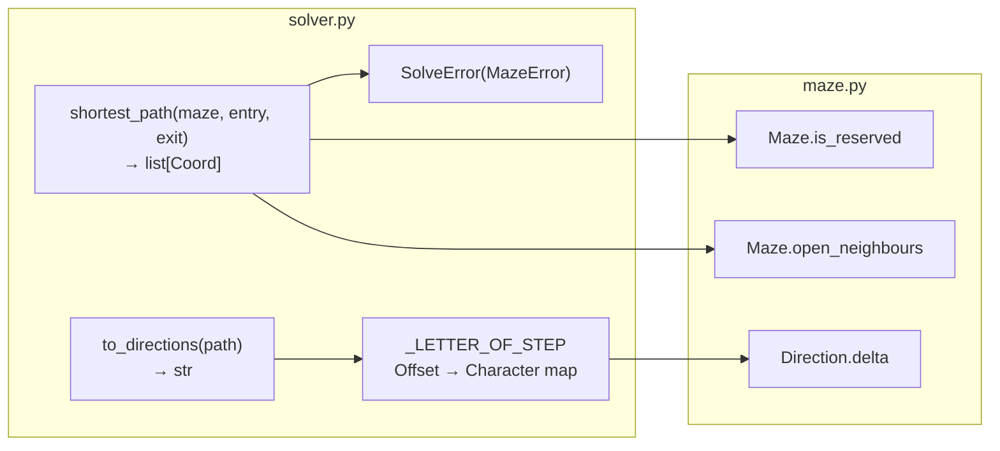

# 4. Shortest Path — `maze/solver.py`

|                    |                                                                                                              |
| ------------------ | ------------------------------------------------------------------------------------------------------------ |
| **Author**         | so                                                                                                           |
| **Consumers**      | `a_maze_ing.py` (Chapter 7), `mazegen` package (Chapter 8)                                                   |
| **Design Records** | [`shortest-path-solver.md`](../implementation_plans/shortest-path-solver.md) (Decisions S1–S3), Decision 3.8 |

## What this chapter covers

- Problem definition and the two representation forms of a solution (cells and direction characters)
- Differences between stacks and queues; why Breadth-First Search (BFS) guarantees the shortest path
- Reconstructing optimal paths by backtracking through parent pointer maps
- Translating coordinate sequences into cardinal direction characters (`N`, `E`, `S`, `W`)

---

## 1. Foundational Concepts

### 1.1 The Question Answered by the Solver

While the generator builds the maze geometry, it does not solve it. The solver receives the generated maze, an entry coordinate, and an exit coordinate, and answers one question:

> **What is the shortest path traversing only open passages from entry to exit?**

The resulting path is consumed in three distinct contexts:

| Consumer                          | Required Format               | Example                             |
| --------------------------------- | ----------------------------- | ----------------------------------- |
| Output file trailer (§IV.5)       | Direction characters          | `"ESEN"`                            |
| Terminal path visualizer (§V)     | Set of cell coordinates       | `(0,0), (1,0), (1,1), (2,1), (2,0)` |
| Standalone reusable package (§VI) | Public access to optimal path | `shortest_path`, `to_directions`    |

### 1.2 Multi-Path Scenarios in Imperfect Mazes

In `PERFECT=False` mazes, cycles exist, creating multiple alternative routes between entry and exit. The solver must strictly find the **shortest** path.

```text
E = Entry (0,0), X = Exit (2,0)

      x=0 x=1 x=2
    +---+---+---+
y=0 | E     | X |      Short path: E → (1,0) → (1,1) → (2,1) → X             "ESEN"    4 steps
    +   +   +   +      Long path:  E → (0,1) → (0,2) → (1,2) → (2,2) → (2,1) → X
y=1 |   |       |                                                            "SSEENN"  6 steps
    +   +---+   +
y=2 |           |
    +---+---+---+
```

### 1.3 Stack vs Queue

| Property        | Stack                               | Queue                                               |
| --------------- | ----------------------------------- | --------------------------------------------------- |
| Analogy         | Stack of plates (push top, pop top) | Grocery checkout line (enqueue rear, dequeue front) |
| Discipline      | **Last In, First Out** (LIFO)       | **First In, First Out** (FIFO)                      |
| Python Type     | `list` (`append` and `pop()`)       | `collections.deque` (`append` and `popleft()`)      |
| Role in Project | DFS maze carving (Chapter 3)        | BFS shortest-path solver (this chapter)             |

`list.pop(0)` can simulate a queue, but shifting $N$ elements incurs $O(N)$ overhead per pop ($O(N^2)$ total). For 100,000 pops, `list.pop(0)` took 645 ms while `deque.popleft()` took 3 ms in benchmark testing.

### 1.4 Why Breadth-First Search Guarantees Shortest Path

Searching via a FIFO queue explores vertices in strictly non-decreasing order of distance from the root:

- Exploring depth-1 cells enqueues their unvisited neighbours at the rear of the queue as depth-2 cells. They wait until all depth-1 cells are exhausted.
- Cells exit the queue ordered strictly by distance: $0, 1, 1, 2, 2, 3, \dots$.
- When the exit cell is first popped from the queue, no shorter path can possibly exist.

```text
Distance from Entry:
    +---+---+---+
    | 0   1 | 4 |      Exit (2,0) is 4 steps away → "ESEN" has 4 characters
    +   +   +   +
    | 1 | 2   3 |
    +   +---+   +
    | 2   3   4 |
    +---+---+---+
```

Depth-First Search (using a stack) follows the most recently discovered branch deeply, frequently finding long winding detours (like `"SSEENN"`) first.

→ Conceptual notes: [`learning_log/bfs-and-shortest-path.md`](../learning_log/bfs-and-shortest-path.md)

---

## 2. Architecture Overview



Both functions are pure, stateless functions (not classes). Invoked repeatedly on the same maze, they yield identical deterministic results (Decision S1 = A).

---

## 3. Component Breakdown

### 3.1 `SolveError(MazeError)`

Raised when no valid path connects entry and exit. Inherits from `MazeError`, allowing `a_maze_ing.py` to catch it cleanly. Formats cell coordinates as `x,y` matching the configuration file.

### 3.2 `shortest_path(maze: Maze, entry: Coord, exit: Coord) -> list[Coord]`

Executes BFS over open passages and returns the optimal sequence of cell coordinates starting at `entry` and ending at `exit`.

**Implementation Steps:**

1. Verify if `entry` is reserved:
   `if maze.is_reserved(entry): raise SolveError("the entry X,Y is part of the \"42\"...")`
2. Verify if `exit` is reserved:
   `if maze.is_reserved(exit): raise SolveError("the exit X,Y is part of the \"42\"...")`
3. Traverse grid using BFS:

```python
parent = {entry: None}           # Predecessor mapping + visited marker
line = deque([entry])            # FIFO exploration queue
path = []
while len(line) > 0:
    cell = line.popleft()
    if cell == exit:
        trace_cell = cell
        while trace_cell is not None:
            path.append(trace_cell)
            trace_cell = parent[trace_cell]
        return path[::-1]        # Reverse backtracked path
    for coord in maze.open_neighbours(cell):
        if coord not in parent:  # Discover unvisited neighbours
            line.append(coord)
            parent[coord] = cell # Record predecessor on enqueue
raise SolveError(f"the exit {exit[0]},{exit[1]} cannot be reached from the entry {entry[0]},{entry[1]}")
```

**Key Design Decisions:**

- **Early "42" Checks:** Reserved cells have all walls closed. Omitting early checks would exhaust the queue and emit an unhelpful "cannot be reached" error rather than pinpointing that the user placed entry/exit inside the pattern.
- **Dual Role of `parent`:** `coord in parent` serves as an $O(1)$ visited check, avoiding a separate `visited` set.
- **Record Predecessor on Enqueue:** Recording predecessors when pushing into the queue prevents a cell from being enqueued multiple times, ensuring each predecessor record reflects the earliest (shortest) arrival.
- **Complexity:** Each cell is enqueued at most once with $\le 4$ edges inspected, resulting in $O(V + E) = O(V)$ linear time and space.

### 3.3 Concrete Execution Trace

Tracing the $3 \times 3$ maze from Section 1.2:

| Step | Popped Cell        | Discovered Neighbours                | Queue State           |
| ---- | ------------------ | ------------------------------------ | --------------------- |
| 0    | —                  | `(0,0) ← None`                       | `(0,0)`               |
| 1    | `(0,0)`            | `(1,0) ← (0,0)`, `(0,1) ← (0,0)`     | `(1,0), (0,1)`        |
| 2    | `(1,0)`            | `(1,1) ← (1,0)`                      | `(0,1), (1,1)`        |
| 3    | `(0,1)`            | `(0,2) ← (0,1)`                      | `(1,1), (0,2)`        |
| 4    | `(1,1)`            | `(2,1) ← (1,1)`                      | `(0,2), (2,1)`        |
| 5    | `(0,2)`            | `(1,2) ← (0,2)`                      | `(2,1), (1,2)`        |
| 6    | `(2,1)`            | **`(2,0) ← (2,1)`**, `(2,2) ← (2,1)` | `(1,2), (2,0), (2,2)` |
| 7    | `(1,2)`            | None                                 | `(2,0), (2,2)`        |
| 8    | **`(2,0) = Exit`** | Reached target; terminate traversal  | —                     |

Backtracking from exit `(2, 0)`:
$$(2,0) \leftarrow (2,1) \leftarrow (1,1) \leftarrow (1,0) \leftarrow (0,0)$$
Reversing yields: `[(0, 0), (1, 0), (1, 1), (2, 1), (2, 0)]`.

### 3.4 `to_directions(path: list[Coord]) -> str`

Translates a list of adjacent coordinates into a string of cardinal direction letters:

```python
_LETTER_OF_STEP = {
    Direction.NORTH.delta: "N",     # (0, -1)
    Direction.EAST.delta: "E",      # (1, 0)
    Direction.SOUTH.delta: "S",     # (0, 1)
    Direction.WEST.delta: "W",      # (-1, 0)
}

def to_directions(path: list[Coord]) -> str:
    result = ""
    for a, b in zip(path, path[1:]):
        ax, ay = a
        bx, by = b
        result += _LETTER_OF_STEP[bx - ax, by - ay]
    return result
```

- `zip(path, path[1:])` iterates consecutive adjacent pairs: `(p[0], p[1]), (p[1], p[2]), ...`.
- Building `_LETTER_OF_STEP` from `Direction.delta` avoids hardcoding `(0, -1)` in multiple places.
- Any non-adjacent step raises a `KeyError`, immediately flagging solver corruption bugs rather than silently returning an incomplete string.

---

## 4. Caveats & Common Misconceptions

| Misconception                                  | Reality                                                                                                            |
| ---------------------------------------------- | ------------------------------------------------------------------------------------------------------------------ |
| Any pathfinding algorithm yields shortest path | Only algorithms exploring in non-decreasing order of distance (BFS) guarantee shortest paths in unweighted graphs. |
| `list.pop(0)` is acceptable for BFS            | $O(N)$ element shifting degrades BFS to $O(N^2)$. `deque.popleft()` runs in $O(1)$ time.                           |
| Marking visited on dequeue is fine             | Enqueues redundant duplicates, corrupting parent pointers. Must mark visited on enqueue.                           |
| `path.reverse()` returns reversed list         | `list.reverse()` reverses in-place and returns `None`. Use slicing `path[::-1]` to return a new reversed list.     |

---

## Related Documentation

- Design contract: [`implementation_plans/shortest-path-solver.md`](../implementation_plans/shortest-path-solver.md)
- Learning log: [`bfs-and-shortest-path.md`](../learning_log/bfs-and-shortest-path.md)
- Tests: `tests/test_solver.py` (Chapter 9)
- Next chapter: [5. Output File](05_output_writer.md)
