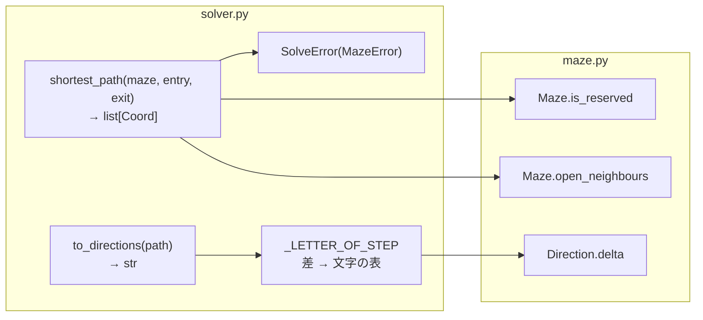

# 4. 最短経路 — `maze/solver.py`

| | |
| --- | --- |
| **書いた人** | so |
| **使う側** | `a_maze_ing.py`(7 章)、`mazegen` パッケージ(8 章) |
| **設計の記録** | [`shortest-path-solver.md`](../implementation_plans/shortest-path-solver.md)(決定 S1〜S3)、決定 3.8 |

## この章で分かること

- ソルバーが答える問いと、その答えの 2 つの形(セルと文字)
- スタックとキューの違い、幅優先探索(BFS)がなぜ最短の道を見つけるか
- 「どこから来たか」の記録から経路を取り出す方法
- セルの並びを `N`・`E`・`S`・`W` の文字にする方法

---

## 1. そもそもの概念

### 1.1 ソルバーが答える問い

生成器は迷路を作りますが、どう通り抜けるかは何も言いません。ソルバーは、完成した迷路・入口・出口を受け取り、1 つの問いに答えます。

> **開いた壁だけを通って、入口から出口へ行く最短の道は何か?**

答えは 3 か所で使われます。

| 使う場所 | 必要な形 | 例 |
| --- | --- | --- |
| 出力ファイルの最終行(§IV.5) | 向きの文字 | `ESEN` |
| 画面の経路表示(§V) | 経路上のセル | `(0,0) (1,0) (1,1) (2,1) (2,0)` |
| 再利用モジュール(§VI) | 「最低ひとつの解」へのアクセス | 関数を公開する |

### 1.2 道が複数あるとき

`PERFECT=False` の迷路にはループがあるので、入口から出口への道がふつう複数あります。そのうち**一番短いもの**を返さなければなりません。

```text
E = 入口 (0,0)、X = 出口 (2,0)

      x=0 x=1 x=2
    +---+---+---+
y=0 | E     | X |      短い道:E → (1,0) → (1,1) → (2,1) → X             "ESEN"    4 歩
    +   +   +   +      長い道:E → (0,1) → (0,2) → (1,2) → (2,2) → (2,1) → X
y=1 |   |       |                                                        "SSEENN"  6 歩
    +   +---+   +
y=2 |           |
    +---+---+---+
```

### 1.3 スタックとキュー

| | スタック | キュー |
| --- | --- | --- |
| たとえ | 積んだ皿(上に置いて上から取る) | レジの行列(後ろに並んで前から抜ける) |
| 取り出すもの | **最後に**入れたもの(LIFO) | **最初に**入れたもの(FIFO) |
| Python | `list` の `append` と `pop()` | `collections.deque` の `append` と `popleft()` |
| この課題 | 迷路を掘る(3 章) | 最短経路(この章) |

`list` の `pop(0)` でもキューは作れますが、先頭を抜くたびに残りを全部ずらすので遅くなります。10 万個を先頭から取り出すと、`list.pop(0)` は 645 ms、`deque.popleft()` は 3 ms でした(学習ノートの実測)。

### 1.4 幅優先探索(BFS)がなぜ最短か

キューで探索すると、**入口に近いセルから順に**取り出されます。

- 入口から 1 歩のセルを取り出している間に見つけた隣は、2 歩のセルです。それらは行列の**後ろ**に並ぶので、1 歩のセルが全部抜けるまで順番が来ません。
- なので、セルは**距離の順**(0, 1, 1, 2, 2, 3, …)にキューを出ていきます。
- 出口が初めて出てきたとき、それより短い道で出口に着くものは、もう待っていません。

```text
入口からの歩数:
    +---+---+---+
    | 0   1 | 4 |      出口 (2,0) は 4 歩 → "ESEN" は 4 文字
    +   +   +   +
    | 1 | 2   3 |
    +   +---+   +
    | 2   3   4 |
    +---+---+---+
```

スタック(深さ優先探索)では、最後に見つけた隣から深く進むので、この順番が崩れ、遠回り(`SSEENN`)を見つけることがあります。

→ 学習ノート [`bfs-and-shortest-path.md`](../learning_log/bfs-and-shortest-path.md)

---

## 2. 全体図



2 つの関数は、状態を持たない**関数**です(クラスではない)。同じ迷路で 2 回呼べば、同じ答えを返します(決定 S1 = A)。

---

## 3. 各部品

### 3.1 `SolveError(MazeError)`

入口から出口に届かないときのエラーです。`MazeError` の子なので、生成器の `GenerationError` と一緒にエントリポイントで捕まります。メッセージは、セルを設定ファイルと同じ `x,y` の形で示します(利用者がそのまま見比べられるように)。

### 3.2 `shortest_path(maze, entry, exit) -> list[Coord]`

**何をするか:** BFS で最短経路を探し、**セルの並び**(先頭が入口、末尾が出口)を返します。

**処理の手順:**

1. **入口が「42」のセルか**を確かめる → そうなら `SolveError("the entry X,Y is part of the \"42\", whose cells are closed on every side")`。
2. **出口も同じ**に確かめる → `SolveError("the exit X,Y is part of the \"42\", ...")`。
3. 探索:

```python
parent = {entry: None}           # どこから来たかの記録(到達済みの印も兼ねる)
line = deque([entry])            # キュー
path = []
while len(line) > 0:
    cell = line.popleft()        # 一番古いセルを取り出す
    if cell == exit:             # 出口を取り出したら
        trace_cell = cell
        while trace_cell is not None:     # 記録を逆にたどる
            path.append(trace_cell)
            trace_cell = parent[trace_cell]
        return path[::-1]                 # 反転して返す
    for coord in maze.open_neighbours(cell):
        if coord not in parent:           # まだ到達していない隣だけ
            line.append(coord)
            parent[coord] = cell          # キューに入れるときに記録
raise SolveError("the exit X,Y cannot be reached from the entry X,Y")
```

**1 と 2 を先に確かめる理由:** 「42」のセルは壁が全部閉じているので、そこから探索すると、キューがすぐ空になって「届かない」という理由でエラーになります。それでは、利用者が本当に直すべき「入口(出口)の位置」が伝わりません。

**`parent` が 2 つの役目を持つ理由:** 辞書のキーには `in` が使えるので、「記録があるか」=「到達済みか」として使えます。別に `visited` を持つ必要がありません。

**キューに入れるときに記録する理由:** 取り出すときに記録すると、取り出される前に同じセルが何度もキューに入り、後から来た長い道が「どこから来たか」を上書きしえます。入れるときに 1 回だけ記録し、二度と上書きしないので、各セルの記録は「初めて着いたとき = 最短で着いたとき」の 1 歩手前のセルになります。

**同じ長さの道が複数あるとき:** 隣を見る順番(N, E, S, W)で決まります。乱数を使わないので、同じ迷路からは常に同じ経路が返ります。

**入口 = 出口のとき:** `[entry]`(0 歩の経路)を返します。設定パーサが先に拒否するので、エントリポイント経由では起きません。

**計算量:** 各セルはキューに最大 1 回入り、隣は最大 4 つなので、時間もメモリもセル数に比例します。

### 3.3 経路の取り出し(トレース)

1.2 の迷路で、実際に実行したときの記録:

| 手 | 取り出す | 見つけた隣(記録) | キュー |
| --- | --- | --- | --- |
| 0 | — | (0,0)←なし | (0,0) |
| 1 | (0,0) | (1,0)←(0,0)、(0,1)←(0,0) | (1,0) (0,1) |
| 2 | (1,0) | (1,1)←(1,0) | (0,1) (1,1) |
| 3 | (0,1) | (0,2)←(0,1) | (1,1) (0,2) |
| 4 | (1,1) | (2,1)←(1,1) | (0,2) (2,1) |
| 5 | (0,2) | (1,2)←(0,2) | (2,1) (1,2) |
| 6 | (2,1) | **(2,0)←(2,1)**、(2,2)←(2,1) | (1,2) (2,0) (2,2) |
| 7 | (1,2) | なし | (2,0) (2,2) |
| 8 | **(2,0) = 出口** | 終了 | — |

出口から記録を逆にたどる:

```text
(2,0) ← (2,1) ← (1,1) ← (1,0) ← (0,0) ← なし(入口)
反転:[(0,0), (1,0), (1,1), (2,1), (2,0)]
```

(2,2) や (0,1) の記録は、たどる途中で一度も使われません。探索では全部記録しますが、出口から戻る 1 本の道に乗った記録だけが経路になります。

### 3.4 `_LETTER_OF_STEP` と `to_directions(path) -> str`

```python
_LETTER_OF_STEP = {
    Direction.NORTH.delta: "N",     # (0, -1)
    Direction.EAST.delta: "E",      # (1, 0)
    Direction.SOUTH.delta: "S",     # (0, 1)
    Direction.WEST.delta: "W",      # (-1, 0)
}

def to_directions(path):
    result = ""
    for a, b in zip(path, path[1:]):          # 隣り合う 2 つのセルの組
        ax, ay = a
        bx, by = b
        result += _LETTER_OF_STEP[bx - ax, by - ay]
    return result
```

**`zip(path, path[1:])`:** 経路と、先頭を 1 つ落とした経路を重ねると、隣り合う組 `(0番目, 1番目)`, `(1番目, 2番目)`, … ができます。短いほうに合わせて止まるので、最後の要素で止まる調整を自分で書かなくて済みます。

**`_LETTER_OF_STEP[bx - ax, by - ay]`:** `[]` の中のカンマはタプルを作るので、`(dx, dy)` をキーに文字を引きます。

**表を `Direction.delta` から作る理由:** 「北は `(0, -1)`」を 2 か所に書かずに済み、書き間違える余地がありません。`y` は下に向かって増えるので、`y` が小さくなる一歩が北です。

**隣り合っていないセルの組:** 表に無い差なので `KeyError` になります。ソルバーの出力では起きないので、起きたらバグです。黙って飛ばすと 1 文字足りない文字列を返してしまうので、止まるほうが安全です。

**トレース:**

| 組 | 差 | 文字 |
| --- | --- | --- |
| (0,0) → (1,0) | (1, 0) | E |
| (1,0) → (1,1) | (0, 1) | S |
| (1,1) → (2,1) | (1, 0) | E |
| (2,1) → (2,0) | (0, −1) | N |

→ `"ESEN"`。セルが 1 つか 0 個なら組が無いので `""` です。

---

## 4. 実際の例 — 3 章の 4 × 3 の完全迷路

3 章で作った 4 × 3、シード 7 の完全迷路を、入口 (0,0)、出口 (3,2) で解いた結果(実際の値):

```text
経路のセル:[(0,0), (0,1), (1,1), (2,1), (2,2), (3,2)]
文字:      SEESE

+---+---+---+---+
| E |           |
+   +---+---+   +
| o   o   o |   |
+---+---+   +   +
|         o   X |
+---+---+---+---+
```

完全迷路なので道は 1 本しかなく、それがそのまま最短です。

---

## 5. 注意点・よくある誤解

| 誤解 | 実際 |
| --- | --- |
| 出口にたどり着く探索なら、どれでも最短 | セルが距離の順に出てくる探索(BFS)だけ |
| キューには `list.pop(0)` で十分 | 動くが遅い(O(n²))。`deque.popleft()` を使う |
| 到達済みの印は取り出すときに付ける | 入れるときに付ける。取り出すときだと、同じセルが何度も入り、記録が上書きされうる |
| キューに経路が入っている | キューにあるのはこれから調べるセル。経路は記録から後で組み立てる |
| `path.reverse()` の結果を返せばよい | `reverse()` は `None` を返す。`path[::-1]` は新しいリストを返す |
| 入口が「42」でも「届かない」と言えば十分 | 何を直せばよいか伝わらない。先に確かめて理由を示す |

---

## 関連文書

- [`shortest-path-solver.md`](../implementation_plans/shortest-path-solver.md) — 設計、トレース、決定 S1〜S3
- 学習ノート:[`bfs-and-shortest-path.md`](../learning_log/bfs-and-shortest-path.md)
- テスト:`tests/test_solver.py`(9 章)
- 次の章:[5. 出力ファイル](05_output_writer.md)
