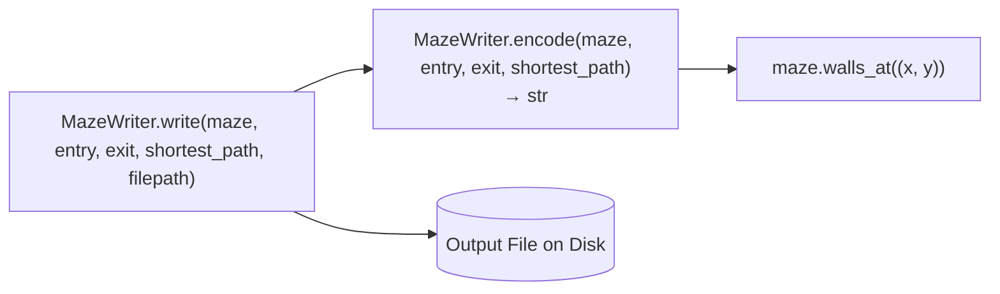

# 5. Output File — `output/maze_writer.py`

|                       |                             |
| --------------------- | --------------------------- |
| **Author**            | javi                        |
| **Consumer**          | `a_maze_ing.py` (Chapter 7) |
| **Subject Reference** | §IV.5                       |

## What this chapter covers

- Output file structure and line-by-line format specifications
- How cell bitmasks translate into single hexadecimal characters
- Operation of `MazeWriter` static methods (`encode` and `write`)

---

## 1. Foundational Concepts — Output Format

Subject §IV.5 specifies the exact file layout:

```text
bd53          ← Maze row 1: 1 hexadecimal character per cell
c53a          ← Maze row 2
d546          ← Maze row 3
              ← Empty blank line
0,0           ← Entry coordinates (x,y)
3,2           ← Exit coordinates (x,y)
SEESE         ← Shortest path from entry to exit (N/E/S/W)
```

(Produced from the $4 \times 3$ perfect maze with seed 7 examined in Chapters 3 and 4.)

**Every line concludes with a standard newline `\n`**, including the final direction string.

### Reading 4-Bit Hexadecimal Characters

Each hex digit directly encodes the 4-bit wall mask of that cell (Chapter 1). **Bit value 1 represents a closed wall; 0 represents an open passage.**

```text
b = 11 = 1011 in binary:
    W S E N
    1 0 1 1   → North, East, West are closed; South is open

d = 13 = 1101 → West, South, North closed; East open
5 =  5 = 0101 → South, North closed; East, West open (horizontal corridor)
3 =  3 = 0011 → East, North closed; South, West open
f = 15 = 1111 → Fully closed cell (new uncarved cell or "42" pattern cell)
```

| Hex Character | Binary Bits | Open Passages           |
| ------------- | ----------- | ----------------------- |
| `0`           | 0000        | All 4 walls open        |
| `5`           | 0101        | East & West open        |
| `a`           | 1010        | North & South open      |
| `f`           | 1111        | None (all walls closed) |

Validation tool `maze_analyzer.py` parses these hexadecimal characters to verify "Wall coherence" across adjacent shared cell boundaries. Because mutations route exclusively through `Maze.open_passage`, shared walls are guaranteed to match atomically.

---

## 2. Architecture Overview



`MazeWriter` is a stateless utility class exposing `@staticmethod` functions called directly as `MazeWriter.write(...)`.

The `maze` parameter is typed against `MazeLike` (the structural `Protocol` detailed in Chapter 6). Any object exposing `width`, `height`, and `walls_at` can be serialized, enabling testing with mock grid objects.

---

## 3. Method Breakdown

### 3.1 `encode(maze: MazeLike, entry: Coord, exit: Coord, shortest_path: str) -> str`

Constructs the complete text content without touching the filesystem.

**Processing Steps:**

1. Iterates through each row $y$; formats each cell's mask via `f"{mask:x}"` (lowercase hexadecimal) concatenated into a line string.
2. Joins grid row strings with `\n`, appending a trailing newline.
3. Formats trailer: `f"\n{entry[0]},{entry[1]}\n{exit[0]},{exit[1]}\n{shortest_path}\n"`.
4. Concatenates and returns the full serialized string.

**Concrete Example:** Initial uncarved $2 \times 2$ maze with entry `(0,0)`, exit `(1,1)`, and path `"SE"`:

```python
'ff\nff\n\n0,0\n1,1\nSE\n'
```

Decoupling `encode` from `write` enables fast in-memory verification without file I/O overhead (`tests/test_output.py`).

### 3.2 `write(maze: MazeLike, entry: Coord, exit: Coord, shortest_path: str, filepath: str) -> None`

Writes encoded text to `filepath` using UTF-8 encoding, overwriting existing files:

```python
content = MazeWriter.encode(maze, entry, exit, shortest_path)
with open(filepath, "w", encoding="utf-8") as f:
    f.write(content)
```

Using a `with open(...)` context manager guarantees the file descriptor is closed properly even if exceptions occur.

**Invocation Points:** Invoked once upon startup and re-invoked on every regeneration keypress (`'r'`) in `a_maze_ing.py`.

---

## 4. Key Considerations

| Consideration         | Detail                                                                                                                                                     |
| --------------------- | ---------------------------------------------------------------------------------------------------------------------------------------------------------- |
| String Path Argument  | `shortest_path` expects a direction string (`"SEESE"`), not a list of cell coordinates.                                                                    |
| Path Writability      | If the target directory does not exist or permissions fail, `open()` raises `OSError`. This is caught cleanly by `a_maze_ing.py` and reported to `stderr`. |
| Lowercase Hexadecimal | `f"{mask:x}"` produces lowercase hex (`b`, `f`), matching subject examples.                                                                                |
| Trailing Newline      | Complies with §IV.5 requirement that every line terminates with `\n`.                                                                                      |

---

## Related Documentation

- Subject §IV.5
- Bitmask encoding: Chapter 1 & [`learning_log/bitmask-wall-encoding.md`](../learning_log/bitmask-wall-encoding.md)
- Tests: `tests/test_output.py` (Chapter 9)
- Next chapter: [6. Display and Controls](06_display.md)
