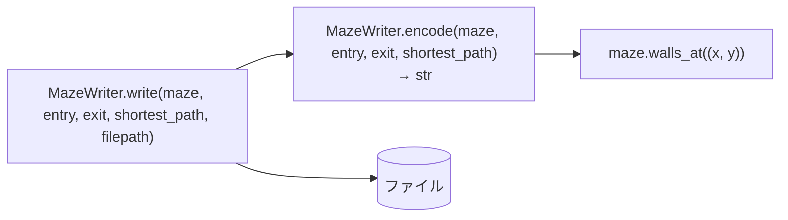

# 5. 出力ファイル — `output/maze_writer.py`

| | |
| --- | --- |
| **書いた人** | javi |
| **使う側** | `a_maze_ing.py`(7 章) |
| **subject** | §IV.5 |

## この章で分かること

- 出力ファイルの形式と、各行の意味
- 迷路のマスクが 16 進数 1 桁になる仕組み
- `MazeWriter` の 2 つのメソッドの働き

---

## 1. そもそもの概念 — 出力ファイルの形式

subject §IV.5 が決めている形式です。

```text
bd53          ← 迷路の 1 行目:1 セルにつき 16 進数 1 桁
c53a          ← 2 行目
d546          ← 3 行目
              ← 空行
0,0           ← 入口の x,y
3,2           ← 出口の x,y
SEESE         ← 入口から出口への最短経路(N/E/S/W)
```

(3 章・4 章の 4 × 3、シード 7 の完全迷路を実際に書き出したもの。)

**すべての行は `\n` で終わります**(最後の経路の行も)。

### 16 進数 1 桁の読み方

各桁は、そのセルのマスク(1 章)をそのまま 16 進数で書いたものです。**ビットが 1 = 壁が閉じている。**

```text
b = 11 = 1011    W S E N
                 1 0 1 1    北・東・西が閉じ、南が開いている

d = 13 = 1101    西・南・北が閉じ、東が開いている
5 =  5 = 0101    南・北が閉じ、東・西が開いている(横の通路)
3 =  3 = 0011    東・北が閉じ、南・西が開いている
f = 15 = 1111    全部閉じている(新しいセル、または「42」のセル)
```

| 桁 | 2 進数 | 開いている壁 |
| --- | --- | --- |
| `0` | 0000 | 全部 |
| `5` | 0101 | 東・西 |
| `a` | 1010 | 北・南 |
| `f` | 1111 | なし |

`maze_analyzer.py` は、この桁から迷路を組み立て直し、隣り合うセルの共有する壁が一致しているかを確かめます(「Wall coherence」)。`Maze.open_passage` が両側を同時に書き換えるので、常に一致します(1 章)。

---

## 2. 全体図



`MazeWriter` は状態を持たないクラスで、2 つのメソッドはどちらも**静的メソッド**(`@staticmethod`)です。インスタンスを作らずに `MazeWriter.write(...)` と呼びます。`self` を受け取りません。

`maze` の型は `MazeLike`(6 章の Protocol)です。`width`・`height`・`walls_at` を持つものなら何でも書き出せるので、テストでは本物の `Maze` 以外も渡せます。

---

## 3. 各メソッド

### 3.1 `encode(maze, entry, exit, shortest_path) -> str`

**何をするか:** ファイルに書く**文字列全体**を作って返します。ファイルには触りません。

**処理の手順:**

1. 各行 `y` について、各セル `x` のマスクを `f"{mask:x}"`(小文字の 16 進数)にして横につなげ、1 行の文字列を作る。
2. 行を `"\n"` でつなぎ、最後に `"\n"` を足す(迷路の部分)。
3. `f"\n{entry[0]},{entry[1]}\n{exit[0]},{exit[1]}\n{shortest_path}\n"` を作る(先頭の `\n` が空行になる)。
4. 2 と 3 をつなげて返す。

**例(実際の値):** 新しい 2 × 2 の迷路、入口 (0,0)、出口 (1,1)、経路 `SE`

```python
'ff\nff\n\n0,0\n1,1\nSE\n'
```

**`encode` と `write` を分けている理由:** `encode` は文字列を返すだけなので、ファイルを作らずにテストできます(`tests/test_output.py`)。

### 3.2 `write(maze, entry, exit, shortest_path, filepath) -> None`

**何をするか:** `encode` の結果を、`filepath` に UTF-8 で書きます(既存のファイルは上書き)。

```python
content = MazeWriter.encode(maze, entry, exit, shortest_path)
with open(filepath, "w", encoding="utf-8") as f:
    f.write(content)
```

`with` を使うと、書き終わったとき(途中でエラーが起きても)ファイルが確実に閉じられます。

**呼ばれるタイミング:** 起動時に 1 回と、`r` で迷路を作り直すたびに 1 回(7 章)。どちらも設定の `OUTPUT_FILE` に上書きします。

---

## 4. 注意点

| 点 | 内容 |
| --- | --- |
| 経路は文字列で受け取る | `shortest_path` 引数は `"SEESE"` のような文字列。セルの並びではない(ソルバーの `to_directions` の結果を渡す) |
| 書けないパス | 存在しないフォルダなどで `open` が `OSError` を投げる。このクラスは捕まえず、エントリポイントも捕まえていない(0 章) |
| 16 進数は小文字 | `f"{mask:x}"` は小文字(`b`, `f`)。subject の例も小文字 |
| ファイルの最後が `\n` で終わる | §IV.5 の「すべての行は `\n` で終わる」を満たす |
| 下の方のコメント | ファイル末尾のコメントアウトされた部分は、開発中に `DummyMaze` で試した名残り。実行されない |

---

## 関連文書

- subject §IV.5([`ja.subject.md`](../subject/ja.subject.md))
- 1 章の「ビットマスク」、学習ノート [`bitmask-wall-encoding.md`](../learning_log/bitmask-wall-encoding.md)
- テスト:`tests/test_output.py`(9 章)
- 次の章:[6. 画面表示と操作](06_display.md)
