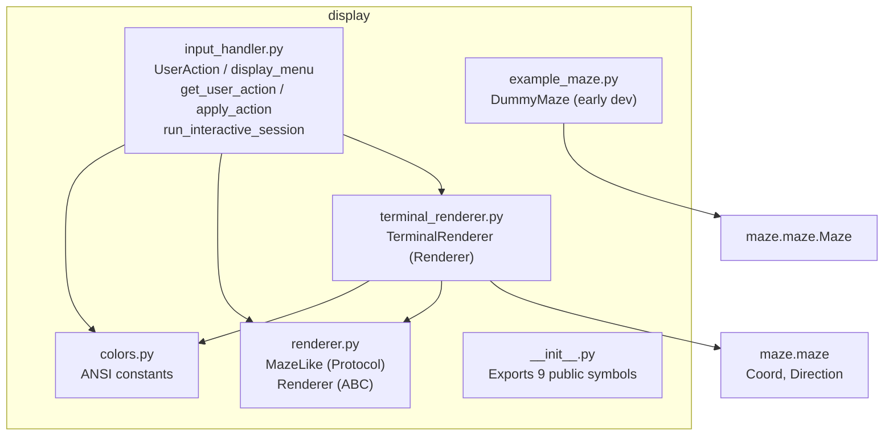
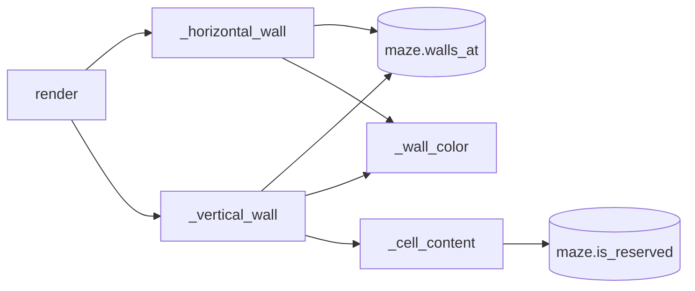

# 6. Display and Controls — `display/`

|                       |                                                                         |
| --------------------- | ----------------------------------------------------------------------- |
| **Author**            | javi                                                                    |
| **Consumers**         | `a_maze_ing.py` (Chapter 7); `output/maze_writer.py` imports `MazeLike` |
| **Subject Reference** | §V, Decisions 4.1, 4.3                                                  |

## What this chapter covers

- Terminal text coloring mechanics via ANSI escape codes
- Architectural distinction between `MazeLike` (Protocol) and `Renderer` (ABC)
- ASCII maze rendering algorithm (converting 1 grid cell row into 2 terminal lines)
- Priority hierarchy for cell contents (entry, exit, path, and "42" logo)
- Menu handling, input parsing, interactive session loop, and maze regeneration

---

## 1. Foundational Concepts

### 1.1 ANSI Escape Sequences — Coloring Terminal Text

Terminals intercept strings beginning with `\033[` (ESC + `[`) as styling instructions rather than literal glyphs:

```text
"\033[36m" + "|" + "\033[0m"
 Set Cyan   Wall   Reset Color
```

| Constant      | Value                      | Visual Style                        | Purpose                                  |
| ------------- | -------------------------- | ----------------------------------- | ---------------------------------------- |
| `RESET`       | `\033[0m`                  | Reset attributes                    | Resets color after rendering symbol      |
| `CYAN`        | `\033[36m`                 | Cyan foreground                     | Wall color 1                             |
| `YELLOW`      | `\033[33m`                 | Yellow foreground                   | Wall color 2                             |
| `BLUE`        | `\033[94m`                 | Bright blue foreground              | Wall color 3                             |
| `WALL_COLORS` | `("", CYAN, YELLOW, BLUE)` | Sequence of wall styles             | Cycled via `'c'` key (index 0 = default) |
| `PATH`        | `\033[32m`                 | Green foreground                    | Shortest path marker `.`                 |
| `ENTRY`       | `\033[44;97m`              | Blue background + bright white text | Entry marker `E`                         |
| `EXIT`        | `\033[41;97m`              | Red background + bright white text  | Exit marker `X`                          |
| `PATTERN42`   | `\033[35m`                 | Magenta foreground                  | "42" reserved blocks `███`               |

Using semicolon-separated arguments like `44;97` sets background and foreground simultaneously. Solid background styling for Entry/Exit ensures high contrast even when wall colors cycle to blue.

### 1.2 `Protocol` vs `ABC` — Dual Interface Strategy

```python
class MazeLike(Protocol):          # Structural typing (Duck typing)
    @property
    def width(self) -> int: ...
    @property
    def height(self) -> int: ...
    def walls_at(self, pos: tuple[int, int]) -> int: ...

class Renderer(ABC):               # Nominal subtyping (Explicit inheritance)
    @abstractmethod
    def render(self, maze: MazeLike) -> None:
        raise NotImplementedError
```

| Aspect      | `MazeLike` (`Protocol`)                                                                                         | `Renderer` (`ABC`)                                                                 |
| ----------- | --------------------------------------------------------------------------------------------------------------- | ---------------------------------------------------------------------------------- |
| Mechanism   | **Structural:** Any object exposing `width`, `height`, and `walls_at` satisfies `MazeLike` without subclassing. | **Nominal:** Classes must explicitly inherit: `class TerminalRenderer(Renderer):`. |
| Enforcement | Checked statically by `mypy`.                                                                                   | Checked at instantiation time (missing `render` raises error).                     |
| Purpose     | Decouples renderers and writers from concrete `Maze` classes (permits test mocks).                              | Mandates that any future visualizer (e.g. MiniLibX) must implement `render`.       |

---

## 2. Architecture Overview



### `TerminalRenderer` Method Call Graph



---

## 3. Package Re-Exports (`__init__.py`)

`display/__init__.py` re-exports 9 core symbols: `WALL_COLORS`, `UserAction`, `apply_action`, `display_menu`, `get_user_action`, `run_interactive_session`, `MazeLike`, `Renderer`, and `TerminalRenderer`.

---

## 4. `TerminalRenderer` Class

### 4.1 Attributes and Initialization

`TerminalRenderer(show_path=False, color_mode=0, entry=None, exit=None, shortest_path=None)`

- `show_path: bool`: Controls rendering of path dots `.` (toggled via `'t'`).
- `color_mode: int`: Index into `WALL_COLORS` (`0`–`3`, cycled via `'c'`).
- `entry: Coord | None`: Coordinates of the entry cell.
- `exit: Coord | None`: Coordinates of the exit cell.
- `shortest_path: set[Coord] | None`: Stores path coordinates converted to a `set` for $O(1)$ lookup performance per cell.

### 4.2 Row Layout Mechanics

Each grid cell spans **4 characters horizontally** (left vertical wall + 3 interior characters). Vertically, each maze row renders across **2 terminal lines** (cell body row + southern wall row):

```text
Top Border Row   ← Formed from North walls of Row 0
+---+---+---+---+
|   |           |   ← Interior Row 0: West wall + content for each cell + rightmost East wall
+   +---+---+   +   ← Horizontal Wall Row 0: Formed from South walls of Row 0
|           |   |   ← Interior Row 1
+---+---+   +   +   ← Horizontal Wall Row 1
|               |   ← Interior Row 2
+---+---+---+---+   ← Horizontal Wall Row 2 (Bottom perimeter)
```

A maze of height $H$ produces $1 + 2H$ terminal lines; width $W$ yields $4W + 1$ characters per line (e.g. $20 \times 15$ maze renders as $81 \times 31$ characters).

### 4.3 Rendering Methods

#### `render(self, maze: MazeLike, shortest_path=None) -> None`

1. If `shortest_path` is passed, updates `self.shortest_path`.
2. Prints northern border line via `_horizontal_wall(maze, 0, N)`.
3. For each row $y$, prints `_vertical_wall(maze, y)` followed by `_horizontal_wall(maze, y, S)`.

#### `_horizontal_wall(self, maze, y, wall) -> str`

Constructs horizontal boundary line using `+` corners, emitting `---` if the wall is closed or `   ` (3 spaces) if open.

#### `_vertical_wall(self, maze, y) -> str`

Iterates columns $x$: renders West wall (`|` or space), renders 3-character cell interior via `_cell_content(x, y, maze)`, and appends East wall of the final column.

#### `_cell_content(self, x, y, maze) -> str`

Determines 3-character interior glyph by evaluating priorities:

| Priority | Condition                                       | Rendered Content                  |
| :------: | ----------------------------------------------- | --------------------------------- |
|    1     | `(x, y) == entry`                               | `E` (Blue background)             |
|    2     | `(x, y) == exit`                                | `X` (Red background)              |
|    3     | `show_path` is True and cell in `shortest_path` | `.` (Green foreground)            |
|    4     | Cell is reserved pattern cell (`is_reserved`)   | `███` (Magenta foreground blocks) |
|    5     | Default walkable cell                           | `   ` (3 spaces)                  |

Prioritizing entry and exit over the path ensures `E` and `X` remain visible when path display is active.

---

## 5. `input_handler.py` — Menu and Interactive Loop

### 5.1 `UserAction(Enum)`

String-backed enum:

- `TOGGLE_PATH = "t"`
- `CHANGE_COLOR = "c"`
- `REGENERATE = "r"`
- `QUIT = "q"`

### 5.2 `display_menu() -> None`

Prints formatted 40-column interactive menu.

### 5.3 `get_user_action() -> UserAction`

Reads input via `input("Choose an option (t/c/r/q): ").strip().lower()`. Re-prompts on unrecognized options. Catches `(EOFError, KeyboardInterrupt)` to return `UserAction.QUIT`, ensuring clean exit when piped from `/dev/null` or interrupted with Ctrl+D/Ctrl+C.

### 5.4 `apply_action(action, renderer, on_regenerate=None) -> bool`

- `'t'`: Inverts `renderer.show_path`; returns `True`.
- `'c'`: Advances `renderer.color_mode = (renderer.color_mode + 1) % len(WALL_COLORS)`; returns `True`.
- `'r'`: Invokes callback if available; returns `True`.
- `'q'`: Prints exit message and returns `False` to terminate the loop.

### 5.5 `run_interactive_session(renderer, maze, on_regenerate=None) -> None`

Drives the interactive loop:

1. Renders `current_maze`.
2. Displays menu and awaits keypress.
3. If `'r'` is chosen and `on_regenerate` callback is supplied, re-invokes generation, updates `current_maze`, and updates `renderer.shortest_path`.
4. Continues until user selects `'q'`.

Decoupling regeneration via a callback allows the display loop to regenerate mazes without depending on `maze.generator` or configuration parsing.

---

## Related Documentation

- Decisions 4.1 (ASCII display), 4.3 (Renderer & "42") — [`pair_communication/01_kickoff.md`](../pair_communication/01_kickoff.md)
- Tests: `tests/test_display.py` (Chapter 9)
- Next chapter: [7. Entry Point](07_entry_point.md)
