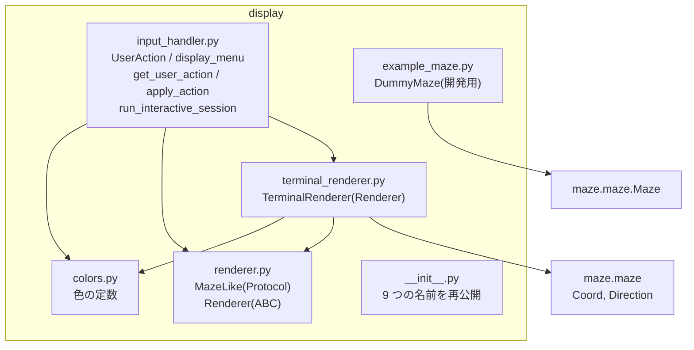
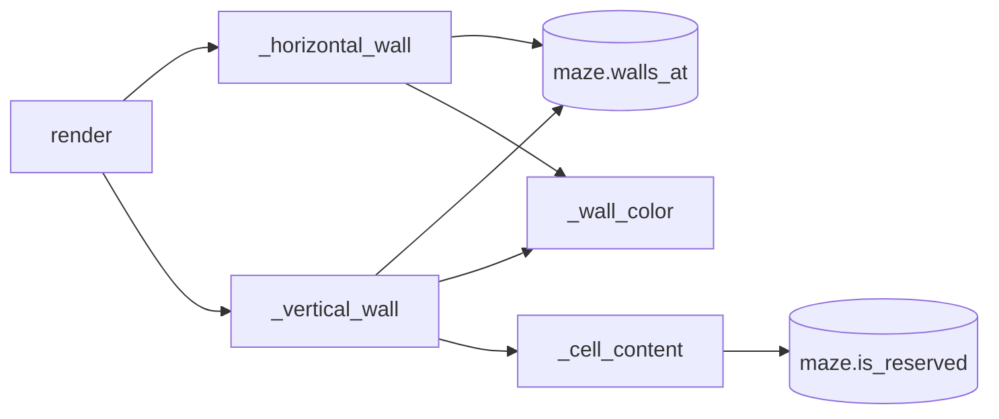
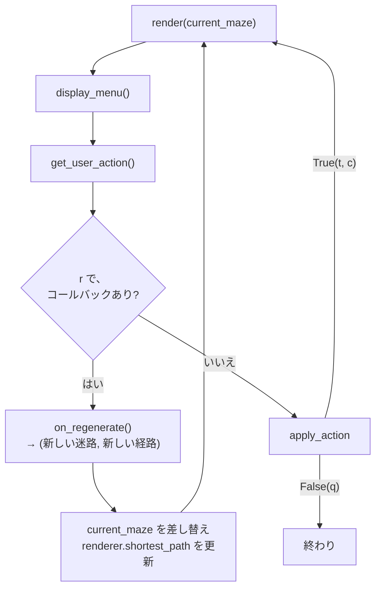

# 6. 画面表示と操作 — `display/`

| | |
| --- | --- |
| **書いた人** | javi |
| **使う側** | `a_maze_ing.py`(7 章)。`output/maze_writer.py` は `MazeLike` だけを借りる |
| **subject** | §V、決定 4.1・4.3 |

## この章で分かること

- 端末に色を付ける仕組み(ANSI エスケープ)
- `MazeLike`(Protocol)と `Renderer`(ABC)の違い
- 迷路を文字で描くアルゴリズム(1 行のセルが 2 行の文字になる)
- 入口・出口・経路・「42」の印の優先順位
- メニュー・キー入力・対話ループ・迷路の作り直しの仕組み

---

## 1. そもそもの概念

### 1.1 ANSI エスケープ — 端末の文字に色を付ける

端末は、`\033[`(ESC 文字 + `[`)で始まる特別な文字の並びを受け取ると、それを表示せずに**次の文字の色を変える命令**として扱います。

```text
"\033[36m" + "|" + "\033[0m"
   シアンにする   縦線   元に戻す(RESET)
```

| 定数 | 値 | 意味 | 使い道 |
| --- | --- | --- | --- |
| `RESET` | `\033[0m` | 色を元に戻す | すべての色の後 |
| `CYAN` | `\033[36m` | シアンの文字 | 壁の色 1 |
| `YELLOW` | `\033[33m` | 黄の文字 | 壁の色 2 |
| `BLUE` | `\033[94m` | 明るい青の文字 | 壁の色 3 |
| `WALL_COLORS` | `("", CYAN, YELLOW, BLUE)` | 壁の色の一覧(0 番は色なし) | `c` キーで切り替え |
| `PATH` | `\033[32m` | 緑の文字 | 経路の `.` |
| `ENTRY` | `\033[44;97m` | 青の背景 + 明るい白の文字 | 入口の `E` |
| `EXIT` | `\033[41;97m` | 赤の背景 + 明るい白の文字 | 出口の `X` |
| `PATTERN42` | `\033[35m` | マゼンタの文字 | 「42」の `███` |
| `WALL` | `\033[37m` | 白の文字 | **使われていない** |

`44;97` のように `;` で区切ると、背景色と文字色を同時に指定できます。入口と出口を背景色にしたのは、壁を青に切り替えたときに入口の青い文字と見分けがつかなくなるのを避けるためです(javi の作業ログ 9/18)。

### 1.2 Protocol と ABC — 「このメソッドを持つこと」の 2 つの表し方

```python
class MazeLike(Protocol):          # 形が合えばよい
    @property
    def width(self) -> int: ...
    @property
    def height(self) -> int: ...
    def walls_at(self, pos: tuple[int, int]) -> int: ...

class Renderer(ABC):               # 継承して実装しなければならない
    @abstractmethod
    def render(self, maze: MazeLike) -> None:
        raise NotImplementedError
```

| | `MazeLike`(Protocol) | `Renderer`(ABC) |
| --- | --- | --- |
| 仕組み | **構造的な型**:`width`・`height`・`walls_at` を持っていれば、継承しなくても `MazeLike` として扱われる | **名前による型**:`class TerminalRenderer(Renderer)` と書いて継承する |
| 確かめる時点 | mypy が型を確かめるとき | インスタンスを作るとき(`render` を実装していないとエラー) |
| 目的 | 描画と書き出しが `Maze` だけに縛られない。テストの偽物や `DummyMaze` も渡せる | 将来、別の描画(MLX など)を足すときに、`render` を必ず持たせる |

`MazeLike` には、`is_reserved`・`entry`・`exit`・`shortest_path` は**含まれていません**。描画は、これらを `hasattr` / `getattr` で「あれば使う」形で探します(4.4)。

---

## 2. 全体図



### `TerminalRenderer` のメソッドの呼び出し関係



---

## 3. `__init__.py`

`display` パッケージから、次の 9 つを直接 import できるようにしています:`WALL_COLORS`、`UserAction`、`apply_action`、`display_menu`、`get_user_action`、`run_interactive_session`、`MazeLike`、`Renderer`、`TerminalRenderer`。

`output/maze_writer.py` が `from display import MazeLike` と書くので、出力モジュールを import すると `display` も読み込まれます。

---

## 4. `TerminalRenderer` — 迷路を文字で描く

### 4.1 `__init__(self, show_path=False, color_mode=0, entry=None, exit=None, shortest_path=None)`

| 属性 | 型 | 意味 |
| --- | --- | --- |
| `show_path` | `bool` | 経路の `.` を描くか(`t` で切り替え) |
| `color_mode` | `int` | 0〜3。`WALL_COLORS` の添字(`c` で切り替え) |
| `entry` | `Coord \| None` | 入口の座標 |
| `exit` | `Coord \| None` | 出口の座標 |
| `shortest_path` | `set[Coord] \| None` | 経路のセル。受け取ったリストを**集合に変えて**保存する |

`color_mode` が 0〜3 でなければ `ValueError("color_mode must be between 0 and 3")`。

**経路を集合にする理由:** 描画ではセルごとに「経路の上か」を聞きます。`in` はリストだと先頭から探しますが、集合ならすぐに答えが出ます。

### 4.2 1 行のセルが 2 行の文字になる仕組み

各セルは**横 4 文字**(左の壁 1 文字 + 中身 3 文字)で描きます。迷路 1 行ぶんは、**中身の行**と**その下の壁の行**の 2 行になります。

```text
一番上の壁の行   ← 行 0 の北の壁から作る
+---+---+---+---+
|   |           |   ← 行 0 の中身の行:各セルの「西の壁 + 中身」、最後に右端の東の壁
+   +---+---+   +   ← 行 0 の下の壁の行:各セルの南の壁から作る
|           |   |   ← 行 1 の中身の行
+---+---+   +   +   ← 行 1 の下の壁の行
|               |   ← 行 2 の中身の行
+---+---+---+---+   ← 行 2 の下の壁の行(一番下)
```

高さ `h` の迷路は `1 + 2h` 行、幅 `w` の迷路は各行 `4w + 1` 文字になります(20 × 15 なら 81 × 31 文字)。

### 4.3 各メソッド

#### `render(self, maze, shortest_path=None) -> None`

1. `shortest_path` が渡されたら、`self.shortest_path` を置き換える(以後も残る)。
2. 一番上の壁の行:`_horizontal_wall(maze, 0, N)` を表示。
3. 各行 `y` について、`_vertical_wall(maze, y)` と `_horizontal_wall(maze, y, S)` を表示。

#### `_horizontal_wall(self, maze, y, wall) -> str` — 横の壁の行

```python
line = ""
for x in range(maze.width):
    cell_mask = maze.walls_at((x, y))
    line += self._wall_color("+")
    line += self._wall_color("---") if cell_mask & wall else "   "
return line + self._wall_color("+")
```

各セルについて「角の `+`」と「壁が閉じていれば `---`、開いていれば空白 3 つ」を並べ、最後に右端の `+` を付けます。`wall` に `N` を渡せば北の壁、`S` を渡せば南の壁を見ます。

#### `_vertical_wall(self, maze, y) -> str` — 中身の行

```python
for x in range(maze.width):
    cell_mask = maze.walls_at((x, y))
    line += self._wall_color("|") if cell_mask & W else " "
    line += self._cell_content(x, y, maze)
last_mask = maze.walls_at((maze.width - 1, y))
return line + (self._wall_color("|") if last_mask & E else " ")
```

各セルの**西の壁**と中身を並べ、最後に右端のセルの**東の壁**を付けます。セルとセルの間の壁は、右側のセルの西の壁として描いています。左側のセルの東の壁と同じ 1 枚なので、どちらで描いても同じです(`open_passage` が両側を一致させているから)。

#### `_wall_color(self, text) -> str`

`WALL_COLORS[self.color_mode]` が空文字列(モード 0)なら、そのまま返します。それ以外は `色 + 文字 + RESET` で包みます。`+`、`---`、`|` の 1 つずつを別々に包みます。

#### `_cell_content(self, x, y, maze) -> str` — セルの中身(3 文字)

入口・出口・経路は、**描画器が持つ値を優先**し、無ければ迷路の属性を探します(`getattr`)。そして次の**優先順位**で中身を決めます。

| 順 | 条件 | 中身 |
| --- | --- | --- |
| 1 | 入口 | 青背景の ` E ` |
| 2 | 出口 | 赤背景の ` X ` |
| 3 | `show_path` が真で、経路の上 | 緑の ` . ` |
| 4 | `maze` に `is_reserved` があり、確保セル | マゼンタの `███`(U+2588「全面ブロック」の文字を 3 つ) |
| 5 | それ以外 | 空白 3 つ |

入口と出口も経路の上にありますが、1 と 2 が先に決まるので `E`・`X` のまま表示されます。**印の色は `color_mode` に関係なく常に付きます**(`color_mode` が変えるのは壁だけ)。

### 4.4 実際の描画

3 章の 4 × 3、シード 7 の完全迷路を、経路を表示して描いたもの(色の命令を取り除いて表示):

```text
+---+---+---+---+
| E |           |
+   +---+---+   +
| .   .   . |   |
+---+---+   +   +
|         .   X |
+---+---+---+---+
```

既定の 20 × 15 では、「42」が次のように見えます(実際の実行結果の一部):

```text
|       |   |   |   |   |   |███|       |   |███|███|███|   |       |           |
|       |   |   |   |   |   |███|                   |███|   |       |           |
|           |       |   |   |███|███|███|   |███|███|███|       |   |   |       |
|                   |       |       |███|   |███|               |   |       |   |
|   |           |   |   |           |███|   |███|███|███|   |       |       |   |
```

---

## 5. `input_handler.py` — メニューと対話ループ

### 5.1 `UserAction(Enum)`

| メンバー | 値(キー) | 動作 |
| --- | --- | --- |
| `TOGGLE_PATH` | `"t"` | 経路の表示/非表示 |
| `CHANGE_COLOR` | `"c"` | 壁の色を次へ |
| `REGENERATE` | `"r"` | 迷路を作り直す |
| `QUIT` | `"q"` | 終了 |

### 5.2 `display_menu() -> None`

`=` 40 個の線、中央寄せの `MAZE INTERACTIVE MENU`、4 つの操作の説明を表示します。キーの文字は `UserAction` の値から取るので、キーを変えるなら `UserAction` の 1 か所だけで済みます。

### 5.3 `get_user_action() -> UserAction`

`input("Choose an option (t/c/r/q): ")` で読み、前後の空白を取り、小文字にします(`" T "` も `t` として受け付ける)。4 つのどれかなら `UserAction(値)` を返し、それ以外なら `❌ Incorrect option, please choose between: 't', 'c', 'r' or 'q'.` と表示して**聞き直します**。

Ctrl-D(`EOFError`)と Ctrl-C(`KeyboardInterrupt`)は捕まえていないので、入力中に押すと traceback で終わります。

### 5.4 `apply_action(action, renderer, on_regenerate=None) -> bool`

キーに応じて描画器を変え、**対話を続けるなら `True`、やめるなら `False`** を返します。

| キー | 処理 | 戻り値 |
| --- | --- | --- |
| `t` | `renderer.show_path = not renderer.show_path` | `True` |
| `c` | `renderer.color_mode = (renderer.color_mode + 1) % 4`(0→1→2→3→0) | `True` |
| `r` | `on_regenerate` があれば呼ぶ(結果は使わない) | `True` |
| `q` | `Exiting application. Goodbye!` を表示 | `False` |

`% len(WALL_COLORS)` は「4 で割った余り」で、3 の次を 0 に戻します。

### 5.5 `run_interactive_session(renderer, maze, on_regenerate=None) -> None` — 対話ループ

```python
current_maze = maze
running = True
while running:
    renderer.render(current_maze)             # 描く
    display_menu()                            # メニュー
    action = get_user_action()                # キーを待つ
    if action == UserAction.REGENERATE and on_regenerate is not None:
        result = on_regenerate()              # 新しい迷路を作ってもらう
        if isinstance(result, tuple):
            current_maze, new_path = result
            renderer.shortest_path = set(new_path)
            ...(迷路にも経路・入口・出口を属性として付ける)
        else:
            current_maze = result
    else:
        running = apply_action(action, renderer)
```



**コールバック(`on_regenerate`)とは:** 対話ループは、迷路の作り方を知りません。そこで、エントリポイントが「迷路を作り直す関数」を渡しておき、`r` が押されたらそれを呼びます。こうすると、表示の部品が生成器に依存せずに済みます。

**`r` の処理は `apply_action` を通りません。** 新しい迷路で `current_maze` を差し替える必要があるからです。`apply_action` の `r` の分岐は、コールバックが無い場合とテストのためにあります。

`show_path` と `color_mode` は、作り直しても引き継がれます。

**迷路に属性を付ける部分について:** 描画器は自分の値(`renderer.shortest_path` など)を優先するので、迷路に付けた属性は予備でしかありません。9/18 の確認で javi に伝えた点で、動作には影響しません。

---

## 6. `example_maze.py` — 開発用のダミー迷路

`DummyMaze(Maze)` は、so の生成器ができる前に、javi が描画を作り進めるために作ったものです。

- 各セルの各隣について、50% の確率で壁を開けます(つながっている保証はない)。
- シードが無ければ、時刻と乱数から作ります。`random.seed` で**共有の乱数**を初期化します(本物の生成器とは違うやり方)。
- `__repr__` は `<DummyMaze 4x4 seed=42 mode=reproducible>` のような文字列を返します。

**本番のコードでは使われていません。** `output/maze_writer.py` の末尾のコメントアウトされた部分から参照されているだけです。

---

## 7. 注意点・よくある誤解

| 誤解 | 実際 |
| --- | --- |
| `color_mode` で入口や経路の色も変わる | 変わるのは壁だけ。印の色は常に同じ |
| `███` はどの端末でも同じ幅 | U+2588(全面ブロック)は、多くの端末で 1 文字分の幅だが、「幅があいまいな文字」に分類されるので、日本語環境などの設定によっては 2 文字分で表示され、列がずれることがある |
| セル間の壁は 2 回描かれる | 右側のセルの西の壁として 1 回だけ。右端だけ東の壁を足す |
| `r` は `apply_action` で処理される | `run_interactive_session` がコールバックを直接呼ぶ |
| Ctrl-C で静かに終わる | 捕まえていないので traceback になる |

---

## 関連文書

- 決定 4.1(端末 ASCII)・4.3(描画と「42」)— [`01_kickoff.md`](../pair_communication/01_kickoff.md)
- テスト:`tests/test_display.py`(9 章)
- 次の章:[7. エントリポイント](07_entry_point.md)
