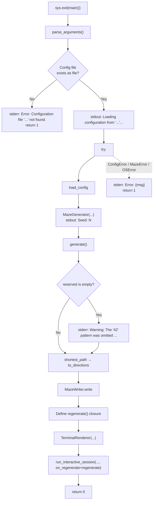

# 7. Entry Point — `a_maze_ing.py`

|                        |                                                             |
| ---------------------- | ----------------------------------------------------------- |
| **Author**             | javi                                                        |
| **Calls**              | All modules (config, generator, solver, output, display)    |
| **Subject References** | §IV.2 (execution & error handling), §V, Decisions 3.9, 3.10 |

## What this chapter covers

- Detailed sequence of events when running `python3 a_maze_ing.py config.txt`
- Standard output vs standard error vs exit status codes
- Intercepted vs uncaught exceptions
- Closure mechanics of maze regeneration on `'r'` keypress
- Complete end-to-end call sequence when pressing `t` → `c` → `r` → `q`

---

## 1. Foundational Concepts

### 1.1 Role of the Entry Point

Individual modules are purposefully decoupled: the config parser knows nothing about terminal displays, the generator knows nothing about file writing, and the visualizer knows nothing about maze generation algorithms. **`a_maze_ing.py` connects these pieces in the correct sequence and translates lower-level exceptions into human-friendly user error messages.**

Subject §IV.2 fixes the script name to `a_maze_ing.py`.

### 1.2 Output Streams and Exit Codes

| Stream                     | Purpose                       | Project Usage                                                                          |
| -------------------------- | ----------------------------- | -------------------------------------------------------------------------------------- |
| Standard Output (`stdout`) | Normal application feedback   | Loading messages, active seed, ASCII maze rendering, interactive menu                  |
| Standard Error (`stderr`)  | Diagnostic alerts & errors    | `Error: ...` messages, omitted "42" pattern warnings                                   |
| Exit Code                  | Process status returned to OS | `0` for success; `1` for operational/configuration errors; `2` for CLI argument errors |

Separating streams ensures that redirection (`python3 a_maze_ing.py config.txt > output.txt`) routes the maze cleanly into the file while keeping error messages visible in the terminal.

### 1.3 `if __name__ == "__main__":`

Guards script execution so `sys.exit(main())` runs only when invoked directly from the CLI. This allows test suites to import `main()` as a function without triggering execution.

---

## 2. Architecture Overview



---

## 3. Component Breakdown

### 3.1 `parse_arguments(argv=None) -> argparse.Namespace`

Uses `argparse` to require a positional `config_file` argument. If omitted, `argparse` displays usage and terminates with exit code `2`. Accepting an optional `argv` parameter allows programmatic testing via `main(["config.txt"])`.

### 3.2 `main(argv=None) -> int`

**Step-by-step Execution Pipeline:**

1. Parses arguments and wraps path in `Path(args.config_file)`.
2. **Checks file existence:** If not an existing file, prints `Error: Configuration file '...' not found.` to `stderr` and returns `1`.
3. Prints `Loading configuration from '...'...` to `stdout`.
4. Enters main `try:` block:
   1. `config = load_config(config_path)` (Chapter 2).
   2. Instantiates `MazeGenerator(width=..., height=..., perfect=..., seed=config.seed)` (Chapter 3).
   3. Prints active seed: `Seed: N` to `stdout` (Decision 3.10 = A).
   4. Carves maze: `maze = maze_generator.generate()`.
   5. If `len(maze.reserved) == 0`: prints warning banner to `stderr` indicating "42" was omitted due to dimensions.
   6. Finds path: `path_cells = shortest_path(maze, config.entry, config.exit)` (Chapter 4).
   7. Converts path to directions: `directions = to_directions(path_cells)`.
   8. Writes output file: `MazeWriter.write(maze, entry, exit, directions, config.output_file)` (Chapter 5).
   9. Defines `regenerate()` closure.
   10. Configures `TerminalRenderer(show_path=False, color_mode=0, entry, exit, path_cells)` (Chapter 6).
   11. Starts event loop: `run_interactive_session(renderer, maze, on_regenerate=regenerate)`.
5. Intercepts `(ConfigError, MazeError, OSError)`: prints formatted `Error: {err}` to `stderr` and returns `1`.
6. Returns `0` on clean exit.

### 3.3 `regenerate() -> tuple[Maze, list[Coord]]` — Closure

Defined inside `main()`, closing over `config`:

1. Constructs `MazeGenerator(..., seed=None)`. Always generates a fresh seed on `'r'`, even if `SEED` was specified in the config file.
2. Prints `New seed: N` to `stdout`.
3. Generates new `Maze`.
4. Re-computes shortest path and cardinal directions.
5. Re-serializes to `OUTPUT_FILE`, keeping file and screen synchronized.
6. Returns `(new_maze, new_path)`.

Because `regenerate` runs inside the enclosing `try:` block, any runtime exception (such as disk write permission errors) is caught cleanly.

---

## 4. Error Handling Matrix

| Scenario               | Originating Call              | Result                                                                     |
| ---------------------- | ----------------------------- | -------------------------------------------------------------------------- |
| File does not exist    | Pre-flight existence check    | `Error: Configuration file '...' not found.` (Exit 1)                      |
| Configuration error    | `load_config`                 | `Error: config.txt:4: ...` (Exit 1)                                        |
| Impossible dimensions  | `MazeGenerator(...)`          | `Error: a maze that is not perfect needs room for two loops: ...` (Exit 1) |
| Unreachable exit       | `shortest_path`               | `Error: the exit X,Y cannot be reached...` (Exit 1)                        |
| Missing CLI argument   | `argparse`                    | Usage summary (Exit 2)                                                     |
| Unwritable output file | `MazeWriter.write`            | `Error: [Errno 13] Permission denied: '...'` (Exit 1)                      |
| Stdin EOF / Interrupt  | `input()` in interactive menu | Intercepted in `input_handler.py`; exits cleanly with code 0               |

---

## 5. End-to-End Sequence Diagram (`t` → `c` → `r` → `q`)

```mermaid
sequenceDiagram
    participant U as User
    participant Main as a_maze_ing.main
    participant Cfg as load_config
    participant Gen as MazeGenerator
    participant Sol as solver
    participant Out as MazeWriter
    participant Loop as run_interactive_session
    participant R as TerminalRenderer

    Main->>Cfg: load_config("config.txt")
    Cfg-->>Main: Config
    Main->>Gen: MazeGenerator(...) / .seed / .generate()
    Gen-->>Main: Maze
    Main->>Sol: shortest_path → to_directions
    Main->>Out: write(... "maze.txt")
    Main->>Loop: run_interactive_session(renderer, maze, regenerate)
    Loop->>R: render(maze)
    U->>Loop: t
    Loop->>R: apply_action → show_path = True
    Loop->>R: render(maze) (with path dots)
    U->>Loop: c
    Loop->>R: apply_action → color_mode = 1 (Cyan)
    Loop->>R: render(maze)
    U->>Loop: r
    Loop->>Main: regenerate()
    Main->>Gen: MazeGenerator(seed=None).generate()
    Main->>Sol: shortest_path → to_directions
    Main->>Out: write(... "maze.txt") (overwritten)
    Main-->>Loop: (new_maze, new_path)
    Loop->>R: render(new_maze) (retains path toggle & cyan color)
    U->>Loop: q
    Loop-->>Main: Exit (Goodbye)
    Main-->>U: Exit code 0
```

---

## Related Documentation

- Decisions 3.9 (error handling), 3.10 (seeds), 4.3 (interactive display) — [`pair_communication/01_kickoff.md`](../pair_communication/01_kickoff.md)
- [`implementation_plans/architecture-overview.md`](../implementation_plans/architecture-overview.md)
- Next chapter: [8. Package and Tooling](08_package_and_tooling.md)
