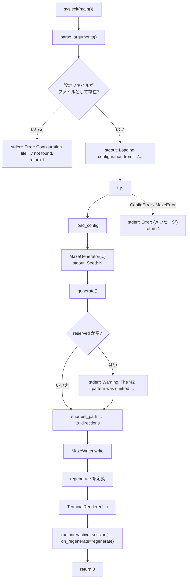

# 7. エントリポイント — `a_maze_ing.py`

| | |
| --- | --- |
| **書いた人** | javi |
| **呼ぶもの** | すべてのモジュール(設定、生成器、ソルバー、出力、表示) |
| **subject** | §IV.2(実行方法とエラー)、§V、決定 3.9・3.10 |

## この章で分かること

- `python3 a_maze_ing.py config.txt` で起きることの順番
- 標準出力と標準エラー、終了コード
- どのエラーを捕まえ、どのエラーを捕まえないか
- `r` で迷路を作り直す `regenerate` の仕組み
- `t` → `c` → `r` → `q` と押したときの、すべての呼び出しの順番

---

## 1. そもそもの概念

### 1.1 エントリポイントの役目

これまでの章の部品は、それぞれ 1 つの仕事しかしません。設定パーサは画面を知らず、生成器はファイルを知らず、描画は迷路の作り方を知りません。**それらを正しい順番でつなぎ、エラーを利用者向けのメッセージにするのが、このファイルの仕事**です。

§IV.2 はファイル名(`a_maze_ing.py`)と実行方法を決めています。

### 1.2 標準出力・標準エラー・終了コード

| | 使い道 | このプログラムでは |
| --- | --- | --- |
| 標準出力(stdout) | 普通の出力 | 読み込みの表示、シード、迷路、メニュー |
| 標準エラー(stderr) | エラーや警告 | `Error: ...`、「42」を省いた警告 |
| 終了コード | プログラムの結果を呼び出し側に伝える整数 | 成功は `0`、エラーは `1` |

2 つを分けておくと、`python3 a_maze_ing.py config.txt > out.txt` のように出力をファイルに送っても、エラーは画面に残ります。

### 1.3 `if __name__ == "__main__":`

ファイルを直接実行したときだけ、`sys.exit(main())` が動きます。`main()` が返した整数がそのまま終了コードになります。テストから `import` したときには動かないので、`main()` を部品として試せます。

---

## 2. 全体図



---

## 3. 各関数

### 3.1 `parse_arguments(argv=None) -> argparse.Namespace`

`argparse` で、必須の引数 `config_file` を 1 つ受け取ります。`argv` が `None` なら、コマンドラインの引数(`sys.argv[1:]`)を使います。引数が無ければ、`argparse` が使い方とエラーを表示して**終了コード 2** で終わります(`argparse` の標準の動き)。

`argv` を引数にしているのは、テストから `main(["config.txt"])` のように呼べるようにするためです。

### 3.2 `main(argv=None) -> int`

**処理の手順:**

1. 引数を読み、`Path(args.config_file)` を作る。
2. **ファイルとして存在しなければ**、`Error: Configuration file '...' not found.` を標準エラーに出して `1` を返す(`try` の外)。
3. `Loading configuration from '...'...` を標準出力に出す。
4. `try:` の中で:
   1. `config = load_config(config_path)` — 2 章
   2. `MazeGenerator(width=..., height=..., perfect=..., seed=config.seed)` — 3 章。シードが `None` なら生成器が引く
   3. `Seed: N` を標準出力に出す(決定 3.10 = A:表示はエントリポイントの仕事)
   4. `maze = maze_generator.generate()`
   5. `len(maze.reserved) == 0` なら、`Warning: The '42' pattern was omitted because the maze size is too small.` を標準エラーに出す(§IV.4 の「小さすぎるときはエラーメッセージを出して省く」)
   6. `path_cells = shortest_path(maze, config.entry, config.exit)` — 4 章
   7. `directions = to_directions(path_cells)`
   8. `MazeWriter.write(maze=..., entry=..., exit=..., shortest_path=directions, filepath=config.output_file)` — 5 章。**ファイルには文字列**を渡す
   9. `regenerate` を定義する(3.3)
   10. `TerminalRenderer(show_path=False, color_mode=0, entry=..., exit=..., shortest_path=path_cells)` — 6 章。**描画にはセルの並び**を渡す
   11. `run_interactive_session(renderer, maze, on_regenerate=regenerate)` — `q` が押されるまでここで待つ
5. `except (ConfigError, MazeError) as err:` → `Error: {err}` を標準エラーに出し、`1` を返す。
6. `0` を返す。

**経路を 2 つの形で渡している点に注目してください**(決定 S2 = A):ファイルには `"SEESE"` のような文字列、画面にはセルの並び。

### 3.3 `regenerate() -> tuple[Maze, list[Coord]]` — クロージャ

`main` の中で定義された関数で、外側の `config` を覚えています(クロージャ)。`r` が押されると、対話ループから呼ばれます。

1. `MazeGenerator(..., seed=None)` を作る。**設定に `SEED` があっても使わず、新しいシードを引く**(決定 4.3 の合意:設定のシードは最初の 1 枚の再現用、`r` は別の迷路を見るため)。
2. `New seed: N` を標準出力に出す。
3. 迷路を作り、「42」が省かれたら警告を出す。
4. 最短経路と文字を作る。
5. **`OUTPUT_FILE` を上書きする**(画面とファイルを一致させるため)。
6. `(新しい迷路, 新しい経路のセル)` を返す。

`regenerate` は `run_interactive_session` を通して `try` の中で呼ばれるので、作り直しの途中のエラーも `except` で捕まります。

---

## 4. 捕まえるエラー・捕まえないエラー

| エラー | 起きる場所 | 結果 |
| --- | --- | --- |
| 設定ファイルが無い | 手順 2 の確認 | `Error: Configuration file '...' not found.`、終了コード 1 |
| `ConfigError` の仲間 | `load_config` | `Error: config.txt:4: ...`、終了コード 1 |
| `GenerationError` | `MazeGenerator(...)` / `generate()` | `Error: a maze that is not perfect needs room for two loops: ...`、終了コード 1 |
| `SolveError` | `shortest_path` | `Error: the entry 8,7 is part of the "42", ...`、終了コード 1 |
| 引数が無い | `argparse` | 使い方の表示、終了コード 2 |
| `OSError` | `MazeWriter.write`(書けない `OUTPUT_FILE`) | **捕まえていない**:traceback |
| `EOFError` / `KeyboardInterrupt` | メニューの入力中の Ctrl-D / Ctrl-C | **捕まえていない**:traceback |

(上の 4 つのメッセージと終了コードは、README の確認で実際に実行して確かめたものです。)

---

## 5. `t` → `c` → `r` → `q` と押したときの呼び出しの順番

```mermaid
sequenceDiagram
    participant U as 利用者
    participant Main as a_maze_ing.main
    participant Cfg as load_config
    participant Gen as MazeGenerator
    participant Sol as solver
    participant Out as MazeWriter
    participant Loop as run_interactive_session
    participant R as TerminalRenderer

    Main->>Cfg: load_config("config.txt")
    Cfg-->>Main: Config
    Main->>Gen: MazeGenerator(...) / .seed / .generate()
    Gen-->>Main: Maze
    Main->>Sol: shortest_path → to_directions
    Main->>Out: write(... "maze.txt")
    Main->>Loop: run_interactive_session(renderer, maze, regenerate)
    Loop->>R: render(maze)
    U->>Loop: t
    Loop->>R: apply_action → show_path = True
    Loop->>R: render(maze)(経路つき)
    U->>Loop: c
    Loop->>R: apply_action → color_mode = 1(シアン)
    Loop->>R: render(maze)
    U->>Loop: r
    Loop->>Main: regenerate()
    Main->>Gen: MazeGenerator(seed=None).generate()
    Main->>Sol: shortest_path → to_directions
    Main->>Out: write(... "maze.txt")(上書き)
    Main-->>Loop: (新しい迷路, 新しい経路)
    Loop->>R: render(新しい迷路)(経路表示・シアンのまま)
    U->>Loop: q
    Loop-->>Main: 終了(Goodbye)
    Main-->>U: 終了コード 0
```

---

## 6. 注意点

| 点 | 内容 |
| --- | --- |
| ファイルの存在確認が 2 か所 | `main` の手順 2 と、`load_config` の `OSError` の捕捉。手順 2 は「存在しない」だけを先に分かりやすく伝える |
| シードの表示 | 生成器は表示しない。`Seed:` と `New seed:` はこのファイルが出す |
| 表示の順番 | パイプに流すと、標準エラーの警告が標準出力より先に見えることがある(標準出力には一時的な溜め込みがあるため)。端末では正しい順に見える |
| `try` の範囲 | 対話ループ全体が `try` の中にあるので、`r` の途中のエラーも捕まる |

---

## 関連文書

- 決定 3.9(エラー方針)・3.10(シード)・4.3 — [`01_kickoff.md`](../pair_communication/01_kickoff.md)
- [`architecture-overview.md`](../implementation_plans/architecture-overview.md)
- 次の章:[8. パッケージと道具](08_package_and_tooling.md)
