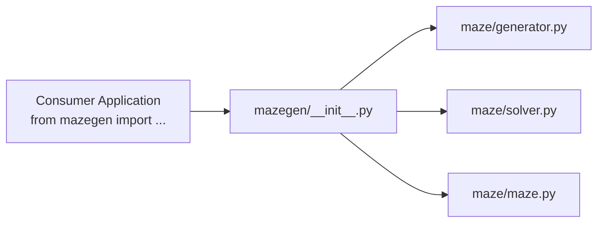

# 8. Package and Tooling — `mazegen/`, `pyproject.toml`, `Makefile`, etc.

|                        |                                                                          |
| ---------------------- | ------------------------------------------------------------------------ |
| **Author**             | javi (generated output exclusion in `.gitignore` added per so's request) |
| **Subject References** | §III.2 (linting), §VI (reusable package)                                 |

## What this chapter covers

- Architecture of the §VI reusable standalone package
- Differences between wheels (`.whl`) and source archives (`.tar.gz`)
- Comprehensive overview of `pyproject.toml` directives
- All `Makefile` targets and strict verification flags
- Purpose of `.gitignore` and `.gitattributes`

---

## 1. Foundational Concepts

### 1.1 Packages and Wheels

Subject §VI requires packaging the maze generator into **a standalone distributable installable via `pip install`**. The distribution files must follow the pattern `mazegen-*` and reside in the repository root.

A **wheel** (`.whl`) is a standardized ZIP archive ready for immediate installation:

```text
mazegen - 0.1.0 - py3 - none - any .whl
   │        │      │      │      └ OS independent
   │        │      │      └ Pure Python (no compiled C extensions)
   │        │      └ Python 3 compatible
   │        └ Version (from pyproject.toml)
   └ Package name
```

Wheel internal contents:

```text
maze/__init__.py  maze/config.py  maze/generator.py  maze/maze.py  maze/solver.py
mazegen/__init__.py
mazegen-0.1.0.dist-info/METADATA, WHEEL, RECORD, licenses/LICENSE.md
```

Testing suites (`tests/`), terminal visualizers (`display/`), file writers (`output/`), and entry point (`a_maze_ing.py`) are deliberately excluded, distributing strictly the reusable generation and solving core.

| Aspect       | Wheel (`.whl`)             | Source Distribution (`sdist`, `.tar.gz`) |
| ------------ | -------------------------- | ---------------------------------------- |
| Analogy      | Assembled finished product | Self-assembly kit                        |
| Contents     | Pre-built package layout   | Source files + `pyproject.toml`          |
| Installation | Fast extraction            | Built in-place before installation       |

**A wheel captures a static snapshot of the source at build time.** Whenever changes are made to `maze/`, `make build` must be re-run to update the wheel archive.

### 1.2 Linting and Norm

- **flake8:** Enforces style conventions (PEP 8) and flags unused imports or syntax errors (pyflakes).
- **mypy:** Analyzes static type annotations to catch type mismatches.

Subject §III.2 mandates passing flake8 and strict mypy checks before submission.

---

## 2. `mazegen/__init__.py` — Public API Facade

```python
from maze.generator import GenerationError, MazeGenerator
from maze.maze import Coord, Direction, Maze, MazeError
from maze.solver import SolveError, shortest_path, to_directions

__all__ = ["Coord", "Direction", "GenerationError", "Maze", "MazeError",
           "MazeGenerator", "SolveError", "shortest_path", "to_directions"]
```

`mazegen` acts as a facade, re-exporting symbols from `maze/`. External consumers do not need to know about internal module boundaries; they import directly from top-level `mazegen`:

```python
from mazegen import MazeGenerator, shortest_path, to_directions
```

The module docstring includes self-contained usage examples demonstrating generation, shortest-path calculation, and direction formatting.



---

## 3. `pyproject.toml`

| Section               | Key                          | Value                              | Purpose                                             |
| --------------------- | ---------------------------- | ---------------------------------- | --------------------------------------------------- |
| `[project]`           | `name`                       | `"mazegen"`                        | Distributable package name (§VI)                    |
|                       | `version`                    | `"0.1.0"`                          | SemVer release version                              |
|                       | `description`                | `"Maze generator project"`         | Brief package summary                               |
|                       | `authors`                    | skusakab, jperez-u                 | Project contributors                                |
|                       | `license` / `license-files`  | `"MIT"` / `["LICENSE.md"]`         | Includes license file in distribution               |
|                       | `readme`                     | `"README.md"`                      | Long description rendered by package index          |
|                       | `requires-python`            | `">=3.10"`                         | Minimum Python version (union syntax `int \| None`) |
|                       | `dependencies`               | `[]`                               | Zero external production dependencies               |
| `[dependency-groups]` | `dev`                        | pytest, flake8, mypy               | Development and testing tools                       |
| `[tool.mypy]`         | `exclude`                    | `dist,__pycache__,mypy_cache,.git` | Paths skipped during type checking                  |
|                       | `ignore_missing_imports`     | `true`                             | Suppresses errors on untyped imports                |
| `[build-system]`      | `requires` / `build-backend` | poetry-core                        | Build backend producing wheels and sdist            |
| `[tool.poetry]`       | `packages`                   | `mazegen` and `maze`               | Packages bundled into wheel artifact                |

---

## 4. `Makefile`

| Target             | Invocation                                           | Purpose                                             |
| ------------------ | ---------------------------------------------------- | --------------------------------------------------- |
| `make install`     | `poetry install`                                     | Initial setup: initializes virtualenv and dev tools |
| `make run`         | `poetry run python3 a_maze_ing.py config.txt`        | Runs main app with default config                   |
| `make debug`       | `poetry run python3 -m pdb a_maze_ing.py config.txt` | Launches in interactive Python debugger (`pdb`)     |
| `make test`        | `poetry run pytest -q`                               | Executes full pytest test suite                     |
| `make lint`        | `flake8 .` & `mypy .` (with §III.2 flags)            | Mandatory linting pass prior to defense             |
| `make lint-strict` | `flake8 .` & `mypy . --strict`                       | Ultra-strict type check                             |
| `make build`       | `poetry build --output .`                            | Compiles wheel and sdist to repo root (§VI)         |
| `make clean`       | Cleans `dist/`, caches, and `__pycache__`            | Cleans temporary build artifacts                    |
| `make clean-cache` | `poetry cache clear --all`                           | Purges Poetry dependency cache                      |

**Mypy Strictness Flags in `make lint` (§III.2):**

- `--warn-return-any`: Warns when returning Any values.
- `--warn-unused-ignores`: Warns about unnecessary `# type: ignore` comments.
- `--ignore-missing-imports`: Ignores untyped external packages.
- `--disallow-untyped-defs`: Prohibits functions lacking type annotations.
- `--check-untyped-defs`: Type-checks untyped function bodies.

---

## 5. `.gitignore` and `.gitattributes`

### `.gitignore` — Excluded Files

| Category                    | Patterns                                         |
| --------------------------- | ------------------------------------------------ |
| Python Bytecode             | `__pycache__/`, `*.py[cod]`                      |
| Generated Maze Output       | `maze*.txt` (`maze.txt`, `maze_large.txt`, etc.) |
| Virtual Environments & IDEs | `.venv/`, `venv/`, `.vscode`                     |
| Tool Caches                 | `.pytest_cache/`, `.mypy_cache/`, `.ruff_cache/` |
| Build Residue               | `build/`, `*.egg-info/`                          |
| OS Artifacts                | `.DS_Store`, `.python-version`                   |

**Important:** `mazegen-*.whl` and `mazegen-*.tar.gz` must **remain tracked in Git** at the repo root to satisfy subject requirement §VI. `Docs/` is also permanently version-controlled.

### `.gitattributes` — Normalizing Line Endings

```text
* text=auto eol=lf
Makefile text eol=lf
```

Enforces LF (`\n`) line endings across Linux and Windows checkouts, preventing broken `Makefile` execution due to CR (`\r`) characters.

---

## 6. Other Root Repository Files

| File                        | Description                                                                                     |
| --------------------------- | ----------------------------------------------------------------------------------------------- |
| `LICENSE.md` / `LICENCE.md` | MIT License (skusakab, jperez-u) permitting reuse and redistribution (§VI).                     |
| `maze_analyzer.py`          | Official evaluation analyzer provided by 42 (verifies wall coherence, connectivity, and loops). |
| `mlx-2.2.tgz`               | MiniLibX graphic library archive (unused; terminal ASCII visualization selected).               |
| `poetry.lock`               | Pinned lockfile ensuring reproducible dependency environments.                                  |

---

## Related Documentation

- Decision 2.1 (Poetry adoption) — [`03_poetry_switch.md`](../pair_communication/03_poetry_switch.md)
- Subject references §III.2, §VI
- Next chapter: [9. Tests](09_tests.md)
