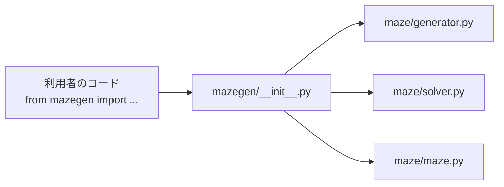

# 8. パッケージと道具 — `mazegen/`、`pyproject.toml`、`Makefile` ほか

| | |
| --- | --- |
| **書いた人** | javi(`.gitignore` の出力ファイルの行は so の依頼で追加) |
| **subject** | §III.2(lint)、§VI(再利用パッケージ) |

## この章で分かること

- §VI の「再利用できるパッケージ」がどう作られているか
- wheel と sdist(`.tar.gz`)の違い
- `pyproject.toml` のすべての設定
- `Makefile` のすべてのターゲット
- `.gitignore` と `.gitattributes` の役目

---

## 1. そもそもの概念

### 1.1 パッケージと wheel

§VI は、迷路の生成器を**他のプロジェクトで `pip install` して使える 1 つのファイル**にすることを求めています。名前は `mazegen-*` で、リポジトリの直下に置きます。

**wheel**(`.whl`)は、Python のコードを「そのままインストールできる形」にまとめた zip ファイルです。

```text
mazegen - 0.1.0 - py3 - none - any .whl
   │        │      │      │      └ どの OS でも動く
   │        │      │      └ C 言語の部品を含まない
   │        │      └ Python 3 用
   │        └ 版(pyproject.toml の version)
   └ パッケージ名
```

中身(実際に一覧したもの):

```text
maze/__init__.py  maze/config.py  maze/generator.py  maze/maze.py  maze/solver.py
mazegen/__init__.py
mazegen-0.1.0.dist-info/METADATA、WHEEL、RECORD、licenses/LICENSE.md
```

`tests/`、`display/`、`output/`、`a_maze_ing.py` は入っていません。再利用する人に必要なのは「迷路を作って解く部品」だけだからです。

| | wheel(`.whl`) | sdist(`.tar.gz`) |
| --- | --- | --- |
| たとえ | 完成品の箱 | 材料キット |
| 中身 | すぐ置ける形 | ソースと `pyproject.toml`(作り方) |
| インストール時 | 置くだけ | その場で組み立ててから置く |

**wheel は作った瞬間のコードの写真です。** `maze/` を直したら、`make build` で作り直さないと、wheel には古いコードが入ったままになります。

### 1.2 lint

- **flake8:** 書き方の規則(PEP 8)と、使っていない import のような明らかな間違い(pyflakes)を見つけます。
- **mypy:** 型ヒントを読んで、型の食い違いを見つけます。

§III.2 は、flake8 と、指定のフラグ付きの mypy を通すことを求めています。

---

## 2. `mazegen/__init__.py` — 窓口

```python
from maze.generator import GenerationError, MazeGenerator
from maze.maze import Coord, Direction, Maze, MazeError
from maze.solver import SolveError, shortest_path, to_directions

__all__ = ["Coord", "Direction", "GenerationError", "Maze", "MazeError",
           "MazeGenerator", "SolveError", "shortest_path", "to_directions"]
```

**自分ではコードを持たず、`maze/` の中身を再公開するだけ**です。利用者は `maze.generator` や `maze.solver` という中の構造を知らなくても、次の 1 行で使えます。

```python
from mazegen import MazeGenerator, shortest_path, to_directions
```

モジュールの docstring には、使い方の例(生成 → 最短経路 → 文字)が書かれています。



**なぜクラスを `mazegen/` に置かず `maze/` に置いたか:** 生成器は、自分が作る `Maze` の隣にあるのが自然です。試しに作った wheel に `maze/` が入っていないと分かったとき、どこに置いても「`maze/` をパッケージに含める」設定が必要だったので、中核をまとめて置いても余計な手間はありませんでした(生成計画の変更履歴 9/13)。

---

## 3. `pyproject.toml`

| 節 | キー | 値 | 意味 |
| --- | --- | --- | --- |
| `[project]` | `name` | `"mazegen"` | パッケージ名(§VI) |
| | `version` | `"0.1.0"` | 版。ファイル名に入る |
| | `description` | `"Maze generator project"` | 説明 |
| | `authors` | skusakab、jperez-u | 作者 |
| | `license` / `license-files` | `"MIT"` / `["LICENSE.md"]` | ライセンス。wheel に `LICENSE.md` が入る |
| | `readme` | `"README.md"` | 説明文として使う |
| | `requires-python` | `">=3.10"` | 3.10 以上(`int \| None` などの書き方を使うため) |
| | `dependencies` | `[]` | 実行に必要な外部ライブラリは無い |
| `[dependency-groups]` | `dev` | pytest、flake8、mypy | 開発用の道具(配布物には入らない) |
| `[tool.mypy]` | `exclude` | `dist,__pycache__,mypy_cache,.git` | mypy が見ない場所 |
| | `ignore_missing_imports` | `true` | 型情報の無いライブラリを無視 |
| `[build-system]` | `requires` / `build-backend` | poetry-core | wheel を作る道具 |
| `[tool.poetry]` | `packages` | `mazegen` と `maze` | **wheel に入れるパッケージ**。これが無かったとき、wheel には空の `mazegen/` しか入らなかった |

---

## 4. `Makefile`

| ターゲット | 実行する命令 | 使う場面 |
| --- | --- | --- |
| `make install` | `poetry install` | 最初に 1 回。仮想環境を作り、開発用の道具を入れる |
| `make run` | `poetry run python3 a_maze_ing.py config.txt` | 既定の設定で動かす |
| `make debug` | `poetry run python3 -m pdb a_maze_ing.py config.txt` | デバッガ(pdb)の中で動かす |
| `make test` | `poetry run pytest -q` | テストを全部実行 |
| `make lint` | `flake8 .` と、§III.2 のフラグ付きの `mypy .` | 提出前に必ず通す |
| `make lint-strict` | `flake8 .` と `mypy . --strict` | より厳しい確認(任意) |
| `make build` | `poetry build --output .` | wheel と sdist をリポジトリ直下に作る(§VI) |
| `make clean` | `dist/`・`.mypy_cache/`・`.pytest_cache/` を消し、`__pycache__` と `*.py[cod]` を探して消す | 一時ファイルの掃除 |
| `make clean-cache` | `poetry cache clear --all` | Poetry のキャッシュを消す |

**`make lint` の mypy のフラグ(§III.2):**

| フラグ | 意味 |
| --- | --- |
| `--warn-return-any` | 型の分からない値を返したら警告 |
| `--warn-unused-ignores` | 不要な `# type: ignore` を警告 |
| `--ignore-missing-imports` | 型情報の無い import を無視 |
| `--disallow-untyped-defs` | 型ヒントの無い関数を許さない |
| `--check-untyped-defs` | 型ヒントの無い関数の中も確かめる |

**注意:** `make lint` は flake8 → mypy の順に実行し、**最初に失敗したところで止まります。** flake8 で止まると、mypy の指摘は表示されません。flake8 の指摘を直したら、もう一度 `make lint` を実行します。

---

## 5. `.gitignore` と `.gitattributes`

### `.gitignore` — git に入れないもの

| 項目 | 例 |
| --- | --- |
| Python の生成物 | `__pycache__/`、`*.py[cod]` |
| **実行で書き出される出力ファイル** | `maze*.txt`(`maze.txt`、`maze_large.txt` など。so の依頼で追加) |
| 仮想環境・エディタ | `.venv/`、`venv/`、`.vscode` |
| 道具のキャッシュ | `.pytest_cache/`、`.mypy_cache/`、`.ruff_cache/` |
| パッケージ作業の残り | `build/`、`*.egg-info/` |
| OS | `.DS_Store`、`.python-version` |

**入れてはいけないもの:** `mazegen-*.whl` と `mazegen-*.tar.gz` は、§VI が「リポジトリの直下に置く」と求めているので、**コミットしたまま**にします。`Docs/` も意図的に git で管理しています。

### `.gitattributes` — 改行コードをそろえる

```text
* text=auto eol=lf
Makefile text eol=lf
```

Windows(改行が `\r\n`)と Linux(`\n`)で作業すると、改行コードが混ざります。特に `Makefile` は `\r` が入ると動かなくなります。この設定で、リポジトリの中は常に `\n` にそろえます(開発の初期に javi が導入)。

---

## 6. リポジトリにあるその他のファイル

| ファイル | 内容 |
| --- | --- |
| `LICENSE.md` | MIT License(skusakab、jperez-u)。§VI は再利用と再配布を許すライセンスを求めている |
| `maze_analyzer.py` | subject に付属する検証ツール。出力ファイルを読み、壁の一致・完全迷路か・遊べる盤面かを判定する。私たちは書いていない |
| `mlx-2.2.tgz` | MiniLibX(MLX)のアーカイブ。§V は表示の方法として「端末の ASCII」か「MLX のグラフィック」を挙げている。このプロジェクトは端末表示を選んだので使っていない(決定 4.1) |
| `poetry.lock` | 開発用の道具の版を固定するファイル。`poetry install` がこれを読む |

---

## 関連文書

- 決定 2.1(Poetry)— [`03_poetry_switch.md`](../pair_communication/03_poetry_switch.md)
- subject §III.2、§VI([`ja.subject.md`](../subject/ja.subject.md))
- 次の章:[9. テスト](09_tests.md)
