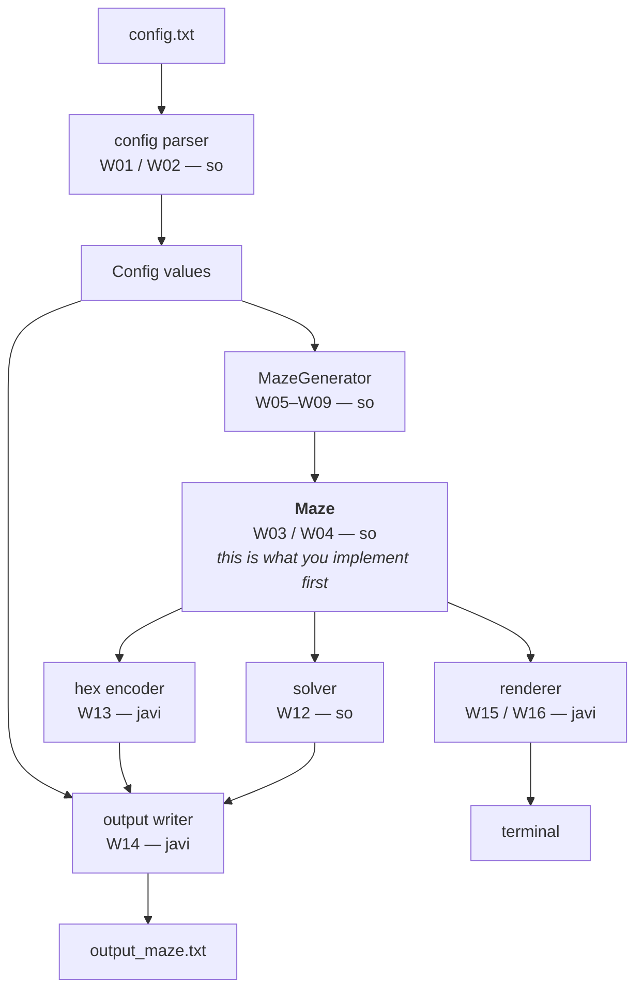

# architecture-overview — how the pieces fit together

| | |
| --- | --- |
| **Owner / 担当** | both |
| **Status / 状態** | living map — update it when a plan changes / 地図。計画が変わったら更新する |
| **Date / 日付** | 2026-08-21 |
| **Subject ref** | §IV.2, §IV.3, §IV.5, §V, §VI |

> **EN** — This file is a **map, not a contract.** It shows what runs in what order and who owns each piece. The
> binding details live in the sibling plan files.
> **JA** — このファイルは**契約ではなく地図**。何がどの順に動き、どこを誰が持つかを示す。
> 拘束力のある詳細は、隣の各計画ファイルにある。

---

## 1. What one run of the program does / プログラムが 1 回動くと何が起きるか

**EN** — The command is fixed by §IV.2:

```bash
python3 a_maze_ing.py config.txt
```

From there, six things happen in order.

**JA** — 実行コマンドは §IV.2 で固定されている(上記)。そこから 6 つのことが順に起きる。

| # | Step | What comes out of it |
| --- | --- | --- |
| 1 | Read `config.txt` | `WIDTH`, `HEIGHT`, `ENTRY`, `EXIT`, `OUTPUT_FILE`, `PERFECT` — plain values |
| 2 | Generate the maze | a `Maze` object: which walls of which cells are closed |
| 3 | Solve it | the shortest path from entry to exit, as `N`/`E`/`S`/`W` letters |
| 4 | Encode it | one hexadecimal digit per cell |
| 5 | Write the output file | the grid, a blank line, then entry, exit and the path |
| 6 | Display it | the maze on screen, and react to the user's keys |



**EN** — Notice that **`Maze` is the hub.** Three consumers read it and none of them talk to each other. That is
why its contract had to be written before javi could start W13 and W15.
**JA** — **`Maze` が中心にある**ことに注目。3 つの利用者がそれを読み、利用者どうしは会話しない。
javi が W13 と W15 に着手する前に、この契約を先に書かねばならなかったのはこのため。

---

## 2. The same maze in four forms / 同じ迷路の 4 つの姿

**EN** — This is the fastest way to see what each module actually does. One tiny 3x3 maze, shown as it passes
through the pipeline. It is the maze traced by hand in
`Docs/learning_log/maze-generation-algorithms.md` §2.2.

**JA** — 各モジュールが実際に何をしているかを掴む最短の方法。
小さな 3x3 の迷路 1 つが、パイプラインを通っていく様子。
`Docs/learning_log/maze-generation-algorithms.md` §2.2 で手で追ったのと同じ迷路。

### Form 1 — what the generator decided / 生成器が決めたこと

**EN** — Eight passages were opened between the nine cells. Nothing else exists yet.
**JA** — 9 個のセルの間に 8 本の通路が開いた。この時点ではまだそれ以外は存在しない。

```text
  (0,0)    (1,0) ── (2,0)          ── is an open passage
    │                 │
  (0,1) ── (1,1)    (2,1)
             │        │
  (0,2) ── (1,2) ── (2,2)
```

### Form 2 — what `Maze` holds in memory / `Maze` がメモリに持つもの

**EN** — Nine integers, one per cell. Each is a 4-bit mask: bit 0 = North, 1 = East, 2 = South, 3 = West, and a
set bit means **the wall is closed**. Take the top-left cell: north is the outer border (closed, +1), east has a
wall to (1,0) (closed, +2), south was opened (0), west is the outer border (closed, +8) → `11`.

**JA** — 9 個の整数、1 セル 1 つ。それぞれ 4 ビットのマスクで、bit0 = 北、1 = 東、2 = 南、3 = 西、
ビットが立っていると**壁が閉じている**。左上のセルなら、北は外周(閉、+1)、
東は (1,0) との間に壁(閉、+2)、南は開通済み(0)、西は外周(閉、+8)→ `11`。

```text
grid[y][x]  →   11  13   3        ← this is exactly what maze.rows() yields
                12   3  10
                13   4   6
```

### Form 3 — the output file / 出力ファイル

**EN** — W13 turns each integer into one hexadecimal digit. **Nothing is translated — `11` simply prints as `b`.**
That is why the encoder is a formatting step. W14 then adds the blank line, the entry, the exit and the path.

**JA** — W13 は各整数を 16 進 1 桁にする。**変換はしていない。`11` はそのまま `b` と表示されるだけ。**
エンコーダが「整形の工程」であるのはこのため。そのあと W14 が空行・入口・出口・経路を足す。

```text
bd3
c3a
d46

0,0
2,2
SESE
```

### Form 4 — what the user sees / ユーザーが見るもの

**EN** — W15 reads the same nine integers and draws them. The maze did not change; only the way of showing it did.

**JA** — W15 は同じ 9 個の整数を読んで描画する。迷路は変わっていない。見せ方が変わっただけ。

```text
+---+---+---+
|   |       |
+   +---+   +
|       |   |
+---+   +   +
|           |
+---+---+---+
```

**EN** — **All four forms are the same eight passages.** `Maze` owns form 2 and nothing else. It does not know
about hexadecimal, about files, about the screen, or even about where the entry is.

**JA** — **4 つの姿はすべて同じ 8 本の通路。** `Maze` が持つのは Form 2 だけで、他は持たない。
16 進のことも、ファイルのことも、画面のことも、入口がどこかさえ知らない。

---

## 3. So what *is* `Maze`? / 結局 `Maze` とは何か

**EN** — Three sentences:

1. **It is a rectangular grid of integers** — one per cell, each recording which of its four walls are closed.
2. **Every wall starts closed**, and the only thing that can open one is `open_passage(a, b)`, which always
   updates **both** neighbouring cells.
3. **It answers questions and nothing more** — how wide am I, what is this cell's mask, is this wall open, who are
   this cell's neighbours.

**JA** — 3 文で言うと:

1. **整数の長方形グリッド。** 1 セル 1 つ、その 4 枚の壁のうちどれが閉じているかを記録する。
2. **すべての壁は閉じた状態から始まり**、開けられるのは `open_passage(a, b)` だけ。
   この操作は常に**隣接する両方の**セルを更新する。
3. **質問に答えるだけ。** 幅はいくつか、このセルのマスクは何か、この壁は開いているか、隣は誰か。

### Why "the only mutator" matters / 「唯一の変更経路」が効く理由

**EN** — A wall between two cells is written down **twice**: as the east wall of the left cell and the west wall of
the right one. §IV.4 requires those two records to agree, always. If any part of the program could edit walls
directly, one of them could be updated without the other, and the analyzer would reject the output — with a
symptom appearing far from the line that caused it.

Routing every change through one operation makes that impossible rather than unlikely. **This is decision 3.3 = A,
and it is the reason `Maze` exists as a class instead of a bare list.**

**JA** — 2 つのセルの間の壁は、**2 か所に書かれている。** 左のセルの東の壁として、そして右のセルの西の壁として。
§IV.4 は、この 2 つが常に一致することを要求している。
もしプログラムのどこからでも壁を編集できたら、片方だけ更新される事故が起こりうる。
analyzer は出力を弾き、しかも症状は原因の行から遠い場所に現れる。

変更を 1 つの操作に集約すると、それが「起こりにくい」ではなく「**起こりえない**」になる。
**これが決定 3.3 = A であり、`Maze` が素のリストではなくクラスである理由。**

### Why `rows()` exists / `rows()` がある理由

**EN** — javi's code needs to walk the grid, but it must not index it. If W13 wrote `grid[y][x]` everywhere and we
later changed how the maze is stored, his code would break. `rows()` hands out the values without exposing the
storage. **The contract is the values, not the container.**

**JA** — javi のコードはグリッドを走査する必要があるが、添字で触ってはいけない。
W13 が至る所で `grid[y][x]` と書いていたら、保存方法を変えた瞬間に彼のコードが壊れる。
`rows()` は保存方法を見せずに値だけを渡す。**契約は値であって、入れ物ではない。**

---

## 4. Who owns what / 担当表

| Module | What it does | Plan | Owner |
| --- | --- | --- | --- |
| `maze/maze.py` | the grid, the wall bits, `open_passage` | `maze-data-structure.md` | so — W03, W04 |
| `maze/config.py` | read `config.txt` into values | `config-parser.md` | so — W01, W02 |
| `mazegen/generator.py` | build the maze; the reusable class of §VI | `generation-algorithm.md` | so — W05–W09, W18 |
| `maze/solver.py` | shortest path as `NESW` | *not written yet* | so — W12 |
| `maze/validator.py` | check the result independently | — | so — W10 |
| `output/maze_writer.py` | hex digits and the output file | *not written yet* | javi — W13, W14 |
| `display/` | terminal rendering and user keys | — | javi — W15, W16 |
| `a_maze_ing.py` | wire it together, catch errors | — | javi — W17 |

**EN** — Two plans are still missing. The remaining seam javi is waiting on is how the path is represented (W14 and
W16 need it). The other seam — how the config values reach him — is now written: `config-parser.md` supplies
`entry`, `exit` and `output_file`, which is exactly what `MazeWriter.write` already takes as parameters.
**JA** — 計画は残り 2 つ未作成。javi が待っている継ぎ目のうち残るのは、経路をどう表現するか(W14 と W16 が必要)。
もう一方の継ぎ目、設定値がどう届くかは `config-parser.md` に書かれた。
`entry` / `exit` / `output_file` を供給する — これは `MazeWriter.write` が既に引数で取っているものそのもの。

---

## 5. What this means for what you write first / 最初に書くものへの含意

**EN** — Everything downstream reads `Maze`, so it is the first thing that has to exist. Within it, the order in
`maze-data-structure.md` §3 is a dependency order, not a preference:

`Direction` → the grid → the read accessors → `open_passage` → `neighbours` → `rows`

You cannot write `open_passage` without `Direction.opposite`, because "open the wall on both sides" is expressed
in terms of it. And `Direction.opposite` cannot be written before you have decided the bit order — which §IV.5
already fixed for us.

**JA** — 下流はすべて `Maze` を読むので、最初に存在すべきものはこれ。
そして `maze-data-structure.md` §3 の順序は、好みではなく**依存順**:

`Direction` → グリッド → 読み取りアクセサ → `open_passage` → `neighbours` → `rows`

`Direction.opposite` なしに `open_passage` は書けない。「両側の壁を開ける」がそれで表現されるため。
そして `Direction.opposite` は、ビット順が決まっていないと書けない — それは §IV.5 が既に決めてくれている。

---

## 6. Related / 関連

- `maze-data-structure.md` — the contract for the hub
- `generation-algorithm.md` — what fills it
- `Docs/learning_log/maze-generation-algorithms.md` — why a maze is a spanning tree, and the trace behind §2
- `Docs/subject/ja.subject.md` §IV.5 — the output format the encoder must produce
