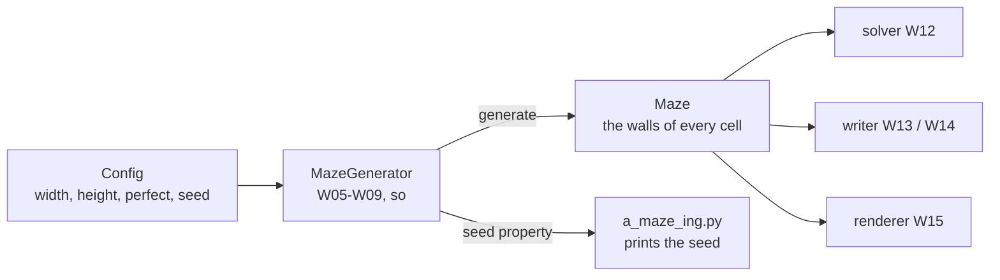
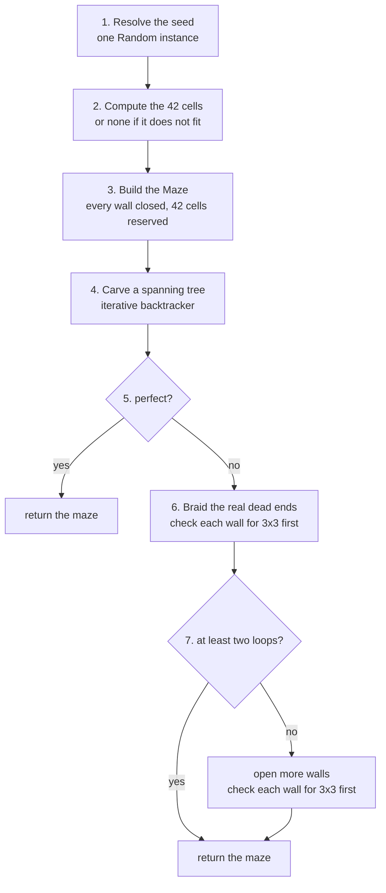

# generation-algorithm

|                          |                                                                                                                                                                                                            |
| ------------------------ | ---------------------------------------------------------------------------------------------------------------------------------------------------------------------------------------------------------- |
| **Owner / 担当**   | so (W05, W06, W07, W08, W09)                                                                                                                                                                               |
| **Status / 状態**  | draft — Q1, Q2 and Q4 settled 2026-09-13; ready to implement / 下書き — Q1・Q2・Q4 は 2026-09-13 に決定。実装に着手できる                                                                                |
| **Date / 日付**    | 2026-08-20 — rewritten with figures on 2026-09-13 / 2026-08-20 — 2026-09-13 に図を加えて改稿                                                                                                             |
| **Subject ref**    | §IV.4, §VI, §VIII                                                                                                                                                                                       |
| **Related / 関連** | `maze-data-structure.md`, `architecture-overview.md`, `Docs/pair_communication/01_kickoff.md` § 3.4, 3.5, 3.6, 3.7, 3.10, `Docs/learning_log/maze-generation-algorithms.md`, `maze_analyzer.py` |

> **EN** — How to read this file. §0 explains what the generator does, in plain words and pictures. §1–§3 are the
> contract: scope, interface and the pipeline. §4 collects the facts worth knowing **before** writing any code, each
> with a figure. §5–§8 cover edge cases, cost, tests and rejected alternatives. §9 records the decisions.
>
> **JA** — このファイルの読み方。§0 は生成器が何をするかを、平易な言葉と図で説明する。§1〜§3 が契約で、
> 対象範囲・インターフェース・パイプラインを定める。§4 はコードを書く**前に**知っておくべき事実を、それぞれ図つきで
> まとめる。§5〜§8 はエッジケース・計算量・テスト・却下した案。§9 に決定事項を記録する。

---

## 0. What the generator is for / 生成器は何のためにあるか

### 0.1 Where it sits / どこに位置するか

**EN** — The generator is the step between the configuration and everything that draws or writes a maze. It
receives plain values from `Config`, builds a `Maze`, and hands it on. It is also the core of the reusable package
§VI requires, which is why it is a class of its own and not a part of `a_maze_ing.py`.

**JA** — 生成器は、設定と「迷路を描く・書き出すもの全部」の間にある工程。`Config` から素の値を受け取り、
`Maze` を組み立てて、次に渡す。同時に §VI が求める再利用パッケージの中核でもある。
そのため `a_maze_ing.py` の一部ではなく、独立したクラスになっている。



**EN** — Two arrows leave the generator. The maze goes to its three readers, and the **seed** goes back to
`a_maze_ing.py`, which prints it. The generator itself prints nothing (Q2).

**JA** — 生成器から出る矢印は 2 本ある。迷路は 3 つの読み手へ、**シード**は `a_maze_ing.py` へ戻り、そこで表示される。
生成器自身は何も表示しない(Q2)。

### 0.2 Two modes, one maze / 2 つのモード、1 つの迷路

**EN** — §IV.4 describes two kinds of board. `PERFECT=True` asks for a perfect maze: exactly one route between any
two cells. `PERFECT=False`, **the default**, asks for a board a Pac-Man game could use: several routes, and almost
no dead ends. The figure shows the same 3x3 maze in both modes. It is the maze traced by hand in §3.1 and in
`architecture-overview.md` §2. It is too small for the "42", so no cell is reserved here.

**JA** — §IV.4 は 2 種類の盤面を定めている。`PERFECT=True` は完全迷路で、任意の 2 セル間の経路がちょうど 1 本。
`PERFECT=False` は**既定**で、パックマンのゲームに使える盤面。経路が複数あり、行き止まりがほとんどない。
図は同じ 3x3 の迷路を 2 つのモードで示したもの。§3.1 と `architecture-overview.md` §2 で手で追ったのと同じ迷路で、
「42」を入れるには小さすぎるため、確保セルはない。

```text
PERFECT=True                 PERFECT=False (default)
a spanning tree              braided

+---+---+---+                +---+---+---+
|   |       |                |           |
+   +---+   +                +   +---+   +
|       |   |                |       |   |
+---+   +   +                +   +   +   +
|           |                |           |
+---+---+---+                +---+---+---+

cells 9, passages 8          cells 9, passages 10
loops 8 - 9 + 1 = 0          loops 10 - 9 + 1 = 2
dead ends 3                  dead ends 0
```

**EN** — The right-hand board is the left-hand board with **two more walls opened**. That is the whole design:
the generator always builds the left one first, and in the default mode it continues until it has the right one.
There is only one algorithm to write, and `PERFECT=True` simply stops early (decision 3.4 = A).

**JA** — 右の盤面は、左の盤面の壁を**さらに 2 枚開けた**ものにすぎない。これが設計のすべて。
生成器はいつも先に左を作り、既定モードではそのまま右まで進める。書くアルゴリズムは 1 つだけで、
`PERFECT=True` は途中で止まるだけ(決定 3.4 = A)。

### 0.3 What makes it hard / 難しさはどこにあるか

**EN** — §IV.4 lists many requirements, but most of them cost nothing once the first stage is right. The table sorts
them by the stage that satisfies them.

**JA** — §IV.4 は多くの要件を並べているが、その大半は最初の工程が正しければ追加の手間なしに満たされる。
表は要件を、それを満たす工程ごとに並べたもの。

| Requirement (§IV.4) / 要件                                                    | Satisfied by / 満たす工程             | Why (EN)                                                                     | 理由(JA)                                                            |
| ------------------------------------------------------------------------------ | ------------------------------------- | ---------------------------------------------------------------------------- | ------------------------------------------------------------------- |
| Reproducible from a seed / シードで再現できる                                  | stage 1                               | One `Random` owned by the generator; nothing else draws from it.            | 生成器が持つ `Random` 1 つだけから乱数を引き、他の誰も引かない。   |
| Neighbours agree on their shared wall / 隣接セルの共有壁が一致する             | `Maze.open_passage`                 | The only operation that opens a wall always updates both sides.              | 壁を開ける唯一の操作が、常に両側を更新する。                        |
| Every walkable cell reachable / すべてのセルに到達できる                       | stage 4                               | A spanning tree reaches every cell it walks.                                 | 全域木は、たどったセルすべてに届く。                                |
| A "42" drawn by closed cells / 閉じたセルで「42」を描く                        | stages 2–3                           | Reserved cells are never carved, and every cell starts closed.               | 確保セルは掘られず、すべてのセルは閉じた状態から始まる。            |
| Exactly one path with `PERFECT=True` / `PERFECT=True` で経路がちょうど 1 本 | stage 4, then stop                    | A tree has exactly one path between any two of its cells.                    | 木では、任意の 2 セル間の経路がちょうど 1 本。                      |
| No 3x3 open area / 3x3 の開放領域を作らない                                    | stage 4 for free, stage 6 by checking | A tree cannot contain one (§4.1); braiding checks before each wall (§4.5). | 木には存在しえない(§4.1)。braiding は壁ごとに事前確認する(§4.5)。 |
| Corners and centre open / 四隅と中央が通路                                     | stage 2                               | Guaranteed unless the "42" covers them (§4.3).                              | 「42」が覆わない限り保証される(§4.3)。                             |
| At least two independent loops / 独立ループ 2 本以上                           | stage 6                               | Each opened wall adds exactly one (§4.2).                                   | 壁を 1 枚開けるたびにちょうど 1 本増える(§4.2)。                   |
| Dead ends rare / 行き止まりは稀                                                | stage 6                               | Braiding opens a wall at each real dead end (§4.4).                         | braiding が本物の行き止まりごとに壁を開ける(§4.4)。                |

**EN** — Read down the second column. Everything down to the corners is settled by simple stages or by code that
already exists. Only the last three rows are real work, and all three live in stage 6.

**JA** — 2 列目を上から読むとよい。四隅の行までは、単純な工程か、既に存在するコードが片付けてくれる。
本当に手間がかかるのは最後の 3 行だけで、その 3 つはすべてステージ 6 に集まっている。

---

## 1. Scope / 対象範囲

### In scope / 対象

**EN** —

- Filling a `Maze` with passages so that it satisfies §IV.4, in both modes.
- `PERFECT=True`: a spanning tree over the walkable cells.
- `PERFECT=False` (**the default**): full connectivity, at least two independent loops, and at most two real dead
  ends.
- Reproducibility from a seed, and generating one when none is given.
- Computing the reserved "42" cells and leaving them untouched.

**JA** —

- 2 つのモードの両方で、§IV.4 を満たすように `Maze` に通路を掘ること。
- `PERFECT=True`:歩けるセル全体の全域木。
- `PERFECT=False`(**既定**):完全な連結性、独立ループ 2 本以上、本物の行き止まり 2 個以下。
- シードによる再現性と、シードが与えられないときの生成。
- 「42」の確保セルを計算し、それに一切触れないこと。

### Out of scope / 対象外

| Not here / ここではやらない                                                       | Where it belongs / 担当                | Why (EN)                                                      | 理由(JA)                                           |
| --------------------------------------------------------------------------------- | -------------------------------------- | ------------------------------------------------------------- | -------------------------------------------------- |
| The grid, the wall bits, `open_passage` / グリッド・壁のビット・ `open_passage` | W03 / W04 — `maze-data-structure.md` | Already built and tested. The generator only calls it.        | 実装・テスト済み。生成器は呼ぶだけ。               |
| Independent verification of the result / 結果の独立した検証                       | W10 — the validator                   | Checking must not trust the code that is being checked.       | 検証は、検証対象のコードを信用してはならない。     |
| Printing the seed / シードの表示                                                  | W17 — `a_maze_ing.py`                | A reusable module must not write to the console (Q2).         | 再利用モジュールは勝手にコンソールへ書かない(Q2)。 |
| Shortest path, hex output, rendering / 最短経路・16 進出力・描画                  | W12 / W13 / W15                        | They read the finished maze and never change it.              | 完成した迷路を読むだけで、変更しない。             |
| The public API of the reusable package / 再利用パッケージの公開 API               | W18 / W19 — `mazegen-package-api.md`       | This class is its core, but the packaging is a separate plan. The class lives in `maze/generator.py`, and a test build showed the wheel holds only `mazegen/`, so W19 must add `maze/` to the package and re-export the class from `mazegen`. | このクラスが中核だが、パッケージ化は別の計画。クラスは `maze/generator.py` に置く。試しにビルドすると wheel には `mazegen/` しか入らなかったので、W19 で `maze/` をパッケージに含め、`mazegen` からクラスを公開する必要がある。     |

### Requirements it satisfies / 対応する要件

> **EN** — §IV.4: random but reproducible from a seed; full connectivity; coherent shared walls; no corridor wider
> than 2 cells, so **no 3x3 open area**; a visible "42" drawn by fully closed cells; with `PERFECT=True`, exactly one
> path between entry and exit; by default, a playable board — the four corners and the centre open, **at least two
> independent routes**, and dead ends rare. A board with no dead end at all earns the §VIII bonus.
>
> **JA** — §IV.4:ランダムだがシードで再現できること。完全な連結性。共有壁の整合。通路の幅は 2 セルまでで、
> **3x3 の開放領域は禁止**。完全に閉じたセルで描いた「42」が見えること。`PERFECT=True` では入口と出口の間の経路が
> ちょうど 1 本。既定では遊べる盤面であること。すなわち四隅と中央が通路で、**独立した経路が 2 本以上**あり、
> 行き止まりは稀。行き止まりが 1 つもない盤面は §VIII のボーナスになる。

---

## 2. Interface / インターフェース

> **Signatures only. No function bodies.** / **シグネチャのみ。関数本体は書かない。**

```python
from random import Random

from maze.maze import Coord, Maze, MazeError


class GenerationError(MazeError):
    """Raised when the requested maze cannot be built (decision 3.9 = A)."""


class MazeGenerator:
    """Builds a maze. This is the reusable class §VI requires."""

    def __init__(
        self,
        width: int,
        height: int,
        *,
        perfect: bool = False,
        seed: int | None = None,
    ) -> None: ...

    @property
    def seed(self) -> int: ...

    def generate(self) -> Maze: ...

    # --- pipeline stages, private ---------------------------------------
    def _pattern_cells(self) -> frozenset[Coord]: ...

    def _carve_spanning_tree(self, maze: Maze, rng: Random) -> None: ...

    def _dead_ends(self, maze: Maze) -> list[Coord]: ...

    def _completes_open_3x3(self, maze: Maze, a: Coord, b: Coord) -> bool: ...

    def _braid(self, maze: Maze, rng: Random) -> int: ...

    def _add_loops(self, maze: Maze, rng: Random, count: int) -> None: ...
```

### What each member is for / 各メンバーの役割

| Member                   | What it does (EN)                                                                                                      | 何をするか(JA)                                                                                                  |
| ------------------------ | ---------------------------------------------------------------------------------------------------------------------- | --------------------------------------------------------------------------------------------------------------- |
| `GenerationError`      | Raised when the parameters make a valid maze impossible, for example a default-mode board too small to hold two loops. | パラメータ上、妥当な迷路が作れないときに送出する。例えば、ループ 2 本を収められないほど小さい既定モードの盤面。 |
| `__init__`             | Stores the size, the mode and the seed. It builds nothing yet.                                                         | 大きさ・モード・シードを保存する。この時点ではまだ何も作らない。                                                |
| `seed`                 | The seed actually used — the one given, or the one generated. Read back by `a_maze_ing.py`.                          | 実際に使ったシード。与えられたもの、または生成したもの。`a_maze_ing.py` が読み戻す。                          |
| `generate`             | Runs the pipeline of §3 and returns a finished `Maze`.                                                               | §3 のパイプラインを実行し、完成した `Maze` を返す。                                                           |
| `_pattern_cells`       | Stage 2: the cells the "42" occupies, or an empty set if it does not fit.                                              | ステージ 2:「42」が占めるセル。収まらなければ空集合。                                                           |
| `_carve_spanning_tree` | Stage 4: the recursive backtracker, written with an explicit stack.                                                    | ステージ 4:再帰的バックトラッカー。明示的なスタックで書く。                                                     |
| `_dead_ends`           | Stage 6: the**real** dead ends, counted the way the analyzer counts them (§4.4).                                | ステージ 6:**本物の**行き止まり。analyzer と同じ数え方(§4.4)。                                           |
| `_completes_open_3x3`  | Stage 6: would opening the wall between `a` and `b` complete a 3x3 open area? (§4.5)                               | ステージ 6: `a` と `b` の間の壁を開けると 3x3 の開放領域が完成するか(§4.5)。                                |
| `_braid`               | Stage 6: opens a wall at each real dead end, skipping any wall `_completes_open_3x3` rejects, and returns how many walls it opened, which is the number of loops (§4.2). | ステージ 6:本物の行き止まりごとに壁を開ける。`_completes_open_3x3` が拒否した壁は飛ばす。開けた壁の枚数を返し、それがループの数になる(§4.2)。 |
| `_add_loops`           | Stage 7: opens `count` more walls when braiding left fewer than two loops (Q9). | ステージ 7:braiding の後でループが 2 本に届かなければ、さらに `count` 枚の壁を開ける(Q9)。 |

**EN** — `perfect` defaults to `False` because §IV.4's default is the playable board, not the perfect maze. When
the signature agrees with the subject, a whole class of "which one was the default again?" bugs disappears.

**JA** — `perfect` の既定を `False` にしているのは、§IV.4 の既定が完全迷路ではなく遊べる盤面だから。
シグネチャが subject と一致していれば、「どちらが既定だったか」に由来するバグが丸ごと消える。

**EN** — `seed` is a property, not only a constructor argument. When the configuration gives no seed, the
generator makes one, and the caller must be able to read it back. A maze you cannot reproduce is a bug report you
cannot write.

**JA** — `seed` はコンストラクタの引数であるだけでなく、property でもある。設定にシードがないとき、生成器は自分で
シードを作る。呼び出し側がそれを読み戻せなければ意味がない。再現できない迷路は、書けないバグ報告と同じ。

**EN** — **The generator never prints the seed.** `a_maze_ing.py` reads the property and prints it (Q2). This class
is the core of the reusable package §VI requires, and a library that writes to the console on its own cannot be
embedded quietly in someone else's program. It is the same reason `load_config` raises instead of printing.

**JA** — **生成器自身はシードを表示しない。** `a_maze_ing.py` が property を読んで表示する(Q2)。
このクラスは §VI が求める再利用パッケージの中核で、勝手にコンソールへ書くライブラリは、他人のプログラムに
静かに組み込むことができない。`load_config` が表示せずに送出するのと同じ理由。

---

## 3. The pipeline / 生成の流れ



| # | Stage                                           | What it achieves (EN)                                                                                                                                                                                                                                                                                        | 何を達成するか(JA)                                                                                                                                                                                                                                                                       |
| - | ----------------------------------------------- | ------------------------------------------------------------------------------------------------------------------------------------------------------------------------------------------------------------------------------------------------------------------------------------------------------------ | ---------------------------------------------------------------------------------------------------------------------------------------------------------------------------------------------------------------------------------------------------------------------------------------- |
| 1 | Resolve the seed / シードを決める               | One `Random` instance owned by this object. Nothing else in the program touches it. If no seed was given, one is generated here and kept for the `seed` property.                                                                                                                                         | このオブジェクトが持つ `Random` を 1 つ作る。プログラムの他の部分は触れない。シードが与えられていなければここで生成し、`seed` property のために保持する。                                                                                                                             |
| 2 | Compute the "42" cells / 「42」のセルを計算する | The set of cells the pattern occupies. If the maze is too small to hold it, the set is empty and the caller reports an error on the console, as §IV.4 requires. The pattern must leave the corners and at least one centre candidate free (§4.3).                                                          | パターンが占めるセルの集合。迷路が小さすぎて収まらなければ空集合にし、§IV.4 の要求どおり呼び出し側がコンソールにエラーを出す。パターンは四隅と、中央候補の少なくとも 1 つを空けておく(§4.3)。                                                                                          |
| 3 | Build the `Maze` / `Maze` を作る             | The set is passed as `reserved`. Every wall starts closed, so a reserved cell that is never touched stays `0xf` by itself. No code paints the "42".                                                                                                                                                       | その集合を `reserved` として渡す。すべての壁は閉じた状態から始まるので、一度も触らない確保セルは自然に `0xf` のまま残る。「42」を描くコードは存在しない。                                                                                                                             |
| 4 | Carve a spanning tree / 全域木を掘る            | The recursive backtracker,**written iteratively with an explicit stack** (decision 3.5). It walks only non-reserved cells. Result: every walkable cell is reachable, and there is exactly one path between any two.                                                                                    | 再帰的バックトラッカーを、**明示的なスタックを使った反復で**書く(決定 3.5)。確保されていないセルだけをたどる。結果として、歩けるセルはすべて到達可能になり、任意の 2 セル間の経路がちょうど 1 本になる。                                                                           |
| 5 | If `perfect` / `perfect` なら                | Done. Return the maze.                                                                                                                                                                                                                                                                                       | 終わり。迷路を返す。                                                                                                                                                                                                                                                                     |
| 6 | Otherwise, braid / そうでなければ braiding      | Open a wall at each**real** dead end (§4.4), **checking before each removal** that no 3x3 open area would result (§4.5). Dead ends that face only the "42" or the border are neither counted nor fixable. Target: at least two loops and at most two real dead ends; zero is the §VIII bonus. | **本物の**行き止まり(§4.4)ごとに壁を開ける。**取り除く前に毎回**、3x3 の開放領域ができないことを確かめる(§4.5)。「42」や外周にしか面していない行き止まりは、数えられず、直すこともできない。目標はループ 2 本以上・本物の行き止まり 2 個以下。0 個なら §VIII のボーナス。 |
| 7 | Top up the loops / ループを補う | `_braid` returns how many walls it opened, which is the number of loops (§4.2). If that is below two, `_add_loops` opens the missing ones: one at a time, each a closed wall between two walkable cells that does not complete a 3x3 area. This is needed only on small boards, where one wall can fix two neighbouring dead ends at once (Q9). Opening a wall never creates a dead end, so stage 6's result still holds. | `_braid` は開けた壁の枚数を返し、それがループの数になる(§4.2)。2 本未満なら、`_add_loops` が足りない分を開ける。1 枚ずつ、歩けるセルどうしの閉じた壁で、3x3 の領域を完成させないものを選ぶ。必要になるのは小さな盤面だけで、隣り合う 2 つの行き止まりが壁 1 枚で同時に直ってしまう場合(Q9)。壁を開けても行き止まりは生まれないので、ステージ 6 の結果は保たれる。 |

**EN** — Stages 4 and 6 are the whole design: **one pipeline, one algorithm, and `PERFECT=True` is simply the
pipeline stopping early** (decision 3.4 = A). There is no second generator to keep in step with the first.

**JA** — ステージ 4 と 6 が設計の本体。**パイプラインは 1 本、アルゴリズムも 1 つで、`PERFECT=True` は途中で止まる
だけ**(決定 3.4 = A)。1 つ目と同期させ続けなければならない 2 つ目の生成器は存在しない。

### 3.1 Stage 4, traced / ステージ 4 のトレース

**EN** — The backtracker keeps a **stack** of cells. It always looks at the cell on top. If that cell has a
neighbour not yet visited, it opens the wall to one of them, chosen by the `Random`, and pushes it. If it has none,
it pops. When the stack is empty, every reachable cell has been visited. The trace below builds the left-hand maze
of §0.2. Each choice shown is one the `Random` could have made; another seed makes other choices.

**JA** — バックトラッカーはセルの**スタック**を持ち、常に一番上のセルを見る。そのセルにまだ訪れていない隣があれば、
`Random` で 1 つを選んで壁を開け、そのセルを積む。なければ取り出す。スタックが空になった時点で、到達できるセルは
すべて訪問済みになっている。下のトレースは §0.2 の左の迷路を作る過程。示した選択は `Random` がありえた選択の 1 つで、
別のシードなら別の選択になる。

```text
coordinates are (x, y): x is the column, y the row, origin top-left

(0,0)  (1,0)  (2,0)
(0,1)  (1,1)  (2,1)
(0,2)  (1,2)  (2,2)
```

| step   | top of stack        | unvisited neighbours | action                       | stack afterwards  |
| ------ | ------------------- | -------------------- | ---------------------------- | ----------------- |
| 0      | —                  | —                   | start at (0,0)               | (0,0)             |
| 1      | (0,0)               | (1,0) (0,1)          | open to**(0,1)**, push | (0,0) (0,1)       |
| 2      | (0,1)               | (1,1) (0,2)          | open to**(1,1)**, push | (0,0) (0,1) (1,1) |
| 3      | (1,1)               | (1,0) (2,1) (1,2)    | open to**(1,2)**, push | … (1,1) (1,2)    |
| 4      | (1,2)               | (0,2) (2,2)          | open to**(0,2)**, push | … (1,2) (0,2)    |
| 5      | (0,2)               | none                 | pop                          | … (1,1) (1,2)    |
| 6      | (1,2)               | (2,2)                | open to**(2,2)**, push | … (1,2) (2,2)    |
| 7      | (2,2)               | (2,1)                | open to**(2,1)**, push | … (2,2) (2,1)    |
| 8      | (2,1)               | (2,0)                | open to**(2,0)**, push | … (2,1) (2,0)    |
| 9      | (2,0)               | (1,0)                | open to**(1,0)**, push | … (2,0) (1,0)    |
| 10     | (1,0)               | none                 | pop                          | … (2,1) (2,0)    |
| 11–17 | each remaining cell | none                 | pop                          | empty — done     |

**EN** — Eight walls were opened, one for every cell except the first: `V − 1` passages, which is exactly what a
spanning tree has. Note also that `Maze.neighbours` already skips positions outside the grid and reserved cells, so
the backtracker cannot leave the grid or carve into the "42" — that protection comes from code written in W04.

**JA** — 開けた壁は 8 枚で、最初のセルを除く各セルに 1 枚ずつ。`V − 1` 本の通路で、これは全域木がちょうど持つ本数。
また `Maze.neighbours` は盤外と確保セルを最初から飛ばすので、バックトラッカーは盤外に出ることも「42」を掘ることも
できない。この保護は W04 で書いたコードから来ている。

**EN** — Why a stack and not recursion: written recursively, the depth reaches one call per cell on the
interpreter's own stack, and Python stops at about 1000. A 40x40 maze already has 1600 cells. With an explicit stack,
the same data lives in an ordinary list and the limit disappears.

**JA** — 再帰ではなくスタックを使う理由:再帰で書くと、インタプリタ自身のスタックにセル 1 つにつき 1 回分の呼び出しが
積まれ、Python は 1000 前後で止まる。40x40 の迷路でもセルは 1600 ある。明示的なスタックなら、同じデータが普通の
リストに載り、この上限が消える。

---

## 4. Facts worth knowing before writing this / 書く前に知っておくべき事実

### 4.1 Stage 4 cannot produce a 3x3 open area — only stage 6 can / 3x3 を作りうるのはステージ 6 だけ

```text
+---+---+
|       |      four cells with all four walls between them open:
+   +   +      (0,0) - (1,0) - (1,1) - (0,1) - back to (0,0)
|       |      is a cycle, and a tree has no cycle
+---+---+
```

**EN** — A perfect maze cannot contain even a 2x2 open block. Four mutually connected cells form a loop of four
cells and four passages, and a tree has no loops. A 3x3 open area contains four 2x2 blocks, so a tree cannot contain
one either. §IV.4's corridor-width rule is therefore satisfied by stage 4 **for free**, and only stage 6 can break
it. That is what decision 3.7 is actually about (Q1).

**JA** — 完全迷路には 2x2 の開放ブロックすら存在しえない。互いに繋がった 4 セルは、4 セルと 4 本の通路からなる輪に
なり、木には輪がないから。3x3 の開放領域は 2x2 のブロックを 4 つ含むので、当然木には含まれない。
したがって §IV.4 の通路幅の規則はステージ 4 では**手間なしに**満たされ、それを破りうるのはステージ 6 だけ。
決定 3.7 が実際に扱っているのはこの点(Q1)。

### 4.2 "At least two independent loops" is a subtraction, not a search / 独立ループ数は探索ではなく引き算

**EN** — For a connected maze, the number of independent loops is `E − V + 1`, where `E` is the number of open
passages and `V` the number of walkable cells. `maze_analyzer.py` uses exactly this formula. The §0.2 maze shows it
at each step:

**JA** — 連結な迷路では、独立ループの数は `E − V + 1` になる。`E` は開いている通路の数、`V` は歩けるセルの数。
`maze_analyzer.py` もまさにこの式を使っている。§0.2 の迷路で、各段階の値は次のとおり:

| state / 状態                       | passages `E` | cells `V` | loops `E − V + 1`                           |
| ---------------------------------- | ------------- | ---------- | --------------------------------------------- |
| after stage 4 / ステージ 4 の後    | 8             | 9          | **0** — a perfect maze / 完全迷路      |
| one wall opened / 壁を 1 枚開けた  | 9             | 9          | **1** — not enough / 足りない          |
| two walls opened / 壁を 2 枚開けた | 10            | 9          | **2** — meets §IV.4 / §IV.4 を満たす |

**EN** — Stage 4 always leaves exactly `V − 1` passages, so **every wall stage 6 opens adds exactly one loop**. Two
openings already satisfy the requirement. The loops are the easy half; the hard half is the dead-end count (§4.4).

**JA** — ステージ 4 は常にちょうど `V − 1` 本の通路を残すので、**ステージ 6 で壁を 1 枚開けるたびに、ループが
ちょうど 1 本増える。** 2 枚開ければ要件は満たされる。ループは簡単な方の半分で、難しいのは行き止まりの数(§4.4)。

**EN** — **But braiding does not always open two walls.** On a 3x2 board the tree can be a single path whose
two ends sit side by side. Opening the wall between them fixes both dead ends at once, so braiding has nothing left
to do after one wall, and the board has one loop. The analyzer rejects it, although `__init__` accepted the size.
Stage 7 opens the missing walls (Q9).

**JA** — **ただし、braiding が必ず 2 枚開けるとは限らない。** 3x2 の盤面では、木が一本道になり、その両端が隣り合う
ことがある。その間の壁を開けると 2 つの行き止まりが同時に直るので、braiding は壁 1 枚でやることがなくなり、
盤面のループは 1 本になる。`__init__` はこの大きさを受け入れたのに、analyzer は不合格にする。
足りない壁はステージ 7 が開ける(Q9)。

```text
after stage 4 / ステージ 4 の後        after braiding / braiding の後

+---+---+---+                          +---+---+---+
| A         |   one path:              |           |   0 dead ends
+---+---+   +   A → → → ↓ ← ← B        +   +---+   +   but 1 loop, a ring of six cells
| B         |   dead ends: A and B     |           |   → the analyzer rejects it
+---+---+---+                          +---+---+---+
E = 5, V = 6, loops = 0                E = 6, V = 6, loops = 1
```

**EN** — When stage 7 runs, **no wall can complete a 3x3 open area.** A 3x3 block with a single closed internal
wall has 11 open passages among its 9 cells, which is 11 − 9 + 1 = 3 loops inside that block alone, and a maze with
fewer than two loops cannot contain three. The check is called anyway: the rule then lives in one place, and the
code does not rest on this argument.

**JA** — ステージ 7 が動く時点では、**どの壁も 3x3 の開放領域を完成させられない。** 内側の閉じた壁が 1 枚だけの 3x3
ブロックには、9 セルの間に開いた通路が 11 本あり、そのブロックだけで 11 − 9 + 1 = 3 本のループを持つ。ループが
2 本未満の迷路に、3 本は含まれえない。それでも確認は呼ぶ。そうすれば規則は 1 か所にまとまり、コードがこの論証に
依存しない。

**EN** — This also narrowed Q2 in `01_kickoff.md`, which listed union-find as the tool for counting loops. Counting
needs no union-find — a subtraction does it. Union-find remains a reasonable way to check **connectivity**, which is
a different question.

**JA** — これは `01_kickoff.md` の Q2 の論点も狭めた。そこではループの計数に union-find を候補に挙げていたが、
計数に union-find は要らない。引き算で済む。ただし**連結性**の確認には依然として妥当な道具で、そちらは別の問い。

### 4.3 The corners, the centre, and where the "42" may go / 四隅・中央・「42」を置ける場所

**EN** — §IV.4's default mode needs the four corners and the centre to be open, reachable passages. Every
non-reserved cell becomes part of the spanning tree, so this holds automatically — **unless the reserved "42"
covers one of those cells.** It is a constraint on stage 2, not a separate stage.

**JA** — §IV.4 の既定モードでは、四隅と中央が到達可能な通路でなければならない。確保されていないセルはすべて
全域木の一部になるので、これは自動的に成り立つ。**ただし、確保した「42」がそれらのセルを覆わない限り。**
これはステージ 2 への制約であって、独立した工程ではない。

**EN** — "The centre" is defined exactly as the analyzer defines it (Q4). For an odd size it is the middle cell.
For an even size there is no single middle, so both middle indices count — up to four candidates — and **one
reachable candidate is enough**.

**JA** — 「中央」は analyzer の定義どおりにする(Q4)。奇数なら真ん中の 1 セル。偶数では真ん中が 1 つに決まらない
ので、真ん中の添字を 2 つとも数え、最大 4 候補になる。**そのうち 1 つに届けば足りる。**

```text
WIDTH=5, HEIGHT=5        WIDTH=6, HEIGHT=4        WIDTH=5, HEIGHT=4

K . . . K                K . . . . K              K . . . K
. . . . .                . . C C . .              . . C . .
. . C . .                . . C C . .              . . C . .
. . . . .                K . . . . K              K . . . K
K . . . K

1 candidate: (2,2)       4 candidates:            2 candidates:
                         (2,1) (3,1) (2,2) (3,2)  (2,1) (2,2)

K = corner, always required     C = centre candidate, one of them required
```

**EN** — For the default `config.txt`, 20x15, the candidates are `(9,7)` and `(10,7)`: the width is even, so both
middle columns count, and the height is odd, so only row 7 does. The figure below places the "42" of Q10 in the
middle of the board, only to show the constraint. The position is W09's decision.

**JA** — 既定の `config.txt`(20x15)では、候補は `(9,7)` と `(10,7)`。幅が偶数なので真ん中の 2 列とも数え、
高さは奇数なので 7 行目だけを数える。下の図は Q10 の「42」を盤面の中央に置いたもので、制約を示すためだけのもの。
位置は W09 で決める。

```text
WIDTH=20, HEIGHT=15 — the "42" of Q10, placed in the middle for illustration

   x: 0 1 2 3 4 5 6 7 8 9 0 1 2 3 4 5 6 7 8 9
y  0  K . . . . . . . . . . . . . . . . . . K
   1  . . . . . . . . . . . . . . . . . . . .
   2  . . . . . . . . . . . . . . . . . . . .
   3  . . . . . . . . . . . . . . . . . . . .
   4  . . . . . . . . . . . . . . . . . . . .
   5  . . . . . . . # . . . # # # . . . . . .
   6  . . . . . . . # . . . . . # . . . . . .
   7  . . . . . . . # # # C # # # . . . . . .
   8  . . . . . . . . . # . # . . . . . . . .
   9  . . . . . . . . . # . # # # . . . . . .
  10  . . . . . . . . . . . . . . . . . . . .
  11  . . . . . . . . . . . . . . . . . . . .
  12  . . . . . . . . . . . . . . . . . . . .
  13  . . . . . . . . . . . . . . . . . . . .
  14  K . . . . . . . . . . . . . . . . . . K

# = reserved cell of the "42"      K = corner      C = the candidate (10,7), left open
the other candidate, (9,7), is covered by the "4" — allowed, because one candidate is enough
```

**EN** — Note that the analyzer writes coordinates as `(row, col)`, while our `Coord` is `(x, y)`. Anything copied
from the analyzer's code must be swapped — the trap decision 3.2 warned about.

**JA** — analyzer は座標を `(row, col)` で書くが、我々の `Coord` は `(x, y)` である点に注意。analyzer のコードから
写すものは、すべて順序を入れ替える必要がある。決定 3.2 で警告した罠そのもの。

### 4.4 Real and enclosed dead ends / 本物の行き止まりと、囲まれた行き止まり

**EN** — A dead end is a walkable cell with exactly one open passage. The analyzer splits them into two kinds and
**counts only one of them**:

- **Real** — at least one of its closed walls faces an ordinary cell inside the grid. Opening that wall would fix
  it. These are counted, and at most two are tolerated.
- **Enclosed** — every closed wall faces the outer border or a fully closed "42" cell. Nothing can be opened, so it
  is tolerated and not counted.

**JA** — 行き止まりとは、開いた通路がちょうど 1 本だけの歩けるセル。analyzer はこれを 2 種類に分け、
**片方だけを数える**:

- **本物** — 閉じた壁のうち少なくとも 1 枚が、盤内の普通のセルに面している。その壁を開ければ直せる。
  数えられ、許容されるのは 2 個まで。
- **囲まれた** — 閉じた壁がすべて、外周か完全に閉じた「42」のセルに面している。開けられる壁がないので、
  許容され、数えられない。

```text
real dead end                     enclosed dead end, tolerated

+---+---+                         +---+---+
| D |   |                         | D |###|      D   = the dead end, open only to the south
+   +---+                         +   +---+      ### = a fully closed "42" cell
|       |                         |       |
                                                 left:  the east wall faces an ordinary cell -> real
(part of a larger maze)                          right: north and west are the border,
                                                        east is the "42" -> nothing to open
```

**EN** — Braiding therefore targets only real dead ends. Opening one of a dead end's walls gives it a second
passage. If the cell on the other side is **also** a dead end, one opening fixes both. The §0.2 maze shows this:

**JA** — したがって braiding の対象は本物の行き止まりだけ。行き止まりの壁を 1 枚開けると、そのセルに 2 本目の通路が
できる。壁の向こうのセル**も**行き止まりなら、1 回開けるだけで両方が直る。§0.2 の迷路でその様子を示す:

```text
before                   step 1: open (0,0)-(1,0) step 2: open (0,2)-(0,1)
                         fixes two dead ends

+---+---+---+            +---+---+---+            +---+---+---+
| D | D     |            |           |            |           |
+   +---+   +            +   +---+   +            +   +---+   +
|       |   |            |       |   |            |       |   |
+---+   +   +            +---+   +   +            +   +   +   +
| D         |            | D         |            |           |
+---+---+---+            +---+---+---+            +---+---+---+

loops 0, dead ends 3     loops 1, dead ends 1     loops 2, dead ends 0
```

**EN** — After step 2 the lower-left 2x2 block is fully open. That is allowed: §IV.4 permits areas up to 2 cells
wide, and the rule only forbids 3x3 (§4.5). The result has two loops and no dead end, so it would be bonus-grade.

**JA** — ステップ 2 の後、左下の 2x2 のブロックが完全に開いている。これは許される。§IV.4 は幅 2 セルまでの領域を
認めており、禁止されているのは 3x3 だけ(§4.5)。結果はループ 2 本・行き止まり 0 個なので、ボーナスの水準になる。

### 4.5 The 3x3 open area, and the six windows / 3x3 の開放領域と、6 つの枠

**EN** — §IV.4 gives examples ("2x3 and 3x2 are fine, 3x3 is not") but no definition, and the analyzer does not
check this rule at all. We therefore define it ourselves (Q1): **a 3x3 open area is nine cells whose twelve internal
walls are all open.** Walls on the outside edge of the nine cells do not matter.

**JA** — §IV.4 は例(「2x3 や 3x2 は可、3x3 は不可」)を挙げているが、定義は書いていない。そして analyzer はこの規則を
まったく検査しない。そこで我々が自分で定義する(Q1):**3x3 の開放領域とは、9 セルの内側の壁 12 枚がすべて開いて
いる状態。** 9 セルの外周にある壁は関係しない。

```text
+---+---+---+
|   a   b   |      a-f : the six walls between columns   (3 rows x 2)
+ g + h + i +      g-l : the six walls between rows      (2 rows x 3)
|   c   d   |
+ j + k + l +      a 3x3 open area = all twelve of a-l open
|   e   f   |
+---+---+---+
```

```text
3 wide x 2 tall, all open     3x3, all 12 open             3x3, 11 of 12 open

+---+---+---+                 +---+---+---+                +---+---+---+
|           |                 |           |                |           |
+   +   +   +                 +   +   +   +                +   +   +   +
|           |                 |           |                |       |   |
+---+---+---+                 +   +   +   +                +   +   +   +
                              |           |                |           |
                              +---+---+---+                +---+---+---+

allowed                       forbidden                    allowed by our definition
```

**EN** — The right-hand case is where the definition matters. A stricter reading could reject it as "too wide", but
that reading would need a definition of its own, and neither the subject nor the analyzer provides one. We take the
literal reading and state it here, so it can be defended.

**JA** — 定義が効いてくるのは右の場合。より厳しい解釈では「広すぎる」として拒否することもできるが、その解釈には
別の定義が必要で、subject も analyzer もそれを与えていない。我々は字義どおりの解釈を採り、説明できるようにここに明記する。

**EN** — **Why the check is cheap.** Opening the wall between `a` and `b` changes only the 3x3 windows in which that
wall is internal — the windows that contain **both** `a` and `b`. For a wall between two cells side by side, there
are at most six such windows:

**JA** — **確認が安い理由。** `a` と `b` の間の壁を開けて変わるのは、その壁が内側にある 3x3 の枠だけ。
つまり `a` と `b` を**両方**含む枠だけ。左右に並んだ 2 セルの間の壁なら、そういう枠は最大 6 つしかない:

```text
          x-1   x   x+1  x+2
        +----+----+----+----+
  y-2   |    |    |    |    |
        +----+----+----+----+
  y-1   |    |    |    |    |
        +----+----+----+----+
  y     |    | a  # b  |    |      # = the wall about to be opened
        +----+----+----+----+
  y+1   |    |    |    |    |
        +----+----+----+----+
  y+2   |    |    |    |    |
        +----+----+----+----+

a window holds both a and b only if its left column is x-1 or x,
and its top row is y-2, y-1 or y:   2 x 3 = 6 windows

top-left corners:   (x-1, y-2)  (x, y-2)
                    (x-1, y-1)  (x, y-1)
                    (x-1, y  )  (x, y  )
```

**EN** — For a wall between two cells one above the other, the same argument gives 3 x 2 = 6. Windows that would
stick out of the grid are simply skipped. So the question "may this wall be opened?" costs at most six windows of
twelve walls each, **whatever the size of the maze** — one small function, and a single `if` in the braiding loop.

**JA** — 上下に並んだ 2 セルの間の壁でも、同じ理屈で 3 × 2 = 6 つ。盤外にはみ出す枠は単に飛ばす。
つまり「この壁を開けてよいか」という問いは、**迷路の大きさに関係なく**、壁 12 枚ずつの枠を最大 6 つ調べるだけで答えが
出る。小さな関数が 1 つと、braiding のループに `if` が 1 つあれば済む。

---

## 5. Edge cases / エッジケース

| #  | Input / situation                                                                                                                   | Expected behaviour (EN)                                                                                                                                                                            | 期待する挙動(JA)                                                                                                                                                                  |
| -- | ----------------------------------------------------------------------------------------------------------------------------------- | -------------------------------------------------------------------------------------------------------------------------------------------------------------------------------------------------- | --------------------------------------------------------------------------------------------------------------------------------------------------------------------------------- |
| E1 | Maze too small for the "42" / 「42」に対して迷路が小さすぎる | Below 9x7, `_pattern_cells` returns an empty set and the maze is built without the pattern (Q11). The generator prints nothing: the caller sees that `maze.reserved` is empty, reports the error on the console and **continues** (§IV.4). | 9x7 未満なら `_pattern_cells` は空集合を返し、パターン無しで迷路を作る(Q11)。生成器は何も表示しない。呼び出し側が `maze.reserved` が空だと分かり、コンソールにエラーを出して**続行する**(§IV.4)。 |
| E2 | The pattern would cover a corner, or every centre candidate, in default mode / 既定モードで、パターンが角か、中央候補のすべてを覆う | Cannot happen with the placement of Q11: from 9x7 up the centred block leaves a margin of at least one cell, and its open column always crosses a centre candidate. | Q11 の配置では起きない。9x7 以上なら中央に置いたブロックの周りに 1 セル以上の余白が残り、ブロックの空き列は必ず中央候補の 1 つを通る。 |
| E3 | The reserved cells cut the walkable region in two / 確保セルが歩ける領域を分断する | Cannot be caused by the "42" of Q10 and Q11: every open cell of the block touches its edge, and the margin joins them all. `GenerationError` is still raised at the end of `_carve_spanning_tree` if it ever happens (Q8), as a guard for reserved cells from elsewhere. | Q10・Q11 の「42」では起きない。ブロック内の開いたセルはすべて縁に面し、余白がそれらを全部つなぐ。それでも起きた場合に備え、`_carve_spanning_tree` の最後の `GenerationError` は残す(Q8)。ほかから与えられた確保セルに対する安全装置。 |
| E4 | `width` or `height` of 1 / 幅か高さが 1                                                                                         | A single row or column is a legal spanning tree, so `PERFECT=True` works. It has no room for any loop, so `PERFECT=False` must fail explicitly rather than return a board that violates §IV.4. | 1 行・1 列でも正当な全域木なので `PERFECT=True` は動く。ループの余地がまったくないので、`PERFECT=False` は §IV.4 に違反する盤面を返さず、明示的に失敗する。                   |
| E5 | Default mode on a maze too small for two loops / ループ 2 本に対して小さすぎる既定モード                                            | `GenerationError` from `__init__`, naming the minimum — checked there and nowhere else (Q6). Without the "42", the smallest boards that can hold two loops are 2x3 and 3x2: 7 internal walls and 6 cells give 7 − 6 + 1 = 2. A 2x2 gives only 1. In general a width by height board holds at most (width − 1) × (height − 1) loops, one per 2x2 block of cells.      | `__init__` で、最小サイズを示して `GenerationError`。確かめるのはここだけ(Q6)。「42」がなければ、ループ 2 本を収められる最小の盤面は 2x3 と 3x2。内側の壁 7 枚・セル 6 個で 7 − 6 + 1 = 2。2x2 では 1 本にしかならない。一般に、幅 × 高さの盤面が持てるループは最大 (幅 − 1) × (高さ − 1) 本で、2x2 のブロック 1 つにつき 1 本。 |
| E6 | Same seed, same parameters / 同じシード・同じパラメータ                                                                             | Byte-identical maze, every time.                                                                                                                                                                   | 毎回、1 バイトも違わない迷路。                                                                                                                                                    |
| E7 | Opening a wall would complete a 3x3 open area / 壁を開けると 3x3 の開放領域が完成する                                               | The wall stays closed and braiding moves on — checked before removal (Q1).                                                                                                                        | その壁は閉じたままにし、braiding は次へ進む。取り除く前に確認する(Q1)。                                                                                                           |
| E8 | `generate()` called twice on the same object / 同じオブジェクトで `generate()` を 2 回呼ぶ                                      | Returns an equivalent maze. The second call must not continue from the first call's random state.                                                                                                  | 同等の迷路を返す。2 回目の呼び出しが 1 回目の乱数の状態から続いてはならない。                                                                                                     |
| E9 | A real dead end whose every openable wall would complete a 3x3 area / 開けられる壁がすべて 3x3 を完成させてしまう本物の行き止まり   | It stays. The analyzer tolerates two real dead ends. Starting from a tree this should be rare; if tests ever show more than two remaining, revisit.                                                | そのまま残す。analyzer は本物の行き止まりを 2 個まで許容する。木から始める以上まれなはず。テストで 3 個以上残ることがあれば見直す。                                               |
| E10 | Braiding opens fewer than two walls / braiding が開ける壁が 2 枚未満 | Stage 7 opens the missing walls (Q9). If no closed wall between two walkable cells is left, the reserved cells took the room for the loops: `GenerationError`. | ステージ 7 が足りない壁を開ける(Q9)。歩けるセルどうしの閉じた壁がもう残っていなければ、確保セルがループの余地を奪っているので `GenerationError`。 |

---

## 6. Complexity / 計算量とその根拠

**EN** — Let `V = width × height` be the number of cells.
**JA** — セル数を `V = width × height` とする。

| Stage                                                | Time           | Space | Why acceptable (EN)                                                                       | 許容できる理由(JA)                                                                  |
| ---------------------------------------------------- | -------------- | ----- | ----------------------------------------------------------------------------------------- | ----------------------------------------------------------------------------------- |
| 4 — carve / 掘る                                    | O(V)           | O(V)  | Every cell is pushed and popped once; the stack and the visited set hold at most V cells. | 各セルは 1 回積まれ 1 回取り出される。スタックと訪問済み集合が持つのは最大 V セル。 |
| 6 — find dead ends / 行き止まりを探す               | O(V)           | O(V)  | Each cell has at most four walls to inspect.                                              | 各セルで調べる壁は最大 4 枚。                                                       |
| 6 — 3x3 check, per wall / 3x3 の確認(壁 1 枚あたり) | O(1)           | —    | At most 6 windows × 12 walls, whatever the size (§4.5).                                 | 大きさに関係なく最大で枠 6 つ × 壁 12 枚(§4.5)。                                  |
| 6 — braid / braiding                                | O(V)           | —    | Bounded by the number of dead ends, itself at most V, times the constant check.           | 行き止まりの数(最大 V)に、定数時間の確認を掛けた分で収まる。                        |
| 7 — add loops / ループを補う | O(V) | O(V) | At most two walls, each chosen from one pass over the board's walls. | 開ける壁は最大 2 枚で、1 枚ごとに盤面の壁を 1 回見渡して選ぶ。 |
| whole `generate()` / 全体                           | **O(V)** | O(V)  | 20×15 = 300 cells is instant; 500×500 = 250,000 cells is still linear.                  | 20×15 = 300 セルは一瞬。500×500 = 25 万セルでも線形のまま。                       |

**EN** — The iterative form matters here. Written recursively, stage 4's depth reaches O(V) on the interpreter's
stack, which Python caps at about 1000. With an explicit stack the same O(V) lives in an ordinary list, and the
limit disappears (§3.1).

**JA** — ここで反復版であることが効く。再帰で書くとステージ 4 の深さが**インタプリタのスタック上で** O(V) に達し、
Python はそれを 1000 前後で打ち切る。明示的なスタックなら同じ O(V) が普通のリストに載り、上限が消える(§3.1)。

---

## 7. Test plan / テスト方針

| Test                                         | Kind      | Checks (EN)                                                                                                                         | 何を保証するか(JA)                                                                                                           |
| -------------------------------------------- | --------- | ----------------------------------------------------------------------------------------------------------------------------------- | ---------------------------------------------------------------------------------------------------------------------------- |
| `test_same_seed_same_maze`                 | property  | Two generators with the same seed produce identical `rows()` output.                                                               | 同じシードの生成器 2 つが、同一の `rows()` を出力する。                                                                     |
| `test_perfect_is_a_tree`                   | invariant | Open passages = walkable cells − 1, and every cell is reachable.                                                                   | 開いた通路の数 = 歩けるセル − 1、かつ全セルに到達できる。                                                                   |
| `test_all_cells_reachable`                 | invariant | In both modes, a search from any walkable cell reaches all of them.                                                                 | 両モードで、任意の歩けるセルからの探索が全セルに届く。                                                                       |
| `test_pattern_cells_stay_closed`           | invariant | Every reserved cell is still `0xf` after `generate()`.                                                                           | `generate()` の後も、すべての確保セルが `0xf` のまま。                                                                   |
| `test_default_mode_has_two_loops`          | unit      | `E − V + 1 ≥ 2` (§4.2).                                                                                                        | `E − V + 1 ≥ 2`(§4.2)。                                                                                                 |
| `test_small_board_still_has_two_loops` | edge | E10 — a 3x2 board whose two dead ends sit side by side still ends with two loops. | E10 — 2 つの行き止まりが隣り合う 3x2 の盤面でも、最後にはループが 2 本ある。 |
| `test_default_mode_dead_ends`              | unit      | At most 2 **real** dead ends, counted the way the analyzer counts them (§4.4).                                                | **本物の**行き止まりが 2 個以下。analyzer と同じ数え方で(§4.4)。                                                      |
| `test_no_3x3_open_area`                    | edge      | After braiding, no 3x3 window has all twelve internal walls open (§4.5). The analyzer does not check this, so only this test does. | braiding の後、内側の壁 12 枚がすべて開いた 3x3 の枠が存在しない(§4.5)。analyzer は検査しないので、守るのはこのテストだけ。 |
| `test_corners_and_a_centre_candidate_open` | unit      | In default mode, the four corners and at least one centre candidate are reachable (§4.3).                                          | 既定モードで、四隅と中央候補の少なくとも 1 つに到達できる(§4.3)。                                                           |
| `test_pattern_omitted_below_9x7` | edge | E1 — an 8x7 and a 9x6 board get no reserved cells; 9x7 gets all 18, placed at (1, 1). | E1 — 8x7 と 9x6 の盤面には確保セルが無く、9x7 には (1, 1) に 18 セルすべてが置かれる。 |
| `test_generate_twice`                      | edge      | E8.                                                                                                                                 | E8。                                                                                                                         |
| `test_generate_prints_nothing`             | design    | `capsys` captures no output — printing the seed is the entry point's job (Q2).                                                   | `capsys` が何も捕まえない。シードの表示はエントリポイントの仕事(Q2)。                                                      |

**EN** — `maze_analyzer.py` is **used, and this is the module where it matters most**. The analyzer reports whether
the output is a perfect maze or a playable board, which is exactly what stages 4 and 6 claim. Run it on both modes
at every integration checkpoint. Remember that it does not check the 3x3 rule — `test_no_3x3_open_area` does.

**JA** — `maze_analyzer.py` は**使う。そしてこのモジュールこそ、それが最も効く場所。** analyzer は出力が完全迷路か、
遊べる盤面かを判定する。これはステージ 4 と 6 が主張していることそのもの。統合の節目ごとに、両方のモードで実行する。
ただし 3x3 の規則は検査しないことを忘れない。それを守るのは `test_no_3x3_open_area`。

---

## 8. Rejected alternatives / 却下した案

| Option                                                                               | Why rejected (EN)                                                                                                                              | 却下した理由(JA)                                                                                                              |
| ------------------------------------------------------------------------------------ | ---------------------------------------------------------------------------------------------------------------------------------------------- | ----------------------------------------------------------------------------------------------------------------------------- |
| Randomized Prim (3.5 B) / ランダム化 Prim                                            | Roughly three times as many dead ends to start from — precisely the work stage 6 has to undo.                                                 | 開始時点の行き止まりがおよそ 3 倍。それはまさにステージ 6 が取り消さねばならない作業。                                        |
| Randomized Kruskal (3.5 C) / ランダム化 Kruskal                                      | On a grid, adjacency follows from the coordinates, so an edge list plus union-find is more machinery for the same result.                      | 格子では隣接関係が座標から決まるので、エッジ一覧と union-find は同じ結果に対して仕組みが多すぎる。                            |
| Two separate generation paths (3.4 B) / 生成経路を 2 本持つ                          | Twice the code to write, test and explain, for two modes that share everything except the last stage.                                          | 最後の工程以外すべてを共有する 2 つのモードのために、書く・テストする・説明するコードが 2 倍になる。                          |
| Carve first, then close the "42" (3.6 B) / 先に掘ってから「42」を閉じる              | Closing cells afterwards can disconnect the maze, and repairing that can break the corridor-width or dead-end rules — a fix that needs a fix. | 後からセルを閉じると迷路が分断されうる。その修復が通路幅や行き止まりの規則を壊しうる。直すための直しが要る。                  |
| Recursive backtracker (3.5 A, recursive form) / 再帰版のバックトラッカー             | Depth reaches one call per cell on the interpreter's stack; §IV.3 lets the configuration ask for a maze large enough to hit the limit.        | インタプリタのスタックにセル 1 つにつき 1 回分の深さが積まれる。§IV.3 により、設定はその上限に届く大きさの迷路を要求できる。 |
| Braid freely, then validate and retry (3.7 B) / 自由に braiding して検証・再試行     | Every attempt scans the whole board and needs an attempt limit and a failure message, while checking each wall first costs a constant (§4.5). | 毎回盤面全体を調べ、試行上限と失敗時のメッセージが必要になる。一方、壁ごとの事前確認は定数時間で済む(§4.5)。                 |
| Find 3x3 areas afterwards and close a wall (3.7 C) / 後から 3x3 を見つけて壁を閉じる | Closing a wall can create a new dead end, which the dead-end rule then has to undo.                                                            | 壁を閉じると新しい行き止まりができうる。それを行き止まりの規則がまた直すことになる。                                          |

---

## 9. Decisions and open questions / 決定事項と未解決の問い

- [x] **Q1 — decision 3.7 = A (2026-09-13): check before removing.**

  **EN** — Before braiding opens a wall, it asks whether that wall would complete a 3x3 open area. Only the windows
  containing both cells of the wall can change, and there are at most six, so the check costs the same on any maze
  (§4.5). The readability cost option A was expected to carry does not materialise: the check is one small function
  and one `if`. **Our definition:** a 3x3 open area is nine cells whose twelve internal walls are all open. §IV.4
  gives examples rather than a definition, and the analyzer does not check the rule, so it is written down here to
  be defended.

  **JA** — braiding が壁を開ける前に、その壁が 3x3 の開放領域を完成させるかを確かめる。変わりうるのは壁の両側の
  セルを含む枠だけで、それは最大 6 つなので、どんな迷路でも確認のコストは同じ(§4.5)。A の案に予想していた
  「読みにくさ」は実際には生じない。確認は小さな関数 1 つと `if` 1 つで済む。**定義(我々の解釈):** 3x3 の開放領域とは、
  9 セルの内側の壁 12 枚がすべて開いている状態。§IV.4 は例しか示さず、analyzer もこの規則を検査しないので、
  説明できるようにここに明記する。
- [x] **Q2 — decision 3.10 = A (2026-09-13): the generator owns the seed, the entry point prints it.**

  **EN** — The generator owns one `Random(seed)` and, when the configuration gives no seed, generates one and keeps
  it for the `seed` property. **It does not print it.** `a_maze_ing.py` reads the property and prints it, because
  the generator is the core of a reusable module (§VI) and must not write to the console on its own.

  **JA** — 生成器は `Random(seed)` を 1 つ持ち、設定にシードがなければ生成して `seed` property のために保持する。
  **表示はしない。** `a_maze_ing.py` が property を読んで表示する。生成器は再利用モジュール(§VI)の中核であり、
  勝手にコンソールへ書いてはならないから。
- [x] **Q3 — how rare is "rare"? Answered by `maze_analyzer.py --help` (2026-09-01).**

  ```text
  --min-loops N       independent routes a playable maze must keep      (default: 2)
  --max-dead-ends N   real dead-ends tolerated; use 0 for the bonus     (default: 2)
  ```

  **EN** — The subject only says "rare"; the analyzer puts a number on it. The default mode passes with **at least
  two independent loops and at most two real dead ends**, and §VIII's bonus is `--max-dead-ends 0`. The loop half is
  cheap, since every opened wall adds one loop (§4.2). **The dead-end count is the real target**, and it is now a
  number we can measure while implementing rather than a word to interpret.

  **JA** — subject は「稀」としか言っていないが、analyzer はそれに数を与えている。既定モードの合格線は
  **独立ループ 2 本以上、本物の行き止まり 2 個以下**で、§VIII のボーナスは `--max-dead-ends 0`。
  ループ側は安い。壁を 1 枚開けるたびにループが 1 本増えるから(§4.2)。**本当の目標は行き止まりの数**で、
  それは解釈すべき言葉ではなく、実装しながら測れる数になった。
- [x] **Q4 — where is "the centre"? The analyzer's definition (2026-09-13).**

  **EN** — `maze_analyzer.py` (`_centre_candidates`) takes the middle cell for an odd size and both middle indices
  for an even one — up to four candidates — and accepts the board if **any** of them is reachable (§4.3). We adopt
  it unchanged. A stricter rule would buy nothing at grading and would only narrow where the "42" can go. Keep in
  mind that the analyzer writes `(row, col)` while our `Coord` is `(x, y)`.

  **JA** — `maze_analyzer.py`(`_centre_candidates`)は、奇数なら真ん中の 1 セル、偶数なら真ん中の添字を 2 つずつ取って
  最大 4 候補とし、そのうち**どれか 1 つ**に届けば合格とする(§4.3)。これをそのまま採用する。より厳しい規則にしても
  採点上の利点はなく、「42」を置ける場所が狭まるだけ。analyzer は `(row, col)`、我々の `Coord` は `(x, y)` で書く点に
  注意する。
- [ ] **Q5 — for javi: how `a_maze_ing.py` calls the generator.**

  **EN** — The skeleton on `feature/a-maze-ing.py` has a TODO calling `generate_maze(config)`, a function. This plan
  defines `MazeGenerator`, a class, because §VI's reusable package needs a class whose seed can be read back. The
  proposal is to keep the class and have `a_maze_ing.py` call `MazeGenerator(...).generate()`, then read `seed` to
  print it. To confirm with javi together with Q2b of `config-parser.md`.

  **JA** — `feature/a-maze-ing.py` の骨組みには、関数 `generate_maze(config)` を呼ぶ TODO がある。この計画は
  クラス `MazeGenerator` を定めている。§VI の再利用パッケージには、シードを読み戻せるクラスが必要だから。
  提案は、クラスのまま残し、`a_maze_ing.py` から `MazeGenerator(...).generate()` を呼び、そのあと `seed` を読んで
  表示してもらう形。`config-parser.md` の Q2b と一緒に javi に確認する。
- [x] **Q6 — where the size rule lives: in the generator only (2026-09-13).**

  **EN** — `__init__` refuses a width or height below 1, and a maze that is not perfect with no room for two loops,
  that is `(width − 1) × (height − 1) < 2`. The left side is the most independent loops the board can hold, one per
  2x2 block of cells. The two checks run in that order so that a negative width and height, whose product is
  positive, cannot slip past the second. The configuration parser does not repeat the rule, although decision D2 of
  `config-parser.md` would allow it, since `WIDTH`, `HEIGHT` and `PERFECT` answer it from the file alone. The rule
  is about loops, which is this module's knowledge, and a second copy could drift from the first. The cost is that
  a well-formed `config.txt` with `WIDTH=2`, `HEIGHT=2` and `PERFECT=False` passes the parser and is refused here,
  with a message that names the size (`got 2x2`) but no line number.

  **JA** — `__init__` は、幅か高さが 1 未満の場合と、完全迷路でないのにループ 2 本分の大きさがない場合、
  つまり `(width − 1) × (height − 1) < 2` の場合を拒否する。左辺は盤面が持てる独立ループの最大数で、2x2 のブロック
  1 つにつき 1 本。検査はこの順に行う。負の幅と高さは積が正になり、2 つ目の検査をすり抜けてしまうから。
  設定パーサはこの規則を繰り返さない。`WIDTH`・`HEIGHT`・`PERFECT` だけで答えられるので、`config-parser.md` の
  決定 D2 に従えば確かめることもできる。しかしこれはループの規則で、このモジュールの知識であり、2 つ目の写しは
  1 つ目と食い違いうる。代償として、`WIDTH=2`・`HEIGHT=2`・`PERFECT=False` と正しく書かれた `config.txt` は
  パーサを通り、ここで拒否される。メッセージは大きさ(`got 2x2`)を示すが、行番号は付かない。
- [x] **Q7 — a maze that is not perfect, before braiding exists: fail loudly (2026-09-14).**

  **EN** — Until stage 6 is written, `generate` raises `NotImplementedError` for a maze that is not perfect, rather
  than returning the unbraided tree. The tree would look like a finished maze while breaking §IV.4's default mode —
  no loop, many dead ends — and the default `config.txt` asks for exactly that mode, so a wrong maze would reach
  the output file with nobody noticing. This follows the rule in `implementation_plans/README.md`: a part that is
  not written yet must fail where it is called, not quietly return something.

  **JA** — ステージ 6 を書くまでは、完全迷路でない迷路を求められたら、`generate` は braiding していない木を返さず、
  `NotImplementedError` を投げる。木は完成した迷路のように見えるが、§IV.4 の既定モードを満たさない(ループが無く、
  行き止まりが多い)。そして既定の `config.txt` が求めるのはまさにそのモードなので、誤った迷路が誰にも気づかれずに
  出力ファイルまで届いてしまう。これは `implementation_plans/README.md` の規則に従っている。まだ書いていない部分は、
  黙って何かを返すのではなく、呼ばれた場所で失敗しなければならない。

  **EN** — **Resolved (2026-09-15).** Braiding and stage 7 are written, and `generate` now builds the default mode.
  `NotImplementedError` is gone, and the test that expected it was replaced by tests of the finished board.

  **JA** — **解決(2026-09-15)。** braiding とステージ 7 を書き、`generate` は既定モードを作るようになった。
  `NotImplementedError` はなくなり、それを期待していたテストは、完成した盤面を確かめるテストに差し替えた。
- [x] **Q8 — where E3 is detected: at the end of `_carve_spanning_tree` (2026-09-14).**

  **EN** — When the walk ends, `visited` holds every cell reachable from `(0, 0)`. If that is fewer than the walkable
  cells — `width × height` minus the reserved ones — the reserved cells have cut the board in two, and a
  `GenerationError` is raised there. The number is already in hand at that point, so no second walk is needed. The
  tests' `_count_reachable` computes the same number from outside, which is what makes it a fair check on this one.

  **JA** — 探索が終わった時点で、`visited` には `(0, 0)` から届くすべてのセルが入っている。その数が歩けるセルの数
  (`width × height` から確保セルを引いたもの)より少なければ、確保セルが盤面を分断しているので、その場で
  `GenerationError` を投げる。この数はその時点ですでに手元にあるので、もう一度歩き直す必要はない。テストの
  `_count_reachable` は同じ数を外側から数える。だからこそ、こちらの判定を公平に確かめられる。

- [x] **Q9 — a board where braiding leaves fewer than two loops: open more walls (2026-09-15).**

  **EN** — `_braid` returns how many walls it opened. Stage 4 leaves exactly `V − 1` passages, so that count is the
  number of loops, and nothing has to be counted again (the same reasoning as Q8). If it is below two,
  `_add_loops` opens the rest, each wall checked for 3x3 first (§4.2). The alternatives were to raise the minimum size
  of the default mode, which would need a proof of how large is always large enough and would change the rule of
  Q6, or to accept the rare failing board, which is the silent wrong result Q7 already refused.

  **JA** — `_braid` は開けた壁の枚数を返す。ステージ 4 はちょうど `V − 1` 本の通路を残すので、その枚数がループの数に
  なり、数え直す必要はない(Q8 と同じ考え方)。2 本未満なら、`_add_loops` が残りを開ける。どの壁も先に 3x3 を確かめる
  (§4.2)。ほかの案は、既定モードの最小サイズを引き上げること(何セルなら必ず足りるかの証明が要り、Q6 の規則を変える)と、
  まれに不合格の盤面が出るのを受け入れること(Q7 ですでに退けた、黙って誤った結果を返す形)だった。

- [x] **Q10 — the shape of the "42": the subject's image, as so read it (2026-09-15).**

  **EN** — Each digit fits a block 3 cells wide and 5 tall, and one open column separates them, so the "42" is
  7 wide and 5 tall. so read the strokes from the image in the subject, starting at each digit's top-left cell:
  the "4" is ↓↓→→↓↓ and the "2" is →→↓↓←←↓↓→→. The "4" is drawn as that single stroke, so the top two cells of
  its right-hand bar stay open. Cells, as `(x, y)` offsets from the top-left of the block:

  **JA** — 数字はそれぞれ幅 3・高さ 5 のブロックに収まり、間に開いた列を 1 列はさむので、「42」全体は幅 7・高さ 5。
  形は so が subject の画像から読み取った筆順で、各数字の左上のセルから始めて、「4」が ↓↓→→↓↓、「2」が
  →→↓↓←←↓↓→→。「4」はこの一筆のとおりに描くので、右の縦線の上 2 セルは開いたまま。セルは、ブロックの左上からの
  `(x, y)` のずれで表す:

  ```text
    x: 0 1 2 3 4 5 6
  y 0  # . . . # # #      "4" (7 cells):  (0,0) (0,1) (0,2) (1,2) (2,2) (2,3) (2,4)
    1  # . . . . . #      "2" (11 cells): (4,0) (5,0) (6,0) (6,1) (4,2) (5,2) (6,2)
    2  # # # . # # #                      (4,3) (4,4) (5,4) (6,4)
    3  . . # . # . .
    4  . . # . # # #      18 reserved cells in all / 確保セルは合計 18
  ```

- [x] **Q11 — where the "42" goes: in the middle, from 9x7 up (2026-09-15).**

  **EN** — The top-left of the 7x5 block is `(width // 2 - 3, height // 2 - 2)`: `(7, 5)` on 20x15, `(1, 1)`
  on 9x7. Below 9 wide or 7 tall, the pattern is left out (E1). This one placement settles three constraints on any
  size, which is why nothing else has to check them:

  **JA** — 7x5 のブロックの左上は `(width // 2 - 3, height // 2 - 2)`。20x15 なら `(7, 5)`、9x7 なら `(1, 1)`。
  幅 9 未満か高さ 7 未満なら、パターンを省く(E1)。この配置ひとつで、どの大きさでも 3 つの制約が満たされる。
  だから、ほかでそれを確かめる必要がない:

  | constraint / 制約 | why it holds (EN) | 成り立つ理由(JA) |
  | --- | --- | --- |
  | a centre candidate stays open / 中央候補が 1 つ空く | The open column of the block (offset x = 3) lands on column `width // 2`: the middle column for an odd width, the right of the two middle columns for an even one. Offset y = 2 lands on row `height // 2` the same way. That column is open from top to bottom. On 20x15 the open candidate is `(10, 7)`. | ブロックの空き列(ずれ x = 3)は列 `width // 2` に重なる。幅が奇数なら真ん中の列、偶数なら真ん中 2 列の右。ずれ y = 2 も同じように行 `height // 2` に重なる。空き列は上から下まで開いている。20x15 で空く候補は `(10, 7)`。 |
  | the corners stay open / 四隅が空く | From 9 wide and 7 tall, the centred block has at least one free cell on every side, so it cannot reach a corner. | 幅 9・高さ 7 以上なら、中央のブロックの四方に 1 セル以上の空きがあるので、角には届かない。 |
  | the walkable cells stay connected / 歩けるセルがつながったまま | Every open cell inside the block touches its edge: the top right of the "4", its bottom left, the open column, and the two notches of the "2". The margin runs all the way round and joins them. | ブロック内の開いたセルは、どれも縁に面している。「4」の右上と左下、空き列、「2」の 2 つのくぼみ。余白が一周してそれらをつなぐ。 |

  **EN** — All three were checked by script on every size from 9x7 to 60x60, and `maze_analyzer.py` judges the
  generated boards PERFECT or Pac-Man-USABLE. The two notches of the "2" are dead ends enclosed by the pattern,
  which the analyzer tolerates. **The bound is a little stricter than it has to be.** On smaller boards the
  placement fails like this: 8 wide or less, or 5 tall, covers a corner or splits the walkable cells, but 9x6
  works, with the block touching the bottom edge. The exact rule would be "at least 9x6"; a margin of one cell on
  every side is the easier one to explain, and it only gives up boards 6 tall.

  **EN** — A perfect maze uses the same placement, though it does not need the corners and centre: one rule is
  simpler to explain and to test than two.

  **JA** — 3 つとも、9x7 から 60x60 までのすべての大きさでスクリプトにより確かめた。生成した盤面は
  `maze_analyzer.py` でも PERFECT か Pac-Man-USABLE と判定される。「2」の 2 つのくぼみはパターンに囲まれた
  行き止まりで、analyzer はこれを許容する。**この境界は、必要よりも少し厳しい。** より小さい盤面では、幅 8 以下か
  高さ 5 だと角を塞ぐか歩けるセルが分断されるが、9x6 なら(ブロックが下の端に接した状態で)成り立つ。正確な規則は
  「9x6 以上」になるが、「四方に 1 セルの余白」のほうが説明しやすく、手放すのは高さ 6 の盤面だけ。

  **JA** — 完全迷路は四隅と中央を必要としないが、同じ配置を使う。規則が 1 つなら、2 つより説明もテストも簡単。

---

## 10. Changelog / 変更履歴

| Date       | Change (EN)                                                                                                                    | 変更(JA)                                                                                                            | Reason (EN)                                                                                                                     | 理由(JA)                                                                                                                     |
| ---------- | ------------------------------------------------------------------------------------------------------------------------------ | ------------------------------------------------------------------------------------------------------------------- | ------------------------------------------------------------------------------------------------------------------------------- | ---------------------------------------------------------------------------------------------------------------------------- |
| 2026-08-20 | initial draft                                                                                                                  | 初稿                                                                                                                | 3.5 decided; W05 can start once Q1–Q4 are answered                                                                             | 3.5 が決定。Q1〜Q4 が決まれば W05 に着手できる                                                                               |
| 2026-09-01 | Q3 answered from `maze_analyzer.py --help`                                                                                    | Q3 を `maze_analyzer.py --help` から回答                                                                           | the acceptance line is 2 loops and 2 dead ends, not a word to interpret                                                         | 合格線はループ 2 本・行き止まり 2 個で、解釈すべき言葉ではない                                                               |
| 2026-09-13 | Q1 = 3.7 A (check before removal, 3x3 defined), Q2 = 3.10 A (the entry point prints the seed), Q4 = the analyzer's centre      | Q1 = 3.7 A(取り除く前に確認、3x3 を定義)、Q2 = 3.10 A(シードはエントリポイントが表示)、Q4 = analyzer の中央         | settles everything stage 6 needs; reading the analyzer showed it counts only real dead ends and does not check 3x3 areas at all | ステージ 6 に必要なことがすべて決まった。analyzer を読んで、数えるのは本物の行き止まりだけで、3x3 は一切検査しないと分かった |
| 2026-09-13 | rewritten with figures and full Japanese; §0, §3.1, §4.4, §4.5 and Q5 added; `_completes_open_3x3` added to the interface | 図と完全な日本語を加えて改稿。§0・§3.1・§4.4・§4.5・Q5 を追加。インターフェースに `_completes_open_3x3` を追加 | the plan for the hardest module has to be understandable before it is implemented, by both of us (§IX)                         | 最も難しいモジュールの計画は、実装の前に二人とも理解できなければならない(§IX)                                               |
| 2026-09-13 | the class goes in `maze/generator.py`; W19 must add `maze/` to the package | クラスは `maze/generator.py` に置く。W19 で `maze/` をパッケージに含める | a test build showed the wheel contains only `mazegen/`, so the packaging fix is needed wherever the generator lives, and keeping the core together costs nothing | 試しにビルドすると wheel には `mazegen/` しか入らなかった。生成器をどこに置いても設定の修正は必要なので、中核をまとめて置いても余計なコストはない |
| 2026-09-13 | Q6: the size rule is checked in `__init__` only; E5 states the general bound | Q6:大きさの規則は `__init__` だけで確かめる。E5 に一般の上限を明記 | the rule is about loops, which is the generator's knowledge; the parser could answer it from the file, but a second copy could drift | ループの規則は生成器の知識。パーサもファイルから答えられるが、2 つ目の写しは食い違いうる |
| 2026-09-14 | Q7: `generate` raises `NotImplementedError` for a maze that is not perfect until braiding exists. Q8: E3 is detected at the end of `_carve_spanning_tree` | Q7:braiding ができるまで、完全迷路でない場合 `generate` は `NotImplementedError`。Q8:E3 は `_carve_spanning_tree` の最後で検出する | an unbraided tree would pass for a default-mode maze without being one; the reachable count is already in hand when the walk ends | braiding していない木は既定モードの迷路に見えてしまう。届いたセルの数は、探索が終わった時点ですでに手元にある |
| 2026-09-15 | Q9: stage 7 opens more walls when braiding leaves fewer than two loops; `_braid` returns the number of walls it opened; E10 and a 3x2 figure in §4.2 | Q9:braiding の後でループが 2 本未満なら、ステージ 7 がさらに壁を開ける。`_braid` は開けた壁の枚数を返す。E10 と、§4.2 に 3x2 の図を追加 | on a 3x2 board one wall can fix both dead ends, leaving one loop on a size `__init__` accepted | 3x2 の盤面では壁 1 枚で両方の行き止まりが直り、`__init__` が受け入れた大きさでループが 1 本しか残らない |
| 2026-09-15 | Q7 resolved: `generate` builds the default mode through stages 6 and 7, sharing one `Random` | Q7 解決:`generate` はステージ 6 と 7 を通して既定モードを作る。`Random` は 1 つを共有する | braiding and the loop top-up are written and tested | braiding とループの補充を書き、テストした |
| 2026-09-15 | Q10: the shape of the "42" is fixed, 7x5 with 18 cells; the §4.3 figure redrawn to match | Q10:「42」の形を決定。7x5、18 セル。§4.3 の図をそれに合わせて描き直した | stage 2 needs the exact cells before its position and minimum size can be worked out | ステージ 2 の位置と最小サイズを考えるには、まず正確なセルが要る |
| 2026-09-15 | Q11: the "42" is centred and left out below 9x7; E1, E2, E3 and the E1 test rewritten | Q11:「42」は中央に置き、9x7 未満では省く。E1・E2・E3 と E1 のテストを書き直した | one placement keeps a centre candidate and the corners open and the board connected on every size | 配置ひとつで、どの大きさでも中央候補と四隅が空き、盤面がつながったままになる |
| 2026-09-15 | Q11 follows the code: the top-left is `(width // 2 - 3, height // 2 - 2)`, so `(10,7)` is the open candidate on 20x15; the smaller boards re-checked (the exact bound is 9x6) | Q11 をコードに合わせた。左上は `(width // 2 - 3, height // 2 - 2)` で、20x15 で空く候補は `(10,7)`。小さい盤面を調べ直した(正確な境界は 9x6) | so's formula puts the open column on `width // 2`, which is simpler to explain; it shifts even sizes by one | so の式は空き列を `width // 2` に置き、説明しやすい。偶数の大きさでは 1 つずれる |
