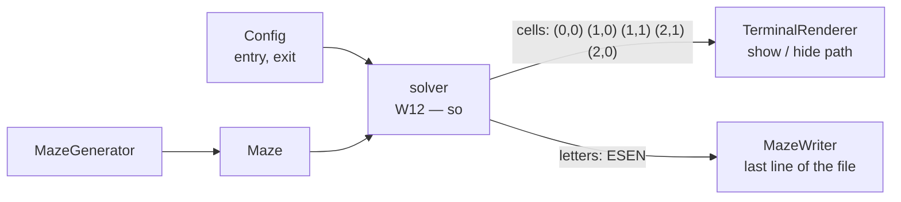

# shortest-path-solver

| | |
| --- | --- |
| **Owner / 担当** | so (W12) |
| **Status / 状態** | implemented — steps 1–3 on 2026-09-17; step 4 (§VI documentation) remains / 実装済み — 2026-09-17 に手順 1〜3。手順 4(§VI の説明)が残る |
| **Date / 日付** | 2026-09-15 |
| **Subject ref** | §IV.5, §V, §VI |
| **Related / 関連** | `architecture-overview.md`, `generation-algorithm.md` (Q10, Q11), `maze-data-structure.md`, `Docs/pair_communication/01_kickoff.md` § 3.8, 3.9, `output/maze_writer.py`, `display/terminal_renderer.py` |

> **EN** — How to read this file. §0 explains what a solver is and why this project needs one, in plain words and
> pictures. §1–§2 are the contract: scope and interface. §3 shows how breadth-first search works, traced step by
> step on a small maze. §4–§8 cover the steps, edge cases, cost, tests and rejected alternatives. §9 records the
> decisions, each with what the other options would have cost.
>
> **JA** — このファイルの読み方。§0 はソルバーとは何か、なぜこの課題に必要かを、平易な言葉と図で説明する。
> §1〜§2 が契約で、対象範囲とインターフェースを定める。§3 は幅優先探索の動きを、小さな迷路で 1 手ずつたどって示す。
> §4〜§8 は実装手順・エッジケース・計算量・テスト・却下した案。§9 に決定事項を、ほかの選択肢の代償とともに
> 記録する。

---

## 0. What the solver is for / ソルバーは何のためにあるか

### 0.1 A maze has a question; the solver answers it / 迷路には問いがあり、ソルバーはそれに答える

**EN** — The generator builds a maze: which walls are open. It says nothing about how to cross it. The solver takes
a finished maze, an entry and an exit, and answers one question: **what is the shortest way from the entry to the
exit, moving only through open walls?** The answer is a list of steps, each one of `N`, `E`, `S` or `W`.

**JA** — 生成器は迷路を作る。つまり、どの壁が開いているかを決める。どう通り抜けるかについては何も言わない。
ソルバーは、完成した迷路と入口・出口を受け取り、1 つの問いに答える:**開いた壁だけを通って、入口から出口へ行く
最短の道は何か。** 答えは一歩ずつの向きの並びで、各歩は `N`・`E`・`S`・`W` のどれか。

```text
the maze of §3 — E = entry (0,0), X = exit (2,0)

      x=0 x=1 x=2
    +---+---+---+
y=0 | E     | X |      two ways from E to X:
    +   +   +   +
y=1 |   |       |      short:  E → (1,0) → (1,1) → (2,1) → X             "ESEN"    4 steps
    +   +---+   +      long:   E → (0,1) → (0,2) → (1,2) → (2,2) → (2,1) → X
y=2 |           |                                                          "SSEENN"  6 steps
    +---+---+---+
                       the solver must return the short one: "ESEN"
```

**EN** — `ESEN` reads: one step east, one south, one east, one north. Starting on the entry and following the
letters, every step crosses an open wall, and the last step lands on the exit.

**JA** — `ESEN` は「東に 1 歩、南に 1 歩、東に 1 歩、北に 1 歩」と読む。入口から文字どおりに進むと、どの一歩も
開いた壁を通り、最後の一歩で出口に着く。

### 0.2 Three parts of the subject need that answer / subject の 3 か所がこの答えを必要とする

| Where / どこ | What it needs (EN) | 何が要るか(JA) |
| --- | --- | --- |
| §IV.5 output file | The last line of the file is the shortest path from entry to exit, as `N`/`E`/`S`/`W` letters. Written by javi's `MazeWriter` (W14), which already takes it as a `str`. | 出力ファイルの最終行は、入口から出口への最短経路を `N`/`E`/`S`/`W` の文字で書いたもの。javi の `MazeWriter`(W14)が書き、すでに `str` として受け取る形になっている。 |
| §V display | The user can show and hide the shortest path. javi's `TerminalRenderer` (W15) marks the **cells** on the path, and already looks for them. | 利用者が最短経路を表示・非表示できる。javi の `TerminalRenderer`(W15)は経路上の**セル**に印を付け、すでにそれを探すコードがある。 |
| §VI reusable module | Its documentation must show how to reach "at least one solution" of a generated maze. | 再利用モジュールの説明に、生成した迷路の「最低ひとつの解」へのアクセス方法を書かねばならない。 |



**EN** — So the answer has **two shapes**: cells for the screen, letters for the file. They carry the same
information, and S2 decides which the solver hands out.

**JA** — つまり答えには**2 つの形**がある。画面にはセル、ファイルには文字。中身は同じ情報で、ソルバーがどちらを
渡すかは S2 で決める。

```text
the output file for the maze above (§IV.5) / 上の迷路の出力ファイル

93B          ← the grid, one hex digit per cell
AC2
C56
             ← a blank line
0,0          ← entry
2,0          ← exit
ESEN         ← the solver's answer
```

### 0.3 Why this module is small / このモジュールが小さい理由

**EN** — Almost everything it needs was written for the generator. The one new idea is the **queue** of §3.1.

**JA** — 必要なものは、ほとんど生成器のために書いてある。新しい考え方は §3.1 の**キュー**の 1 つだけ。

| Needed here / ここで要るもの | Already written / すでにあるもの |
| --- | --- |
| step only through open walls / 開いた壁だけを通る | `Maze.open_neighbours` |
| remember the cells already reached / 到達済みのセルを覚える | `visited` in `_carve_spanning_tree` |
| walk the whole board / 盤面全体を歩く | `_count_reachable` in `tests/test_generator.py` |
| turn a step into a letter / 一歩を文字にする | `Direction` and its `delta` |

---

## 1. Scope / 対象範囲

### In scope

- **EN** — Given a `Maze`, an entry and an exit, find a shortest path through open walls.
  **JA** — `Maze` と入口・出口を受け取り、開いた壁を通る最短経路を求める。
- **EN** — Express that path as cells (entry first, exit last) and as `N`/`E`/`S`/`W` letters.
  **JA** — その経路を、セルの並び(先頭が入口、末尾が出口)と `N`/`E`/`S`/`W` の文字で表す。
- **EN** — Fail with a clear error when no path exists (S3).
  **JA** — 経路が存在しないとき、分かりやすいエラーで失敗する(S3)。

### Out of scope

- **EN** — Writing the file (javi, W14), drawing the path (javi, W15), and catching the error to print it
  (`a_maze_ing.py`, javi, W17).
  **JA** — ファイルへの書き出し(javi、W14)、経路の描画(javi、W15)、エラーを捕まえて表示すること
  (`a_maze_ing.py`、javi、W17)。
- **EN** — Checking that entry and exit lie inside the grid and differ: `load_config` already refuses those.
  **JA** — 入口と出口が盤面の中にあり、互いに異なることの確認。`load_config` がすでに拒否している。
- **EN** — Printing anything. Like the generator, this is part of the reusable module (§VI).
  **JA** — 何かを表示すること。生成器と同じく、再利用モジュールの一部だから(§VI)。

### Requirement it satisfies / 対応する要件

Quoted from `Docs/subject/ja.subject.md` / `Docs/subject/ja.subject.md` からの引用:

> §IV.5 — 「入口の座標、出口の座標、そして入口から出口への**最短の妥当な経路**。経路は `N`, `E`, `S`, `W` の
> 4 文字で表す。」
>
> §V — 「入口から出口への妥当な最短経路を**表示/非表示**する。」
>
> §VI — 「生成された構造へのアクセス方法、および**最低ひとつの解**へのアクセス方法。」

---

## 2. Interface / インターフェース

> **Signatures only. No function bodies.** / **シグネチャのみ。関数本体は書かない。**
>
> **EN** — The shape below follows the decisions of §9: S1 = A, S2 = A, S3 = A.
> **JA** — 下の形は §9 の決定(S1 = A、S2 = A、S3 = A)に従う。

### Public API

```python
# maze/solver.py
from maze.maze import Coord, Maze, MazeError


class SolveError(MazeError):
    """Raised when no path joins the entry and the exit."""


def shortest_path(maze: Maze, entry: Coord, exit: Coord) -> list[Coord]: ...


def to_directions(path: list[Coord]) -> str: ...
```

| Member | What it does (EN) | 何をするか(JA) |
| --- | --- | --- |
| `SolveError` | Raised when the exit cannot be reached from the entry, naming the reason (S3). A `MazeError`, like `GenerationError`. | 入口から出口に届かないとき、理由を示して送出する(S3)。`GenerationError` と同じく `MazeError` の一種。 |
| `shortest_path` | Breadth-first search from `entry`. Returns the cells of a shortest path, `entry` first and `exit` last. | `entry` から幅優先探索する。最短経路のセルを、先頭が `entry`、末尾が `exit` の並びで返す。 |
| `to_directions` | Turns consecutive cells into letters: `[(0,0), (1,0), (1,1)]` → `"ES"`. Knows nothing about walls. | 隣り合うセルの並びを文字に変える:`[(0,0), (1,0), (1,1)]` → `"ES"`。壁については何も知らない。 |

### Exceptions raised / 送出する例外

| Exception | Raised when / 条件 | Who catches it / 誰が捕まえるか |
| --- | --- | --- |
| `SolveError` | entry or exit is a reserved "42" cell, or the exit is unreachable (S3) / 入口か出口が「42」の確保セル、または出口に届かない(S3) | `a_maze_ing.py` → message, non-zero exit (Q1) |
| `OutOfBoundsError` | entry or exit outside the grid — cannot happen after `load_config`, raised by `Maze` itself / 入口か出口が盤面の外。`load_config` の後では起きない。`Maze` 自身が送出する | nobody needs to; it would be a bug / 捕まえる必要はない。起きればバグ |

### Data it owns / 保持するデータ

**EN** — None. Both functions keep their working data in local variables and return; calling them twice on the same
maze gives the same answer.

**JA** — なし。どちらの関数も作業用のデータはローカル変数に持ち、返したら終わり。同じ迷路で 2 回呼べば同じ答えになる。

---

## 3. How breadth-first search finds the shortest path / 幅優先探索が最短経路を見つける仕組み

### 3.1 The only difference from carving: a queue instead of a stack / 掘る段階との違いは 1 つだけ:スタックではなくキュー

**EN** — `_carve_spanning_tree` keeps a **stack**: it always continues from the cell added **last**, so it runs as
deep as it can before backing up. That is depth-first search. The solver keeps a **queue**: it always continues from
the cell added **first**. Cells therefore leave the queue in order of their distance from the entry — every cell one
step away, then every cell two steps away, and so on. That is breadth-first search.

**JA** — `_carve_spanning_tree` は**スタック**を持つ。常に**最後に**入れたセルから続けるので、行けるところまで深く
進んでから引き返す。これが深さ優先探索。ソルバーは**キュー**を持つ。常に**最初に**入れたセルから続ける。
そのためセルは、入口からの距離の順にキューを出ていく。まず 1 歩のセル全部、次に 2 歩のセル全部、という順。
これが幅優先探索。

```text
stack (carving, DFS) / スタック              queue (solver, BFS) / キュー

   add →  [ A  B  C ]                         add →  [ A  B  C ]
   take ←          C   the newest            take ←   A          the oldest
```

**EN** — In Python, a `list` is a fine stack (`append`, `pop`), but a poor queue: `pop(0)` shifts every remaining
element, so emptying a queue of `V` cells costs O(V²). `collections.deque` removes from the front in constant time
with `popleft`.

**JA** — Python の `list` はスタックとしては良い(`append`・`pop`)が、キューとしては向かない。`pop(0)` は残りの要素を
全部ずらすので、`V` セルのキューを空にするのに O(V²) かかる。`collections.deque` なら `popleft` で先頭を定数時間で
取り出せる。

### 3.2 Distance rings / 距離の輪

**EN** — On the maze of §0.1, the numbers below are each cell's distance from the entry. BFS takes the cells in
exactly this order, so **the first time it reaches the exit, it has reached it by a shortest route**: any shorter
route would have brought the exit out of the queue earlier.

**JA** — §0.1 の迷路で、下の数字は各セルの入口からの距離。BFS はまさにこの順にセルを取り出すので、**出口に初めて
着いたとき、それは最短の道で着いている。** もっと短い道があれば、出口はもっと早くキューから出ていたはずだから。

```text
    +---+---+---+
    | 0   1 | 4 |      0 = entry
    +   +   +   +      the exit (2,0) is at distance 4 → "ESEN" has 4 letters
    | 1 | 2   3 |
    +   +---+   +      (2,2) is also at distance 4, reached from (2,1)
    | 2   3   4 |
    +---+---+---+
```

### 3.3 Traced, step by step / 1 手ずつのトレース

**EN** — Neighbours come in the order `Maze.neighbours` yields them: N, E, S, W. A cell is recorded in `parent` the
moment it is added to the queue, which is also what marks it as reached — the same "mark on push" as the carving.
The table was produced by running it on the real `Maze`.

**JA** — 隣は `Maze.neighbours` が返す順、つまり N・E・S・W の順に来る。セルはキューに入れた瞬間に `parent` に
記録し、それが「到達済み」の印も兼ねる。掘る段階の「積むときに印を付ける」と同じ。この表は実際の `Maze` で実行して
得たもの。

| step | taken from the front / 先頭から取り出す | added, with its parent / 追加(親) | queue afterwards / その後のキュー |
| --- | --- | --- | --- |
| 0 | — | (0,0) | (0,0) |
| 1 | (0,0) | (1,0)←(0,0), (0,1)←(0,0) | (1,0) (0,1) |
| 2 | (1,0) | (1,1)←(1,0) | (0,1) (1,1) |
| 3 | (0,1) | (0,2)←(0,1) | (1,1) (0,2) |
| 4 | (1,1) | (2,1)←(1,1) | (0,2) (2,1) |
| 5 | (0,2) | (1,2)←(0,2) | (2,1) (1,2) |
| 6 | (2,1) | **(2,0)←(2,1)**, (2,2)←(2,1) | (1,2) (2,0) (2,2) |
| 7 | (1,2) | none | (2,0) (2,2) |
| 8 | **(2,0) = exit** | stop | — |

**EN** — A stack on the same maze takes `(0,1)` before `(1,0)` at step 2, runs down the left side, and reaches the
exit along `SSEENN`, 6 steps. It finds **a** path, not the shortest one.

**JA** — 同じ迷路でスタックを使うと、2 手目で `(1,0)` より先に `(0,1)` を取り出し、左側を下っていき、`SSEENN` の
6 歩で出口に着く。見つかるのは**ある**道で、最短の道ではない。

### 3.4 Walking back through the parents / 親をたどって戻る

**EN** — The search only records, for each cell, which cell it was reached from. The path comes from walking those
records **backwards** from the exit until the entry, whose parent is none, and then reversing the list.

**JA** — 探索が記録するのは、各セルが「どのセルから来たか」だけ。経路は、その記録を出口から**逆向きに**、親を持たない
入口までたどり、最後にリストを反転して得る。

```text
parent:  (1,0)←(0,0)   (0,1)←(0,0)   (1,1)←(1,0)   (0,2)←(0,1)
         (2,1)←(1,1)   (1,2)←(0,2)   (2,0)←(2,1)   (2,2)←(2,1)

from the exit:  (2,0) → (2,1) → (1,1) → (1,0) → (0,0)    parent of (0,0) is none: stop
reversed:       (0,0) → (1,0) → (1,1) → (2,1) → (2,0)    = shortest_path's answer
```

### 3.5 Cells to letters / セルから文字へ

**EN** — Two consecutive cells differ by exactly one `Direction.delta`; its initial is the letter.

**JA** — 隣り合う 2 つのセルの差は、ちょうど 1 つの `Direction.delta` になる。その頭文字が文字。

| from → to | difference `(dx, dy)` | direction | letter |
| --- | --- | --- | --- |
| (0,0) → (1,0) | (1, 0) | EAST | `E` |
| (1,0) → (1,1) | (0, 1) | SOUTH | `S` |
| (1,1) → (2,1) | (1, 0) | EAST | `E` |
| (2,1) → (2,0) | (0, -1) | NORTH | `N` |

**EN** — `y` grows downwards, so a step to a smaller `y` is north. This is the same convention as `Direction`
itself, which is why the letters can come straight from it.

**JA** — `y` は下に向かって増えるので、`y` が小さくなる一歩が北。`Direction` 自身と同じ約束なので、文字をそこから
そのまま取れる。

---

## 4. Implementation steps / 実装手順

1. **EN** — `shortest_path` on a maze where a path exists: the queue, `parent`, stopping at the exit, walking back.
   **JA** — 経路が存在する迷路での `shortest_path`。キュー、`parent`、出口で止まる、親をたどって戻る。
2. **EN** — `to_directions`.
   **JA** — `to_directions`。
3. **EN** — `SolveError` and the cases of S3.
   **JA** — `SolveError` と S3 の場合分け。
4. **EN** — Show the solver in the reusable module's documentation (§VI), with the generator example.
   **JA** — 再利用モジュールの説明(§VI)に、生成器の例と並べてソルバーの使い方を書く。

---

## 5. Edge cases / エッジケース

| # | Input / situation | Expected behaviour (EN) | 期待する挙動(JA) |
| --- | --- | --- | --- |
| E1 | entry is a reserved "42" cell / 入口が「42」の確保セル | `SolveError` naming the entry (S3). On 20x15 the "42" covers x 7–13, y 5–9, so `ENTRY=8,7` hits it. | 入口を示して `SolveError`(S3)。20x15 では「42」が x 7〜13、y 5〜9 を覆うので、`ENTRY=8,7` が該当する。 |
| E2 | exit is a reserved "42" cell / 出口が「42」の確保セル | Same, naming the exit. | 同じく、出口を示して。 |
| E3 | exit unreachable from entry / 出口に届かない | `SolveError`. A maze from our generator is always connected (E3 of the generation plan), so only a maze built by hand gets here — the reusable module must still not crash on it. | `SolveError`。この生成器の迷路は常につながっている(生成計画の E3)ので、ここに来るのは手で作った迷路だけ。それでも再利用モジュールとして落ちてはならない。 |
| E4 | several shortest paths / 最短経路が複数 | Any one of them, always the same one for the same maze: the order of `Maze.neighbours` decides the tie. Common in the default mode, which has loops. | どれか 1 本。同じ迷路なら常に同じもの。同点は `Maze.neighbours` の順で決まる。ループのある既定モードではよく起きる。 |
| E5 | perfect maze / 完全迷路 | Exactly one path exists, so it is also the shortest. | 経路はちょうど 1 本なので、それが最短でもある。 |
| E6 | entry equals exit / 入口と出口が同じ | Refused earlier by `load_config`. If called anyway, `[entry]` and `""`: a path of no steps. | `load_config` が先に拒否する。それでも呼ばれたら、`[entry]` と `""`(0 歩の経路)。 |
| E7 | large maze / 大きな迷路 | Linear time, no recursion (§6). | 線形時間、再帰なし(§6)。 |

---

## 6. Complexity / 計算量とその根拠

**EN** — Let `V = width × height`.
**JA** — `V = width × height` とする。

| Operation | Time | Space | Why acceptable (EN) | 許容できる理由(JA) |
| --- | --- | --- | --- | --- |
| `shortest_path` | O(V) | O(V) | Each cell enters the queue at most once and has at most four neighbours; `parent` and the queue hold at most V cells. A 500x500 maze is 250,000 cells, still linear. | 各セルがキューに入るのは最大 1 回、隣は最大 4 つ。`parent` とキューが持つのは最大 V セル。500x500 でも 25 万セルで、線形のまま。 |
| `to_directions` | O(L) | O(L) | L, the path length, is at most V. | 経路長 L は最大でも V。 |

**EN** — Two ways to lose linearity, both avoided: a `list` used as a queue (`pop(0)` makes it O(V²), §3.1), and
storing a whole path per queued cell instead of one parent (O(V × L) memory).

**JA** — 線形でなくなる落とし穴が 2 つあり、どちらも避ける。`list` をキューに使うこと(`pop(0)` で O(V²)、§3.1)と、
キューのセルごとに親 1 つではなく経路まるごとを持つこと(メモリが O(V × L))。

---

## 7. Test plan / テスト方針

| Test | Kind | Checks (EN) | 何を保証するか(JA) |
| --- | --- | --- | --- |
| `test_shortest_path_of_the_traced_maze` | unit | The maze of §0.1 gives `[(0,0), (1,0), (1,1), (2,1), (2,0)]`, not the 6-step route. | §0.1 の迷路で `[(0,0), (1,0), (1,1), (2,1), (2,0)]` が返り、6 歩の道ではない。 |
| `test_path_of_a_single_cell` | edge | E6: entry equal to exit gives `[entry]`, and one cell or none gives `""`. | E6:入口と出口が同じなら `[entry]`。セル 1 つか 0 個なら `""`。 |
| `test_to_directions_of_the_traced_path` | unit | That path gives `"ESEN"`; a step west gives `"W"`. | その経路で `"ESEN"`、西への一歩で `"W"`。 |
| `test_to_directions_rejects_cells_not_one_step_apart` | edge | Cells two apart, or diagonal, raise `KeyError` instead of a string a letter short. | 2 マス離れたセルや斜めのセルは、1 文字足りない文字列ではなく `KeyError` になる。 |
| `test_path_follows_open_walls` | property | On 80 generated cases (both modes, 20x15 and 9x7, 10 seeds, two corner pairs), the letters replayed from the entry cross only open walls and end on the exit. | 生成した 80 ケース(両モード、20x15 と 9x7、10 シード、角の組 2 通り)で、文字を入口からたどると開いた壁だけを通り、出口に着く。 |
| `test_path_is_shortest` | property | The length equals a distance the test computes another way, by relaxing distances until nothing changes, so it does not share the search's logic. | 長さが、テスト側が別の方法(変化がなくなるまで距離を更新する)で求めた距離と等しい。探索と同じ考え方を使わない。 |
| `test_same_maze_same_path` | property | E4: solving twice gives the same path. | E4:2 回解くと同じ経路になる。 |
| `test_reserved_entry_or_exit_raises` | edge | E1, E2 on 20x15: the message names the entry or exit as `8,7` and mentions the "42". | 20x15 で E1・E2。メッセージが入口か出口を `8,7` と示し、「42」に触れる。 |
| `test_unreachable_exit_raises` | edge | E3 on a hand-built 3x2 whose exit is cut off, with the message naming both cells. | 出口が切り離された手作りの 3x2 で E3。メッセージが両方のセルを示す。 |
| `test_solving_prints_nothing` | design | `capsys` captures no output. | `capsys` が何も捕まえない。 |

- Verified with `maze_analyzer.py`? / `maze_analyzer.py` で検証するか: **no** — it reads the entry and exit from
  the footer but never checks the path line, so the tests above are the only check on it. / **しない。** 末尾の入口
  と出口は読むが、経路の行は検査しない。経路を確かめるのは上のテストだけ。

---

## 8. Rejected alternatives / 却下した案

| Option | Why rejected (EN) | 却下理由(JA) |
| --- | --- | --- |
| Depth-first search / 深さ優先探索 | Finds a path, not the shortest (§3.3: `SSEENN` instead of `ESEN`). | 経路は見つかるが最短ではない(§3.3:`ESEN` ではなく `SSEENN`)。 |
| Dijkstra's algorithm / ダイクストラ法 | Solves weighted graphs with a priority queue; every step here costs the same, where it gives BFS's answer with more machinery. | 優先度付きキューで重み付きグラフを解く方法。ここではどの一歩も同じコストで、BFS と同じ答えを、より多くの仕組みで出すことになる。 |
| A* | Faster on large open maps thanks to a distance estimate, but the estimate is one more thing to write and defend, and BFS is already linear. | 距離の見積もりのおかげで広いマップでは速いが、見積もりという書いて説明するものが 1 つ増える。BFS はすでに線形。 |
| Recursive search / 再帰での探索 | Depth would reach one call per cell and hit Python's limit of about 1000, the same reason the carving uses a stack. | 深さがセル 1 つにつき 1 呼び出しに達し、Python の上限 1000 前後にぶつかる。掘る段階がスタックを使うのと同じ理由。 |
| A `list` as the queue / キューに `list` | `pop(0)` is O(n), making the search O(V²) (§6). | `pop(0)` が O(n) なので、探索全体が O(V²) になる(§6)。 |

---

## 9. Decisions and open questions / 決定事項と未解決の問い

### S1 — where the solver lives, and how §VI's "access to a solution" is met / ソルバーの置き場所と、§VI の「解へのアクセス」の満たし方

**EN** — Deciding this also settles `01_kickoff.md` 3.8, which is still open. The architecture overview already
places the solver in `maze/solver.py`, on the engine side and inside the reusable package; what remains is the
shape of the access.

**JA** — これを決めると、まだ開いている `01_kickoff.md` の 3.8 も決まる。アーキテクチャ概要はすでにソルバーを
`maze/solver.py`、つまりエンジン側で再利用パッケージの中に置いている。残るのはアクセスの形。

| | Option (EN) | 選択肢(JA) | Consequences (EN) | 帰結(JA) |
| --- | --- | --- | --- | --- |
| **A** | Functions in `maze/solver.py`, taking a `Maze`. The §VI documentation shows `generate()` then `shortest_path(maze, entry, exit)`. | `maze/solver.py` の関数で、`Maze` を受け取る。§VI の説明には `generate()` の後に `shortest_path(maze, entry, exit)` を呼ぶ例を書く。 | The generator stays as it is, and the solver works on any `Maze`, including hand-built ones in tests. **Cost:** a user of the package imports two things instead of one. | 生成器は今のまま。ソルバーはテスト用の手作りのものも含め、どの `Maze` にも使える。**代償:** パッケージの利用者は 1 つではなく 2 つを import する。 |
| B | A method on `MazeGenerator`, e.g. `solve(maze, entry, exit)`, calling the same search. | `MazeGenerator` のメソッド(例:`solve(maze, entry, exit)`)にし、同じ探索を呼ぶ。 | One import, and "the generator exposes a solution" reads literally. **Cost:** the generator gains a job that is not generating, and still needs the maze passed back in, since it keeps none. | import が 1 つで済み、「生成器が解を公開する」を文字どおりに満たす。**代償:** 生成器が生成ではない仕事を持つ。迷路を保持しないので、結局迷路を渡し直す必要がある。 |
| C | Both: the functions of A, plus a thin method of B that calls them. | 両方。A の関数に加え、それを呼ぶだけの B のメソッドを置く。 | Either way of reading §VI is covered. **Cost:** two entry points to the same thing, to test and to explain. | §VI をどちらの意味で読んでも満たす。**代償:** 同じものへの入口が 2 つになり、テストも説明も 2 つ分。 |

**Decided (2026-09-17) / 決定:** **A.** §VI asks the *module* for access to a solution, not the class; the
architecture already names `maze/solver.py`.
**A。** §VI が解へのアクセスを求めているのは*モジュール*で、クラスではない。アーキテクチャ概要もすでに
`maze/solver.py` と名指ししている。

### S2 — what the solver returns / ソルバーが何を返すか

| | Option (EN) | 選択肢(JA) | Consequences (EN) | 帰結(JA) |
| --- | --- | --- | --- | --- |
| **A** | `shortest_path` returns cells; `to_directions` turns cells into letters. | `shortest_path` はセルを返し、`to_directions` がセルを文字に変える。 | The renderer uses the cells as they are, the writer calls `to_directions`. Each function does one thing and is tested alone. **Cost:** two functions to call where the file is written. | 描画はセルをそのまま使い、書き出しは `to_directions` を呼ぶ。関数はそれぞれ 1 つの仕事で、単独でテストできる。**代償:** ファイルを書く場所では関数を 2 つ呼ぶ。 |
| B | Return letters only. | 文字だけを返す。 | Matches `MazeWriter.write` exactly. **Cost:** the renderer has to replay the letters from the entry to find the cells, which is solver logic on javi's side. | `MazeWriter.write` とそのまま合う。**代償:** 描画側は、セルを知るために入口から文字をたどり直す必要がある。ソルバーの仕事が javi 側に漏れる。 |
| C | Return both at once, as a tuple or a small class. | 両方を一度に返す(タプルか小さなクラス)。 | One call gives everything. **Cost:** a new type to name and document, and every caller unpacks what it does not need. | 1 回の呼び出しで全部が手に入る。**代償:** 名前を付けて説明する型が 1 つ増え、呼び出し側は要らない方まで受け取る。 |

**Decided (2026-09-17) / 決定:** **A.** Cells are the natural result of the search (§3.4), and letters are one
small, separately testable step from them.
**A。** セルは探索の自然な結果で(§3.4)、文字はそこから小さく、別にテストできる一歩で作れる。

### S3 — when no path exists / 経路が存在しないとき

**EN** — With our generator this happens only when the entry or the exit sits on a "42" cell: `load_config` checks
the grid bounds but cannot know where the pattern goes, since the generator decides that (Q11 of the generation
plan). The default `config.txt` uses the corners, which the "42" never covers.

**JA** — この生成器では、入口か出口が「42」のセルに乗ったときにだけ起きる。`load_config` は盤面の範囲は確かめるが、
パターンの位置は生成器が決める(生成計画の Q11)ので知りようがない。既定の `config.txt` は四隅を使っていて、
「42」は四隅を決して覆わない。

| | Option (EN) | 選択肢(JA) | Consequences (EN) | 帰結(JA) |
| --- | --- | --- | --- | --- |
| **A** | `shortest_path` raises `SolveError`, with a message saying whether the entry or exit is reserved, or the exit is unreachable. | `shortest_path` が `SolveError` を送出する。メッセージで、入口か出口が確保セルなのか、出口に届かないのかを示す。 | Never returns something that looks like an answer; the user is told exactly what to change in the file. **Cost:** the maze is built before the problem is found, and `a_maze_ing.py` must catch one more error class (Q1). | 答えに見えるものを返すことがない。利用者はファイルの何を直せばよいかが分かる。**代償:** 問題が見つかるのは迷路を作った後。`a_maze_ing.py` が捕まえる例外が 1 種類増える(Q1)。 |
| B | Return `None`, and let the caller decide. | `None` を返し、呼び出し側に任せる。 | No exception to catch. **Cost:** every caller must remember to check; one that forgets hands `None` to the writer, which fails far from the cause — the failure `implementation_plans/README.md` warns about. | 捕まえる例外がない。**代償:** 呼び出し側全員が確認を覚えていなければならない。忘れると `None` が書き出しに渡り、原因から遠い場所で落ちる。`implementation_plans/README.md` が警告している形。 |
| C | Keep the "42" off the entry and exit: `MazeGenerator` takes them and moves or drops the pattern. | 「42」を入口と出口から避ける。`MazeGenerator` がそれらを受け取り、パターンをずらすか省く。 | The user never meets the error. **Cost:** the generator's signature and the placement proofs of Q11 change two days before the deadline, and the solver still needs A or B for hand-built mazes. | 利用者はこのエラーに出会わない。**代償:** 締切 2 日前に生成器のシグネチャと Q11 の配置の証明が変わる。手作りの迷路のために、ソルバーは結局 A か B も必要。 |

**Decided (2026-09-17) / 決定:** **A.** It is the same policy as the generator's: fail where the problem is seen,
with a message a user can act on.
**A。** 生成器と同じ方針。問題を見つけた場所で、利用者が対処できるメッセージとともに失敗する。

### Open questions / 未解決

- [x] **S1, S2, S3 — all A (2026-09-17).** / **すべて A(2026-09-17)。**
- [ ] **Q1 — for javi: the entry point must catch `MazeError` as well as `ConfigError`.** / **javi へ:エントリポイントは
  `ConfigError` に加えて `MazeError` も捕まえる必要がある。**

  **EN** — Decision 3.9 = A agreed on one `except ConfigError` in `a_maze_ing.py`. But `ConfigError` is not a
  `MazeError`: `GenerationError` from the generator, and `SolveError` from here, would pass straight through it and
  crash the program, which §IV.2 forbids. Catching `MazeError` next to it covers both.

  **JA** — 決定 3.9 = A では、`a_maze_ing.py` に `except ConfigError` を 1 つ置くと合意した。しかし `ConfigError` は
  `MazeError` の子ではない。生成器の `GenerationError` も、ここの `SolveError` も、そこを素通りしてプログラムを
  落とし、§IV.2 が禁じる状態になる。隣に `MazeError` の捕捉を置けば、両方を受け止められる。
- [ ] **Q2 — for javi: the renderer reads `maze.shortest_path`, which `Maze` does not have.** / **javi へ:描画は
  `maze.shortest_path` を読むが、`Maze` にその属性はない。**

  **EN** — `TerminalRenderer` looks for the path with `getattr(maze, "shortest_path", ())`. With S2 = A the cells
  come from `shortest_path(...)` instead, so the renderer should take them as an argument. Keeping solver results
  out of `Maze` keeps `Maze` a plain structure of walls.

  **JA** — `TerminalRenderer` は `getattr(maze, "shortest_path", ())` で経路を探している。S2 = A ならセルは
  `shortest_path(...)` から来るので、描画はそれを引数で受け取るのがよい。解の結果を `Maze` に持たせないことで、
  `Maze` は壁だけを表す単なる構造のままでいられる。

---

## 10. Changelog / 変更履歴

| Date | Change (EN) | 変更(JA) | Reason (EN) | 理由(JA) |
| --- | --- | --- | --- | --- |
| 2026-09-15 | initial draft, with §0 on what a solver is and a BFS trace run on the real `Maze` | 初稿。§0 にソルバーとは何かを、実際の `Maze` で実行した BFS のトレースとともに記載 | the generator is finished; W12 is next, and S1–S3 must be settled before the code | 生成器が完成し、次は W12。コードの前に S1〜S3 を決める必要がある |
| 2026-09-17 | S1, S2, S3 decided: functions in `maze/solver.py`, cells from `shortest_path` and letters from `to_directions`, `SolveError` when no path exists | S1・S2・S3 を決定。`maze/solver.py` の関数、`shortest_path` がセル・`to_directions` が文字、経路が無ければ `SolveError` | so chose the recommended options | so がおすすめの選択肢を採用 |
| 2026-09-17 | steps 1–3 implemented; §7 lists the ten tests as written | 手順 1〜3 を実装。§7 を実際に書いた 10 本のテストに合わせた | three edge and design tests were added while writing them; all 12 mutants of the solver fail a test or hang | 書く途中で端のケースと設計のテストを 3 本足した。ソルバーの 12 個のミューテーションはすべて、テストが失敗するか止まらなくなる |
