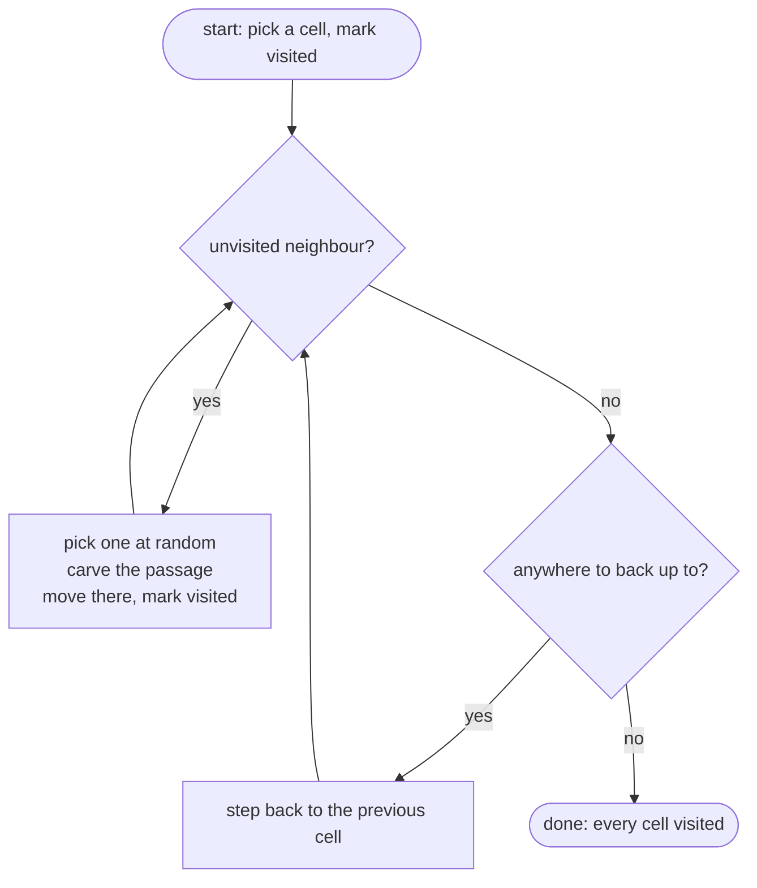
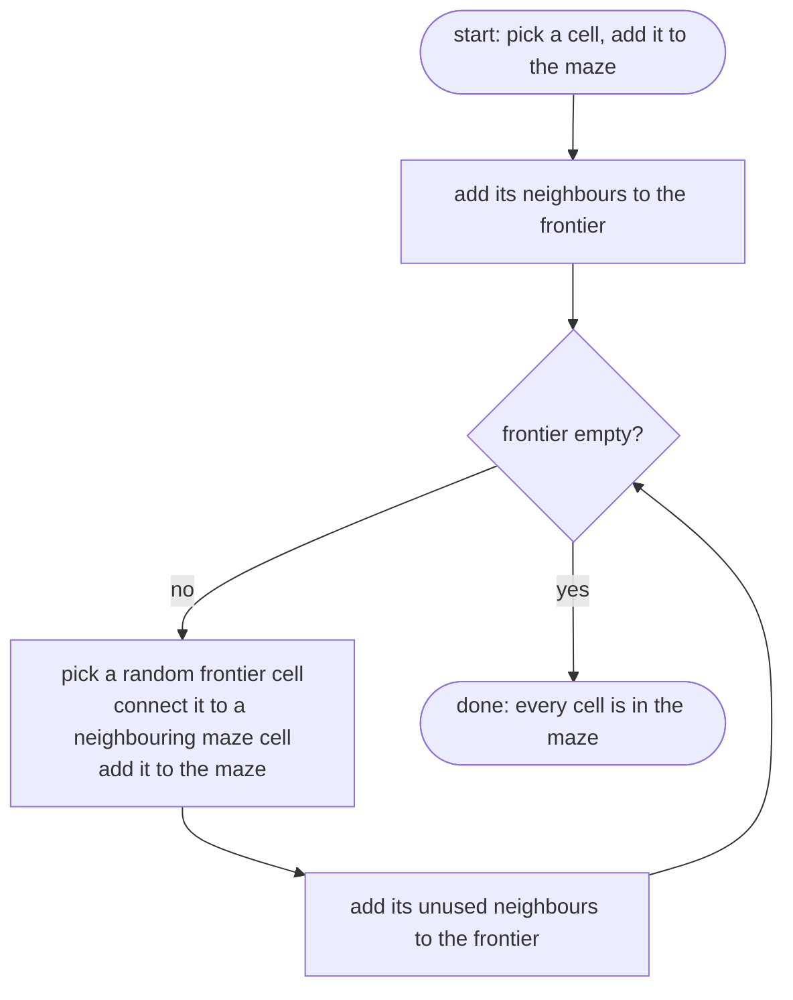
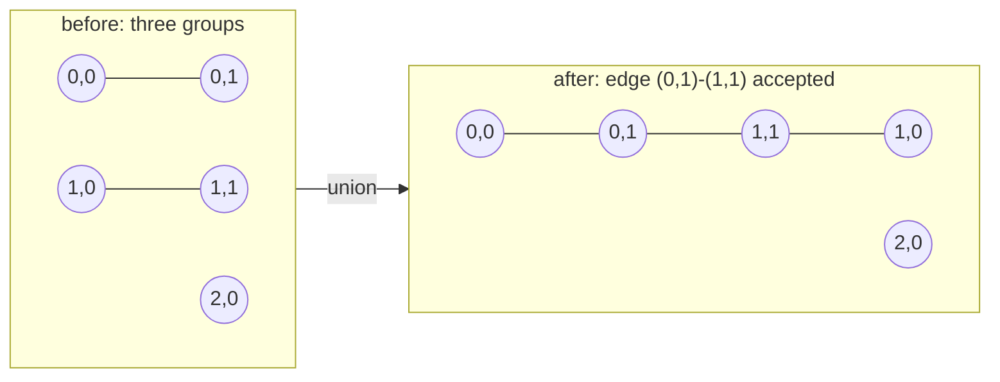
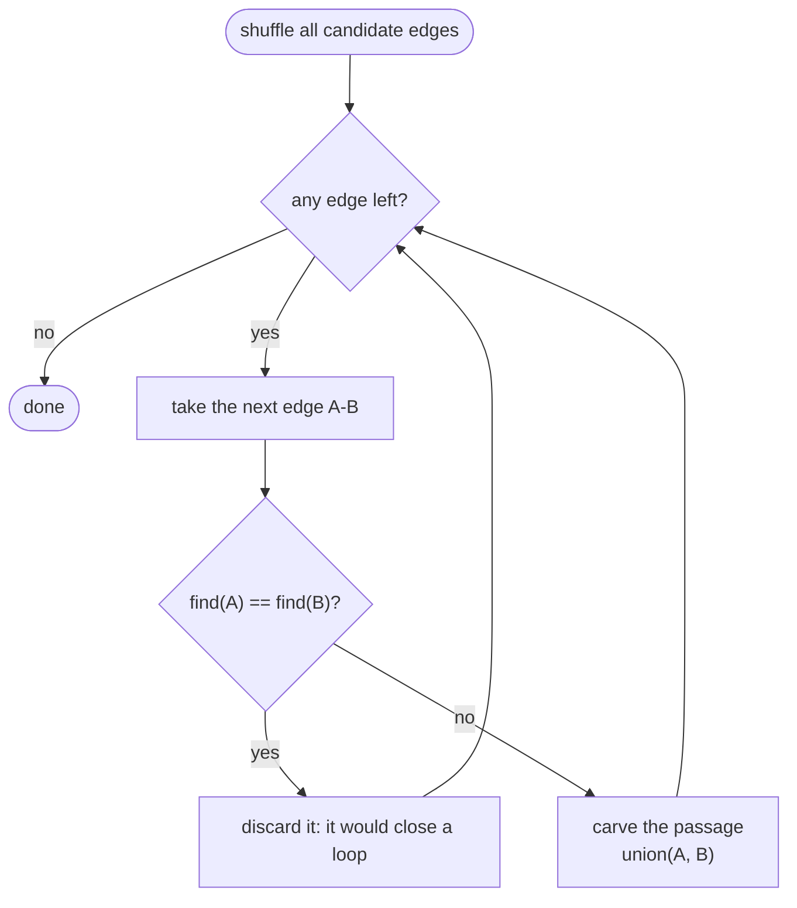

# Maze generation algorithms — recursive backtracker, Prim, Kruskal

| | |
| --- | --- |
| **Author / 筆者** | so |
| **Date / 日付** | 2026-08-14 |
| **Where it is used / 使い所** | decision 3.5 (`Docs/pair_communication/01_kickoff.md`), W05 / W07 / W08 |
| **Written with AI? / AI 併用** | yes — drafted with Claude: explanations, diagrams and the trace. Checked by hand against the subject. (§VII の記録用) |
| **Confidence / 理解度** | — (fill after answering §7 / §7 に答えてから記入) |

> **How to use this file / このファイルの使い方**
> **EN** — This is a **reference document**, meant to be returned to whenever the topic comes back: before
> implementing W05, before writing the README justification, before the defense. Not a one-time read. Whether it
> worked is measured by §7 — answer those out loud before relying on it, and if a question is hard, fix the
> section above it rather than the answer.
> **JA** — これは**解説書**。話題が戻ってくるたびに読み返すためにある(W05 の実装前、README の選定理由を書く前、
> ディフェンス前)。一度読んで終わりではない。効いたかどうかの尺度は §7。
> 頼る前に声に出して答えること。答えにくい問いがあったら、答えではなく**その上の節の書き方**を直す。

---

## 0. At a glance / 全体像

**EN** — All three candidates produce a **perfect maze**, because all three build a **spanning tree** over the
grid. So the choice is **not about correctness** — any of them is a correct generator. It is about texture, how
much work is left for the braiding step of the default mode, and how much conceptual surface we have to defend.

**JA** — 3 つとも**完全迷路**を作る。どれも格子上の**全域木**を作るからで、
つまり選択は**正しさの問題ではない**。どれを選んでも正しい生成器になる。
判断材料は、質感、既定モードの braiding にどれだけ仕事が残るか、そして説明すべき概念がどれだけ増えるか。

| | Recursive backtracker (DFS) | Randomized Prim | Randomized Kruskal |
| --- | --- | --- | --- |
| **Texture / 質感** | long winding corridors, few junctions / 長く曲がりくねる通路、分岐は少ない | short corridors, many junctions, grows outward / 通路が短く分岐が多い、外へ広がる | uniform, no growth direction / 均一、育つ方向に偏りがない |
| **Dead ends / 行き止まり** (rough — verify, see §5.4) | ~10% of cells / 全セルの約 1 割 | ~30% / 約 3 割 | ~30% / 約 3 割 |
| **Braiding work left / braiding の残作業** (`PERFECT=False`) | least / 最少 | more / 多い | more / 多い |
| **Extra structure / 増える道具** | a stack / スタック | a frontier set / フロンティア集合 | **union-find** / 素集合データ構造 |
| **Main risk / 主なリスク** | recursion depth if written recursively / 再帰で書くと深さ | none in particular / 特になし | one more concept both must explain (§IX) / 二人とも説明すべき概念が 1 つ増える |

---

## 1. A maze is a graph, a perfect maze is a spanning tree / 迷路はグラフ、完全迷路は全域木

### 1.1 Seeing the maze as a graph / 迷路をグラフとして見る

**EN** — Treat every cell as a **node**, and the wall between two adjacent cells as an **edge that could become a
passage**. A 3x3 grid has 9 nodes and 12 possible passages. Generating a maze is choosing **which of those 12 to
open**. Think of it as *choosing passages*, not *breaking walls* — everything below reads more naturally that way.

**JA** — 各セルを**点(ノード)**、隣り合うセルの間の壁を**通路になりうる辺(エッジ)**と考える。
3x3 なら点が 9 個、通路になりうる辺が 12 本。迷路を作るとは、その 12 本から**どれを開通させるか**を選ぶこと。
「壁を壊す」ではなく「**道を選ぶ**」と考えると、以降の話がすべて素直になる。

```text
The 12 candidate edges          cell coordinates are (x, y), y points down
                                stored as grid[y][x]  (decision 3.2)

  (0,0) ── (1,0) ── (2,0)
    │        │        │
  (0,1) ── (1,1) ── (2,1)
    │        │        │
  (0,2) ── (1,2) ── (2,2)
```

### 1.2 Perfect maze = spanning tree / 完全迷路 = 全域木

**EN** — §IV.4 defines `PERFECT=True` as "exactly one path between any two cells". Rephrased, that is two
conditions at once: **every cell is reachable** (connected) and **there is no detour anywhere** (no cycle). A graph
with both properties is a **tree**; a tree that includes every node is a **spanning tree**. This is what the
subject's foreword means when it says a perfect maze corresponds to a spanning tree.

A tree has a strong property: **for N nodes there are exactly N−1 edges.** For 3x3 that is 8 passages chosen out
of the 12 candidates.

**JA** — §IV.4 の `PERFECT=True` は「任意の 2 セル間の経路がちょうど 1 本」。言い換えると 2 条件の同時成立:
**全セルに到達できる**(連結)、かつ **回り道が 1 つもない**(閉路がない)。
両方を満たすグラフを**木**と呼び、全部の点を含む木を**全域木**という。
subject のまえがきが「完全迷路は全域木に対応する」と書いているのはこの意味。

木には強い性質がある:**点が N 個なら、辺はちょうど N−1 本。**
3x3 なら 12 本の候補から 8 本を選ぶ、というのが迷路生成の正体。

```text
8 of the 12 chosen — this is a perfect maze
(the same maze the trace in §2.2 produces)

  (0,0)    (1,0) ── (2,0)
    │                 │
  (0,1) ── (1,1)    (2,1)
             │        │
  (0,2) ── (1,2) ── (2,2)
```

> **EN** — Check yourself: what happens with fewer than 8 edges? With 9?
> **JA** — 確認:8 本より少ないと何が起きるか。9 本にすると何が起きるか。

### 1.3 What actually differs between the three / 3 つは何が違うのか

**EN** — **All three build a spanning tree. They differ only in *which* spanning tree they tend to pick.** There
are very many ways to choose 8 edges out of 12, and every one of them is a valid perfect maze. Each algorithm has
its own bias, and that bias becomes the visible **texture** and the **number of dead ends** — and the number of
dead ends is what costs us work in this subject (§5.1).

**JA** — **3 つとも全域木を作る。違うのは「どの全域木を選びやすいか」の偏り方だけ。**
12 本から 8 本を選ぶ組み合わせは非常に多く、どれも正しい完全迷路になる。
アルゴリズムごとに選ばれやすい形が違い、それが目に見える**質感**と**行き止まりの数**になる。
そしてこの課題で実務的に効くのは行き止まりの数(§5.1)。

---

## 2. Recursive backtracker (randomized DFS) / 再帰的バックトラッカー

### 2.1 What it does / やっていること

**EN** — **Walk as far as you can, and back up when you are stuck.** That is all of it.

1. Start at any cell and mark it visited
2. Pick a random **unvisited** neighbour of the current cell
3. Open the passage to it, move there, mark it visited
4. When no unvisited neighbour is left, **step back one cell** (backtrack)
5. When there is nowhere left to step back to, stop

**JA** — **一筆書きで行けるところまで進み、行き止まったら戻る。** それだけ。

1. 適当なセルから始め、訪問済みにする
2. 今いるセルの隣で**まだ訪問していない**ものをランダムに 1 つ選ぶ
3. そこへの道を開通させ、移動して訪問済みにする
4. 未訪問の隣がなくなったら、**来た道を 1 歩戻る**(バックトラック)
5. 戻る先がなくなったら終了



### 2.2 Trace on a 3x3 grid / 3x3 でのトレース

**EN** — Fixing the random choices, here is every step. `stack` is the way back.
**JA** — 乱数の選択を固定したとして、一手ずつ追う。`stack` は「戻る道」。

| # | Where / 位置 | Unvisited neighbours / 未訪問の隣 | Choice / 選択 | Passage carved / 開通した道 | Stack (oldest first) |
| --- | --- | --- | --- | --- | --- |
| 1 | (0,0) | (1,0), (0,1) | south to (0,1) | (0,0)–(0,1) | (0,0) |
| 2 | (0,1) | (1,1), (0,2) | east to (1,1) | (0,1)–(1,1) | (0,0),(0,1) |
| 3 | (1,1) | (1,0), (2,1), (1,2) | south to (1,2) | (1,1)–(1,2) | …,(1,1) |
| 4 | (1,2) | (0,2), (2,2) | west to (0,2) | (1,2)–(0,2) | …,(1,2) |
| 5 | (0,2) | **none** | back up | — | …,(1,2) |
| 6 | (1,2) | (2,2) | east to (2,2) | (1,2)–(2,2) | …,(1,2) |
| 7 | (2,2) | (2,1) | north to (2,1) | (2,2)–(2,1) | …,(2,2) |
| 8 | (2,1) | (2,0) | north to (2,0) | (2,1)–(2,0) | …,(2,1) |
| 9 | (2,0) | (1,0) | west to (1,0) | (2,0)–(1,0) | …,(2,0) |
| 10 | (1,0) | **none** | back up until empty, stop | — | empties |

**EN** — 8 passages for 9 cells — **N−1**, exactly as §1.2 predicts.
**JA** — 開通した道は **8 本**、セルは 9 個。**N−1 = 8** で、§1.2 の性質どおり。

```text
The resulting maze

+---+---+---+
|   |       |
+   +---+   +
|       |   |
+---+   +   +
|           |
+---+---+---+
```

**EN** — **Connecting this to §IV.5:** take the top-left cell (0,0). North is the outer border, so closed. East
has a wall to (1,0), closed. South was carved, so open. West is the outer border, closed. With bit 0 = N, 1 = E,
2 = S, 3 = W and 1 meaning closed: `1 + 2 + 0 + 8 = 11` → **`b`**. That is the first character of the output file.

**JA** — **§IV.5 との接続:**左上のセル (0,0) を見る。北は外周なので閉、東は (1,0) との間に壁があるので閉、
南は開通済みなので開、西は外周なので閉。bit0=N、bit1=E、bit2=S、bit3=W、1 が閉なので
`1 + 2 + 0 + 8 = 11` → **`b`**。これが出力ファイルの 1 文字目になる。

### 2.3 Its character / 性格

**EN** — Steps 1–4 of the trace show the shape: it **dives in a single line as far as it can**. The result is
long, winding corridors, few junctions, a long solution path, and **relatively few dead ends** — around 10% of
cells as a rough figure.

**JA** — トレースの 1〜4 手目に性格が出ている。**行けるところまで一直線に潜っていく**。
結果として通路は長く曲がりくねり、分岐は少なく、解の経路も長くなりがちで、
**行き止まりは少ない**(目安として全セルの 1 割程度)。

### 2.4 The one caveat / 注意点

**EN** — Written recursively, the **depth can reach the number of cells**: steps 1–9 of the trace never back up
once. Python's default recursion limit is around 1000, so 20x15 = 300 cells is fine, but §IV.3 lets the config ask
for a much larger maze. Writing it iteratively with an explicit stack removes the problem entirely — that stack is
literally the `Stack` column of the trace above.

**JA** — 再帰で書くと**深さがセル数に達しうる**。トレースの 1〜9 手目は一度も戻っていない。
Python の既定の再帰上限は 1000 前後なので 20x15 = 300 セルなら問題ないが、
§IV.3 は設定でもっと大きな迷路を要求できる。
**明示的なスタックを持つ反復版**で書けばこの問題は消える。そのスタックは、上のトレースの `Stack` 列そのもの。

---

## 3. Randomized Prim / ランダム化 Prim

### 3.1 What it does / やっていること

**EN** — **Grow one passage at a time from the edge of what already exists.**

1. Put one random cell into the maze
2. Keep the set of unused cells adjacent to the maze — the **frontier**
3. Pick a **random** frontier cell and connect it to a maze cell next to it
4. Add that cell's unused neighbours to the frontier
5. Stop when the frontier is empty

**JA** — **すでに出来ている迷路の「縁」から、ランダムに 1 本ずつ生やす。**

1. 適当なセルを 1 つ、迷路の一部にする
2. 迷路に隣接している未使用のセル(= **フロンティア**)を集めておく
3. フロンティアから**ランダムに 1 つ**選び、隣の迷路側と繋ぐ
4. 繋いだセルの未使用の隣を、新しくフロンティアに加える
5. フロンティアが空になったら終了



### 3.2 The decisive difference from the backtracker / バックトラッカーとの決定的な違い

**EN** — **Where to grow next is chosen from the whole edge, not from where you are standing.** The backtracker
can only pick a neighbour of the current cell, so a single line extends. Prim can pick anywhere on the frontier,
so **many places grow a little at a time**.

**JA** — **次にどこを伸ばすかを、「今いる場所」ではなく「縁全体」から選ぶ。**
バックトラッカーは今いるセルの隣からしか選べないので一本道が伸びる。
Prim は縁のどこからでも選べるので、**あちこちが同時に少しずつ伸びる**。

```text
Backtracker grows like this        Prim grows like this (schematic)

  ■→■→■→■                          ■ ■   ■
        ↓                             ■ ■ ■ ■
  ■←■←■                              ■   ■
  ↓                                     ■ ■
  ■→■→■                        spreads outward from the centre
```

### 3.3 Its character / 性格

**EN** — Short corridors, many junctions, a radial texture spreading from the start; **more dead ends**, around
30% as a rough figure. No recursion, so no depth problem. The only tool it needs is the frontier set — light
conceptually.

**JA** — 通路が短く分岐が多く、開始点から放射状に広がった質感になる。**行き止まりは多い**(目安 3 割程度)。
再帰を使わないので深さの問題がない。必要な道具はフロンティアの集合だけで、概念としては軽い。

---

## 4. Randomized Kruskal / ランダム化 Kruskal

### 4.1 What it does / やっていること

**EN** — **Shuffle all candidate edges, then accept each one only if it does not close a loop.**

1. List all 12 candidate edges and shuffle them
2. Take them one at a time: if the two cells are **not yet connected**, open the passage
3. If they are already connected, **discard** the edge — accepting it would create a loop
4. Stop when the list is exhausted

The whole algorithm hinges on how you answer "are these two already connected?".

**JA** — **全部の候補エッジをシャッフルし、「輪を作らないなら採用」を繰り返す。**

1. 12 本の候補エッジを全部並べてシャッフルする
2. 先頭から 1 本ずつ見て、両端のセルが**まだ繋がっていなければ**開通させる
3. すでに繋がっているなら**捨てる**(採用すると輪ができるため)
4. 全部見終わったら終了

「まだ繋がっていないか」をどう判定するかが、このアルゴリズムの本体。

### 4.2 Union-find (disjoint set) / union-find(素集合データ構造)

**EN** — A structure that can do exactly two things: **"are these two in the same group?"** and **"merge two
groups"**. At the start the 9 cells are 9 separate groups; every accepted edge merges two of them, and at the end
there is one group left.

- **find(cell)** returns the representative of the group the cell belongs to
- **union(A, B)** merges two groups

If `find(A) == find(B)` the two cells are **already connected**, so accepting the edge would close a loop —
discard it. Otherwise accept it and `union(A, B)`.

**JA** — **「この 2 つは同じグループか?」と「2 つのグループを合体させる」だけができるデータ構造。**
最初、9 個のセルは 9 個のバラバラなグループ。エッジを採用するたびに 2 つが合体し、最後に 1 つになる。

- **find(セル)** — そのセルが属するグループの「代表」を返す
- **union(A, B)** — 2 つのグループを合体させる

`find(A) == find(B)` なら**すでに繋がっている**ので、採用すると輪になる → 捨てる。
違えば採用して `union(A, B)`。





### 4.3 Its character / 性格

**EN** — No growth bias in any direction, so the texture is uniform. Dead ends are on the high side, comparable to
Prim, around 30%. It adds **one data structure** — a real cost under §IX, because both of us must be able to
explain *why* `find` decides the loop question. On the other hand, union-find is also the natural tool for "is it
still a tree?" and for counting independent loops, so it may pay for itself in validation (W10).

**JA** — どこから育つという偏りがなく、全体が均一な質感になる。行き止まりは多めで Prim と同程度、3 割前後。
**道具が 1 つ増える**のが §IX の観点では実コストで、二人とも「なぜ `find` で輪の判定ができるのか」を
説明できる必要がある。一方、union-find は「まだ木か?」の判定や独立ループ数の計数にも自然に使えるので、
検証(W10)で元が取れる可能性がある。

---

## 5. Against this subject's constraints / この課題の制約と照らし合わせる

### 5.1 The default mode is `PERFECT=False`, and that is what decides it / 効くのは既定が `PERFECT=False` であること

**EN** — The default in §IV.4 is **not** a perfect maze. It requires full connectivity, the four corners and the
centre open, **at least two independent loops**, and **dead ends to be rare** (zero is the §VIII bonus).

Decision 3.4 = A means: build a perfect maze first, then remove walls to eliminate dead ends — **braiding**. So:

> **The fewer dead ends the algorithm starts with, the less braiding work is left.**

That is where §2.3 and §3.3/§4.3 diverge: roughly 10% versus roughly 30%. On a 20x15 = 300-cell maze that is
roughly **30 dead ends versus 90**.

**JA** — §IV.4 の既定は完全迷路**ではない**。要求は、完全連結、四隅と中央が通路、**独立した経路が 2 本以上**、
そして**行き止まりが稀**であること(ゼロが §VIII のボーナス)。

決定 3.4 = A では、まず完全迷路を作り、そのあと壁を取り除いて行き止まりを潰す — **braiding**。つまり:

> **最初に行き止まりが少ないアルゴリズムほど、braiding の仕事が少ない。**

ここで §2.3 と §3.3 / §4.3 の差が効く。目安 1 割 対 3 割。
20x15 = 300 セルなら、およそ **30 個 対 90 個**の差になる。

> **EN** — ⚠️ Those percentages are commonly cited figures, not something measured here. **Verify them on our own
> output with `maze_analyzer.py`** — see §5.4.
> **JA** — ⚠️ この割合は一般に言われている目安であって、ここで実測した値ではない。
> **`maze_analyzer.py` で自分たちの出力を実測して確かめること**(§5.4)。

### 5.2 A 3x3 open area cannot occur during generation / 3x3 の開放領域は生成では起きない

**EN** — This changes what decision 3.7 is about. **A perfect maze cannot contain even a 2x2 open block**: four
mutually connected cells form a loop of four nodes and four edges, and a tree has no loops. A 3x3 is therefore
impossible too.

So §IV.4's "no corridor wider than 2 cells" is **automatically satisfied by generation**, and only becomes a real
constraint **after braiding removes walls**. What 3.7 has to decide is not "how does the generator guarantee it"
but "**how do we guarantee braiding does not break it**".

**JA** — これは決定 3.7 の意味を変える。**完全迷路には 2x2 の開放ブロックすら存在しえない。**
4 セルが互いに全部繋がれば、それは 4 点 4 辺の**輪**であり、木の定義に反する。したがって 3x3 も当然できない。

つまり §IV.4 の「通路幅は 2 セルを超えない」は**生成段階では自動的に満たされ**、
**braiding で壁を取り除いた後**にはじめて実際の制約になる。
3.7 で決めるべきなのは「生成器がどう保証するか」ではなく「**braiding が壊さないことをどう保証するか**」。

### 5.3 Interaction with 3.6 = A (reserve the "42" first) / 3.6 = A との相性

**EN** — All three cope, but each excludes the reserved cells in a different place.

**JA** — 3 つとも対応できるが、確保セルを除外する場所がそれぞれ違う。

| | Where the reserved cells are excluded / 除外する場所 |
| --- | --- |
| Backtracker | when looking for unvisited neighbours — reserved cells are never neighbours / 「未訪問の隣」を探すとき、確保セルを最初から隣とみなさない |
| Prim | never added to the frontier / フロンティアに入れない |
| Kruskal | edges touching a reserved cell are left out of the candidate list / 候補エッジ一覧に、確保セルに触れるエッジを入れない |

**EN** — **Shared pitfall:** if the walkable region left over is **not connected**, the spanning tree will only
cover the part containing the start cell. Whichever algorithm we pick, we must check that the "42" shape does not
cut the grid in two.

**JA** — **共通の落とし穴:**確保セルを除いた残りの領域が**連結していない**と、
全域木は開始セルを含む部分しか覆わない。どのアルゴリズムを選んでも、
「42」の形が格子を分断していないかの確認は必要。

### 5.4 How to check the numbers ourselves / 自分で確かめる方法

**EN** — Do not trust the figures — measure. The approach (no code here):

**JA** — 数字を信じずに測る。手順の考え方だけ(コードは書かない):

1. Generate output files with each candidate algorithm, same config and same seed /
   同じ設定・同じシードで、候補それぞれの出力ファイルを作る
2. Read `maze_analyzer.py --help` and find the dead-end option — §VIII mentions `--max-dead-ends 0`, so the
   capability is certainly there / `--help` を読み、行き止まりを数えるオプションを確認する
3. Compare the real dead-end ratio at the same size / 同じ大きさで実際の行き止まり率を比較する
4. Measure again after braiding and check the default-mode requirements /
   braiding 後にもう一度測り、既定モードの要求を満たしているか見る

**EN** — **These four steps are exactly the justification §VII asks for.** "Because we measured it on our
implementation" is a much stronger answer at the defense than "because that is what people say".

**JA** — **この 4 手順は、そのまま §VII の「なぜこのアルゴリズムを選んだか」の根拠になる。**
「一般にそう言われているから」より「自分たちの実装で測ったらこうだったから」の方が、ディフェンスで確実に強い。

---

## 6. The questions that decide it / 決め手になる問い

**EN** — Answer these four and 3.5 is decided.
**JA** — この 4 つに答えれば 3.5 は決まる。

1. **Braiding workload / braiding の作業量** — how differently does `PERFECT=False` play out starting from 10%
   dead ends versus 30%? / 行き止まり 1 割から始めるのと 3 割から始めるのとで、実装がどれだけ変わるか
2. **Cost of explaining / 説明コスト** — union-find adds a concept, but makes the loop question trivial. Given
   §IX, is that a liability or an asset? / union-find は概念が 1 つ増えるが、輪の判定が自明になる。負債か資産か
3. **Appearance / 見た目** — long winding corridors or short branching ones: which makes the "42" easier to read?
   (this ties into 4.3, the rendering choice) / どちらが「42」を読みやすくするか(4.3 の描画方式と関係する)
4. **§VIII bonus** — if we want multiple algorithms later, which one is the better foundation to start from? /
   複数アルゴリズム対応を狙うなら、最初の 1 つはどれが土台として都合がよいか

---

## 7. Self-check / 確認問題

**EN** — Answer out loud after a gap, not immediately after reading. If a question is hard, fix the section above
rather than looking up the answer.
**JA** — 読んだ直後ではなく、少し時間を置いてから声に出して答える。
詰まった問いは、答えを調べるのではなく**該当する節の書き方を直す**。

- [ ] Q1. Why is a perfect maze a spanning tree? State the two conditions of a tree in maze language. /
  「完全迷路 = 全域木」と言えるのはなぜか。木の 2 条件を迷路の言葉で言い直せるか
- [ ] Q2. On a 3x3 grid, how many passages are always opened, and why? /
  3x3 では開通する道が必ず何本になるか。その理由は
- [ ] Q3. In one sentence, how do the backtracker and Prim differ — in terms of *where the next growth is chosen
  from*? / バックトラッカーと Prim の違いを一文で(「次にどこを伸ばすか」に注目して)
- [ ] Q4. Why does Kruskal discard an edge when `find(A) == find(B)`? What would happen if it did not? /
  `find(A) == find(B)` のエッジを捨てるのはなぜか。捨てないと何が起きるか
- [ ] Q5. Why can a perfect maze never contain a 2x2 open block? /
  完全迷路に 2x2 の開放ブロックが存在しえないのはなぜか
- [ ] Q6. The dead-end count matters for which mode, and for which step of it? /
  行き止まりの数が重要になるのは、どのモードの、どの工程のためか

## 8. Still unclear / まだ分かっていないこと

- [ ] What the real dead-end ratios are for our implementation (measure per §5.4) /
  行き止まりの割合の実測値(§5.4 で測る)
- [ ] How to **count** independent loops to guarantee §IV.4's "at least two" after braiding — union-find may help /
  braiding 後に「独立した経路 2 本以上」をどう数えて保証するか。union-find が使えるかもしれない
- [ ] How to verify that the "42" shape does not disconnect the grid /
  「42」の形が格子を分断しないことをどう確認するか

## 9. Related / 関連

- `Docs/pair_communication/01_kickoff.md` § 3.1, 3.2, 3.3, 3.4, 3.5, 3.6, 3.7
- `Docs/implementation_plans/maze-data-structure.md` (not written yet / 未作成)
- `Docs/subject/ja.subject.md` § IV.4, § IV.5, § VIII

## 10. Sources

> **EN** — Pointers only. Never paste the content: a pasted article becomes the very thing you were trying to
> avoid re-reading.
> **JA** — ポインタのみ。中身は貼らない。貼った記事は「読み直したくなかったもの」そのものになる。

- `Docs/subject/en.subject.pdf` — §IV.4 maze requirements, and the foreword's reference to spanning trees
- `maze_analyzer.py` — used to measure dead ends and connectivity for real
- Comparisons of maze generation algorithms — Jamis Buck's series is the standard reference for texture and
  dead-end statistics
